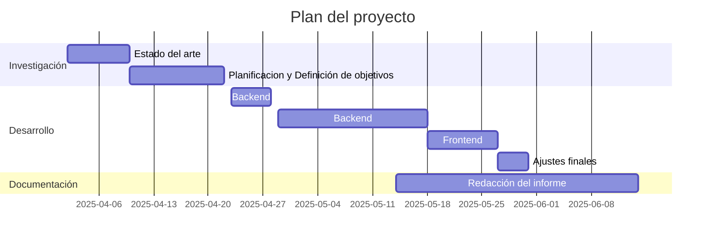
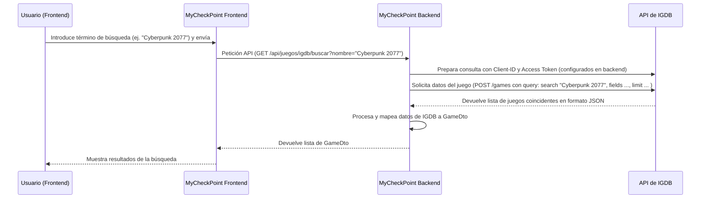

# MyCheckpoint

**MyCheckPoint: Organiza tu progreso, vive tu pasión.**

# Resumen
Este documento describe MyCheckPoint, una aplicación web diseñada para ayudar a los aficionados a los videojuegos a organizar sus bibliotecas de juegos, seguir su progreso y fomentar la interacción social. La plataforma aspira a ser una crónica personal de las trayectorias lúdicas de los jugadores, inspirándose en las exitosas funcionalidades sociales y de catalogación de otros sectores del entretenimiento como el cine (Filmaffinity) y la música (Rate Your Music). Sus funcionalidades principales incluyen la gestión de una biblioteca de juegos personal, la creación de listas personalizadas y "tier lists" para clasificar juegos, y la construcción de una red social para conectar con otros jugadores. El documento también detalla la arquitectura técnica de MyCheckPoint, empleando un robusto backend en Java Spring Boot para la gestión de datos y servicios API, junto con un frontend en Vue.js para una interfaz de usuario intuitiva, enfatizando una clara separación de responsabilidades y una metodología de desarrollo ágil.

# Introducción

En el panorama actual de la industria del videojuego, caracterizado por una oferta masiva y una distribución fragmentada a través de múltiples plataformas, los jugadores se enfrentan al desafío de organizar eficientemente sus títulos, seguir sus progresos y preservar su historial lúdico. Muchos aficionados no solo buscan gestionar su actividad presente, sino también catalogar sus experiencias pasadas, concibiendo su trayectoria como una valiosa crónica personal.

Esta necesidad se nos hizo evidente a nivel personal; nuestra afición por registrar y clasificar los videojuegos que completábamos cada año mediante herramientas manuales y poco integradas nos evidenció una carencia en el mercado. Observamos que las soluciones existentes, a menudo, no satisfacen de forma unificada la necesidad de organizar colecciones, crear clasificaciones subjetivas como las 'tier lists' y compartir estas experiencias en comunidad.

Para dar respuesta a esta problemática, en este Trabajo de Fin de Grado abordamos el diseño y desarrollo de MyCheckPoint. Concebimos el proyecto como un ecosistema digital donde los usuarios pueden catalogar sus videojuegos, registrar su progreso y crear y compartir listas y 'tier lists' de forma sencilla e intuitiva. Para enriquecer la experiencia, la plataforma se nutre con bases de datos externas como IGDB, proporcionando un entorno conectado y con información actualizada. Con MyCheckPoint no solo buscamos ofrecer una herramienta de gestión, sino también una "cápsula del tiempo" digital que permita a cada jugador atesorar y revisitar su evolución y sus logros.

Para este proyecto, hemos realizado un análisis del panorama digital. Al observar plataformas consolidadas no solo en el sector de los videojuegos sino que tambien en otros ámbitos como el cine o la música, identificamos mecánicas de catalogación, interacción y descubrimiento muy efectivas. En consecuencia, hemos diseñado la plataforma para trasladar y adaptar dichas funcionalidades a las necesidades específicas de la comunidad de jugadores.

# Revisión de las alternativas

El panorama de las plataformas digitales relacionadas con los videojuegos es amplio y diverso. A continuación, se examinan algunas de las soluciones más relevantes que ofrecen funcionalidades de catalogación, información o interacción social, seguidas de un análisis de plataformas análogas en otros sectores del entretenimiento que sirven como referencia.

### **Plataformas del Sector de Videojuegos**

**[IGDB](https://www.igdb.com/) (Internet Games Database)** es una de las mayores base de datos de videojuegos, fue [comprada por Twitch en 2019](https://areajugones.sport.es/videojuegos/twitch-adquiere-la-plataforma-internet-games-database/). Su principal función es la recopilación y organización de metadatos detallados sobre títulos, desarrolladores, distribuidores, plataformas, géneros y calificaciones. Su cobertura de videojuegos es notablemente amplia, aunque su enfoque no reside en la creación de una comunidad de usuarios interactiva dentro de su propia web, sino en la provisión de datos.

**[Metacritic](https://www.metacritic.com/)**  opera como un agregador de reseñas para videojuegos, películas, televisión y música, calculando una puntuación media ("_Metascore_") a partir de las valoraciones de críticos profesionales seleccionados. La plataforma también permite a los usuarios publicar sus propias puntuaciones y críticas. La representatividad del _Metascore_ [ha sido objeto de debate](https://youtu.be/QqLGF_ghc8A?feature=shared), por su potencial para simplificar la recepción de una obra o por la influencia que pueden ejercer unas pocas reseñas sobre el valor final. Además, la sección de puntuaciones de usuarios ha demostrado ser vulnerable a campañas coordinadas de _"review bombing"_ donde los usuarios sin consumior el producto le ponen notas, que suele ser extremadamente bajas para afectar a la media de la nota. El sitio se centra en la agregación de valoraciones más que en ofrecer herramientas avanzadas de gestión de colecciones personales o interacción social profunda.

**[IGN](https://www.ign.com/) (Imagine Games Network)**  es uno de los portales de noticias y medios de comunicación sobre videojuegos más grandes a nivel global. Proporciona análisis profesionales, noticias, avances, contenido en vídeo y guías de juego. Si bien cuenta con una comunidad considerable que participa en sus foros, su modelo se basa en la publicación de contenido editorial y está sustentado por publicidad. Carece de funcionalidades específicas para la gestión detallada de bibliotecas de juegos personales o la creación de contenido estructurado por los usuarios, como listas personalizadas o _rankings_, más allá de las interacciones convencionales en foros.

**[OpenCritic](https://opencritic.com/)** funciona como un agregador de reseñas enfocado exclusivamente en videojuegos, buscando ofrecer una alternativa a Metacritic. Presenta de forma transparente los críticos y publicaciones que contribuyen a la puntuación media, mostrando el rango de calificaciones y los autores de cada reseña. A pesar de su transparencia en la agregación, su utilidad depende de la disponibilidad de reseñas de críticos profesionales y su enfoque principal es la recepción crítica de los juegos,su funcionalidad no es la gestión de colecciones personales ni la creación de una red social con funcionalidades avanzadas para los usuarios.

**[Polygon](https://www.polygon.com/)** es un sitio web de noticias, reseñas y contenido de vídeo sobre videojuegos, perteneciente a Vox Media. Se caracteriza por un estilo editorial distintivo y la publicación de artículos de fondo. Al igual que IGN, su rol es el de un medio de comunicación, y no ofrece herramientas para la organización de ludotecas personales ni una plataforma social dedicada a la gestión y compartición de experiencias de juego detalladas por parte de sus usuarios. Su contenido está influenciado por su línea editorial y se financia mediante publicidad.

**Tiendas Online** ([Steam](https://store.steampowered.com/), [Epic Games Store](https://store.epicgames.com/es-ES/), [Ubisoft](https://www.ubisoft.com/es-es), [GOG](https://www.gog.com/en/), etc.) Además de su función como tiendas, integra una biblioteca de juegos para los títulos adquiridos en ella, en algunas con seguimiento de logros y funcionalidades comunitarias como foros, grupos, perfiles de usuario con reseñas y un sistema de amigos. No obstante, su capacidad de gestión de biblioteca se limita a los juegos propios de su ecosistema (GOG puedes importarlas de otras bibliotecas de tus juegos digitales), sin permitir la catalogación unificada de títulos de otras plataformas (consolas u otras tiendas de PC). Las opciones de personalización para listas o rankings detallados, como las 'tier lists', no son una característica nativa de la plataforma.

### **Plataformas de Referencia en Otros Sectores**

Existen plataformas con funcionalidades análogas en otros sectores del entretenimiento que han logrado consolidar comunidades activas y ofrecer herramientas de gran utilidad para sus usuarios. Estos referentes sirven de inspiración por sus fortalezas en la organización y la interacción social.

En el ámbito cinematográfico, **[Filmaffinity](https://www.filmaffinity.com/)**  destaca por permitir a los usuarios calificar, reseñar y catalogar películas, así como crear listas personalizadas y descubrir nuevo contenido a través de un sistema de afinidad con otros usuarios ("almas gemelas"), fomentando una fuerte comunidad, especialmente en el mundo hispanohablante.  
**[IMDb (Internet Movie Database)](https://www.imdb.com/)**, propiedad de Amazon, es una de las mayores base de datos que incluye fichas detalladas de películas, series y personal de la industria, complementada con valoraciones de usuarios y listas de seguimiento.  
**[Letterboxd](https://letterboxd.com/)** se ha popularizado como una red social para cinéfilos, donde el registro de películas vistas, la creación de diarios cinematográficos, las reseñas y la confección de listas temáticas son sus pilares, con una interfaz cuidada y un fuerte componente de descubrimiento social.

En el sector musical, **[Pitchfork](https://pitchfork.com/)**  ofrece críticas musicales detalladas, noticias y reportajes, siendo un referente para el descubrimiento de nueva música, especialmente en géneros alternativos. **[Rate Your Music (RYM](https://rateyourmusic.com/)** es una plataforma colaborativa donde los usuarios catalogan, califican y reseñan música (y también películas), destacando por su detallado sistema de etiquetado de géneros y la generación de listas y estadísticas basadas en la participación comunitaria.

Finalmente, en el mundo literario, **[Goodreads](https://www.goodreads.com/)**, también propiedad de Amazon, permite a los lectores llevar un registro de sus lecturas (pasadas, presentes y futuras), escribir reseñas, obtener recomendaciones personalizadas, participar en retos de lectura y unirse a grupos de discusión, compuesto por una gran comunidad.

### **Conclusión de la Revisión de Alternativas**

Como se ha podido observar, el ecosistema de plataformas relacionadas con videojuegos presenta una variedad de herramientas especializadas, cada una con sus fortalezas, pero también con ciertas limitaciones que fragmentan la experiencia del usuario. Mientras que bases de datos como IGDB ofrecen una amplia cantidad de información —siendo IGDB, de hecho, una fuente de datos crucial para la funcionalidad de MyCheckPoint—, su enfoque principal no reside en la provisión de herramientas avanzadas de gestión personalizada para el usuario final o en la creación de comunidades con interacción social profunda directamente en sus plataformas web. Por otro lado, los medios de comunicación como IGN o Polygon se centran en la difusión de contenido editorial y noticias, sin facilitar la organización de ludotecas personales o la creación de contenido original y estructurado por parte del usuario, como pueden ser las _'tier lists'_. Finalmente, las plataformas de distribución como Steam, si bien integran bibliotecas y funciones sociales, naturalmente limitan su alcance a los títulos adquiridos dentro de su propio ecosistema.

En este contexto, MyCheckPoint identifica una oportunidad clara: la de unificar y enriquecer la experiencia del jugador en un solo lugar. El atractivo fundamental de nuestra plataforma radica en la implementación de una amplia gama de funcionalidades en este entorno unificado, ofreciendo la catalogación detallada y personalizable de juegos de múltiples orígenes, herramientas flexibles para la creación de contenido propio —destacando las _'tier lists'_ y clasificaciones personales—, y funcionalidades sociales diseñadas para una interacción entre amigos y la comunidad.  MyCheckPoint no busca reemplazar las bases de datos existentes, sino construir sobre ellas una capa de personalización, organización y comunidad que actualmente el usuario solo puede encontrar de forma dispersa, aspirando a ofrecer un espacio centralizado donde los jugadores puedan gestionar su historial lúdico y compartir su criterio personal, de forma similar a otras plataformas de referencia como Letterboxd o Goodreads lo han conseguido en sus respectivos dominios.

## Objetivos

El presente Trabajo de Fin de Grado se centra en la concepción, diseño, desarrollo y validación de la plataforma web MyCheckPoint. A continuación, se detallan el objetivo general que persigue el proyecto y los objetivos específicos que se derivan del mismo.

**Objetivo General:**

- **Desarrollar** una aplicación web, denominada MyCheckPoint, que permita a los usuarios catalogar su colección de videojuegos de forma personalizada, realizar un seguimiento detallado de su progreso lúdico, crear y compartir contenido como listas de juegos y _'tier lists'_, y fomentar la interacción social con otros jugadores, utilizando la API de IGDB como fuente principal de información de juegos.

**Objetivos Específicos:**

1.  **Diseñar** una interfaz atractiva y amigable con el usuario.
2.  **Implementar** un sistema de gestión de usuarios seguro y robusto, que abarque el registro de nuevas cuentas con verificación por correo electrónico, la recuperación de contraseñas, y la gestión de perfiles de usuario incluyendo la subida de avatares.
3.  **Integrar** la API de Internet Games Database (IGDB) para obtener, procesar y persistir de manera eficiente información detallada y actualizada sobre videojuegos, incluyendo metadatos, carátulas, géneros, plataformas, y relaciones entre diferentes títulos (DLCs, expansiones, etc.).
4.  **Desarrollar** la funcionalidad de biblioteca personal de videojuegos, permitiendo a los usuarios añadir juegos, registrar su estado (ej. jugando, completado, pendiente), asignar puntuaciones personales, redactar comentarios públicos y privados, y documentar detalles de sus partidas como fechas y tiempos de juego.
5.  **Construir** un módulo para la creación y administración de listas de juegos personalizadas, donde los usuarios puedan agrupar títulos de su biblioteca según criterios propios y definir la visibilidad (pública o privada) de dichas listas.
6.  **Crear** una herramienta interactiva para la elaboración y personalización de _'tier lists'_, facilitando a los usuarios la clasificación visual de videojuegos en diferentes niveles o categorías configurables, y permitiendo la compartición de estos rankings.
7.  **Establecer** un sistema de interacciones sociales dentro de la plataforma, enfocado principalmente en la gestión de amistades, que permita a los usuarios enviar, aceptar, rechazar o cancelar solicitudes de amistad, y visualizar sus conexiones.

# Desarrollo del proyecto

Esta sección detalla el proceso de desarrollo de la plataforma MyCheckPoint, abarcando la planificación temporal, la metodología adoptada, las tecnologías empleadas, los requisitos funcionales que guiaron la implementación, y la estructura arquitectónica del sistema.

## Temporalización

La planificación del proyecto MyCheckPoint se ha estructurado en varias fases clave, desde la concepción inicial y la investigación hasta el desarrollo iterativo y la documentación final. Para visualizar esta planificación, se ha elaborado un diagrama de Gantt que refleja las principales etapas y su duración estimada.

## Metodología

El desarrollo de MyCheckPoint se ha gestionado siguiendo principios de **metodología ágil**, buscando flexibilidad y capacidad de adaptación ante los desafíos y descubrimientos inherentes a un proyecto de esta envergadura. Aunque no se siguió un framework ágil de manera formal debido a la naturaleza y tamaño del equipo, se adoptaron las siguientes prácticas clave:

- **Desarrollo Iterativo e Incremental:** El proyecto se descompuso en módulos funcionales que se abordaron en sucesivas iteraciones. Cada iteración buscaba entregar un conjunto coherente de funcionalidades, permitiendo una evolución progresiva de la aplicación.
- **Gestión de Tareas basada en** _**Issues**_**:** Se utilizó el sistema de seguimiento de incidencias GitHub Issues para definir, asignar y rastrear el progreso de las tareas de desarrollo, correcciones de errores y nuevas funcionalidades. Esto facilitó la organización del trabajo y la visibilidad del estado del proyecto.
- **Revisión por Pares (_Peer Review_):** Aunque el equipo es reducido, se fomentó la revisión cruzada del código antes de integrar los cambios (_commits_ y _merge/pull requests_). Esta práctica ayudó a mejorar la calidad del código, detectar errores tempranamente y compartir conocimiento entre los miembros del equipo.
- **Comunicación Periódica:** A través de reuniones o informes programados regularmente. Esto permitió discutir problemas, proponer soluciones y coordinar esfuerzos de manera consistente, adaptando los planes según fuera necesario en cada intervalo.

Esta aproximación nos permitío responder a la naturaleza evolutiva del proyecto, donde la comprensión de los requisitos y la complejidad de ciertas funcionalidades se fue refinando con el tiempo, llevando a las reestructuraciones y ajustes mencionados en la introducción.

## Tecnologías

La plataforma MyCheckPoint se ha desarrollado utilizando un conjunto de tecnologías modernas y robustas, tanto para el backend como para el frontend, además de diversas herramientas que han facilitado el ciclo de vida del desarrollo.

**Backend:**

- **[Java 21](https://www.oracle.com/java/ "null"):** Lenguaje de programación principal para el desarrollo del backend, seleccionado por su madurez, robustez y el amplio ecosistema de herramientas y bibliotecas disponibles.
- **[Spring Boot 3.3.0](https://spring.io/projects/spring-boot "null"):** Framework principal para la creación de la aplicación backend. Facilita la configuración, el desarrollo de APIs RESTful, la gestión de dependencias y la integración con otras tecnologías Spring.
- **[Spring Data JPA](https://spring.io/projects/spring-data-jpa "null"):** Proporciona una capa de abstracción sobre JPA (Java Persistence API) para simplificar la interacción con la base de datos, permitiendo la creación de repositorios de forma declarativa.
- **[Hibernate](https://hibernate.org/ "null"):** Implementación de JPA utilizada como ORM (Object-Relational Mapping) para mapear las entidades Java a las tablas de la base de datos PostgreSQL.
- **[Spring Security](https://spring.io/projects/spring-security "null"):** Framework para la gestión de la seguridad de la aplicación, utilizado para la autenticación y autorización, incluyendo la implementación de JWT.
- **[PostgreSQL](https://www.postgresql.org/ "null"):** Sistema de gestión de bases de datos relacional objeto-relacional, elegido por su fiabilidad, características avanzadas y licencia de código abierto.
- **[JSON Web Tokens (JWT)](https://jwt.io/ "null"):** Estándar abierto (RFC 7519) para la creación de tokens de acceso que permiten la transmisión segura de información entre partes como un objeto JSON. Utilizado para la autenticación stateless. La librería `io.jsonwebtoken` (jjwt) se empleó para su manejo.
- **[MapStruct](https://mapstruct.org/ "null"):** Generador de código que facilita la conversión entre clases Java como DTOs y entidades del dominio. Estas clases, llamadas _JavaBeans_, siguen una convención con atributos privados y métodos públicos de acceso. MapStruct automatiza esta conversión y evita escribir código repetitivo (código _boilerplate_).
- **[Spring WebFlux (WebClient)](https://docs.spring.io/spring-framework/docs/current/reference/html/web-reactive.html#webflux-client "null"):**  Utilizado para hacer llamadas no bloqueantes a la API externa de IGDB de forma reactiva. A diferencia de las llamadas bloqueantes, que detienen el hilo hasta recibir una respuesta, WebClient libera el hilo para que pueda atender otras tareas. Esto mejora la eficiencia y escalabilidad del sistema.
- **[Spring Boot Starter Mail](https://docs.spring.io/spring-boot/docs/current/reference/html/io.html#io.email "null"):** Facilita el envío de correos electrónicos, utilizado para la verificación de cuentas y el restablecimiento de contraseñas.
- **[Springdoc OpenAPI](https://springdoc.org/ "null"):** Herramienta que genera automáticamente la documentación de la API en formato OpenAPI 3 a partir del código Spring Boot, facilitando la visualización y prueba de los endpoints a través de Swagger UI.
- **[Lombok](https://projectlombok.org/ "null"):** Biblioteca que ayuda a reducir el código boilerplate en las clases Java mediante anotaciones (e.g., `@Data`, `@Getter`, `@Setter`).
- **[Maven](https://maven.apache.org/ "null"):** Herramienta de gestión y construcción de proyectos Java, utilizada para manejar las dependencias del backend y el ciclo de vida de la compilación.

**Frontend:**

- **[Vue.js 3](https://vuejs.org/ "null"):** Framework progresivo de JavaScript para la construcción de interfaces de usuario. Elegido por su curva de aprendizaje amigable, rendimiento y ecosistema.
- **[Vite](https://vitejs.dev/ "null"):** Herramienta de frontend de nueva generación que proporciona un servidor de desarrollo extremadamente rápido y optimiza la compilación para producción.
- **[Vue Router 4](https://router.vuejs.org/ "null"):** Librería oficial de enrutamiento para Vue.js, utilizada para gestionar la navegación entre las diferentes vistas de la aplicación de una sola página (_Single Page Application_, SPA).
- **[Pinia 3](https://pinia.vuejs.org/ "null"):** Librería oficial de gestión de estado para Vue.js, utilizada para manejar el estado global de la aplicación, como la información del usuario autenticado y el token JWT.
- **[Axios](https://axios-http.com/ "null"):** Cliente HTTP basado en promesas para el navegador y Node.js, utilizado para realizar las llamadas a la API del backend.
- **[OpenAPI Generator Client (TypeScript-Axios)](https://openapi-generator.tech/docs/generators/typescript-axios/):** El cliente API para el frontend fue generado a partir de la especificación OpenAPI del backend (MyCheckPoint.yaml), utilizando `openapi-generator-cli`. Esto proporciona una capa tipada y estructurada para interactuar con los endpoints del backend.

**Entorno de Desarrollo y Herramientas Adicionales:**

- **[Intellij IDEA](https://www.jetbrains.com/idea/ "null"):** Entorno de desarrollo integrado para el backend.
- **[Visual Studio Code](https://code.visualstudio.com/ "null")**: Entorno de desarrollo integrado para el frontend.
- **[Git](https://git-scm.com/ "null"):** Sistema de control de versiones distribuido, fundamental para el seguimiento de cambios y la colaboración en el código.
- **[GitHub](https://github.com/):** Plataforma de hospedaje de repositorios Git, utilizada para la gestión del código fuente, seguimiento de _issues_ y revisión de código.
- **[Node.js](https://nodejs.org/ "null") y [npm](https://www.npmjs.com/):** Entorno de ejecución para JavaScript del lado del servidor (Node.js) y gestor de paquetes (npm o yarn) para las dependencias del frontend.
- **[Postman](https://www.postman.com/ "null"):** Herramientas para probar los endpoints de la API RESTful durante el desarrollo del backend.
- **[DataGrip](https://www.jetbrains.com/es-es/datagrip/ "null"):** Herramientas de administración y desarrollo para la base de datos PostgreSQL.

## Requisitos funcionales

Los requisitos funcionales especifican las acciones y servicios que la plataforma MyCheckPoint debe ofrecer a sus usuarios para cumplir con los objetivos del proyecto. A continuación, se detallan estos requisitos, agrupados por módulos principales:

**RF-AUTH: Gestión de Usuarios y Autenticación**

- **RF-AUTH-001:** El sistema debe **permitir** a los nuevos usuarios registrarse en la plataforma proporcionando un nombre de usuario único, una dirección de correo electrónico válida y una contraseña segura.
- **RF-AUTH-002:** El sistema debe **enviar** un correo electrónico de verificación a la dirección proporcionada por el usuario durante el registro para confirmar la validez de la misma.
- **RF-AUTH-003:** El sistema debe **restringir** el acceso a funcionalidades específicas de usuario registrado hasta que la dirección de correo electrónico haya sido verificada.
- **RF-AUTH-004:** El sistema debe **permitir** a los usuarios registrados iniciar sesión utilizando su identificador (correo electrónico o nombre de usuario) y su contraseña.
- **RF-AUTH-005:** El sistema debe **generar** y **gestionar** tokens JWT (JSON Web Tokens) para mantener la sesión del usuario autenticado y asegurar las peticiones a la API.
- **RF-AUTH-006:** El sistema debe **permitir** a los usuarios autenticados cerrar su sesión activa en la plataforma.
- **RF-AUTH-007:** El sistema debe **ofrecer** a los usuarios la posibilidad de solicitar un restablecimiento de contraseña si la han olvidado, mediante un enlace enviado a su correo electrónico registrado.
- **RF-AUTH-008:** El sistema debe **permitir** a los usuarios autenticados cambiar su contraseña actual, requiriendo la confirmación de la contraseña vigente.
- **RF-AUTH-009:** El sistema debe **permitir** a los usuarios autenticados visualizar y modificar la información de su perfil, incluyendo el nombre de usuario, el tema de la interfaz (claro/oscuro), las preferencias de notificación y el nivel de visibilidad de su perfil (público, privado, solo amigos).
- **RF-AUTH-010:** El sistema debe **permitir** a los usuarios autenticados subir, actualizar o eliminar su foto de perfil.
- **RF-AUTH-011:** El sistema debe **permitir** a los usuarios autenticados solicitar la eliminación programada de su cuenta, requiriendo confirmación mediante contraseña.
- **RF-AUTH-012:** El sistema debe **cancelar** automáticamente una eliminación de cuenta programada si el usuario inicia sesión antes de que finalice el periodo de gracia establecido.
- **RF-AUTH-013:** El sistema debe **eliminar** permanentemente los datos de un usuario una vez transcurrido el periodo de gracia de una eliminación programada, mediante una tarea automatizada.

**RF-GAME: Gestión de Información de Videojuegos e Integración con IGDB**

- **RF-GAME-001:** El sistema debe **integrarse** con la API de Internet Games Database (IGDB) para obtener información detallada y actualizada sobre videojuegos.
- **RF-GAME-002:** El sistema debe **permitir** la búsqueda de videojuegos en IGDB por diversos criterios, como título.
- **RF-GAME-003:** El sistema debe **almacenar** localmente la información relevante de los juegos obtenidos de IGDB para optimizar consultas y reducir la dependencia de la API externa para datos frecuentemente accedidos.
- **RF-GAME-004:** El sistema debe **actualizar** la información local de los juegos si se detectan cambios o si la información almacenada es parcial y se requiere una versión más completa desde IGDB.
- **RF-GAME-005:** El sistema debe **presentar** al usuario la información detallada de un videojuego, incluyendo metadatos (nombre, resumen, fecha de lanzamiento, etc.), carátula, géneros, plataformas, modos de juego, temas, capturas de pantalla, vídeos y compañías involucradas.

**RF-LIB: Gestión de la Biblioteca Personal de Videojuegos (UserGame)**

- **RF-LIB-001:** El sistema debe **permitir** a los usuarios autenticados añadir cualquier juego (cuya información se obtiene vía IGDB) a su biblioteca personal.
- **RF-LIB-002:** El sistema debe **permitir** a los usuarios registrar y modificar el estado de cada juego en su biblioteca (ej. Jugando, Completado, Pendiente, Lista de Deseos, Archivado).
- **RF-LIB-003:** El sistema debe **permitir** a los usuarios especificar la plataforma personal en la que poseen o juegan cada título de su biblioteca.
- **RF-LIB-004:** El sistema debe **permitir** a los usuarios indicar si poseen una copia del juego.
- **RF-LIB-005:** El sistema debe **permitir** a los usuarios asignar una puntuación personal a los juegos de su biblioteca.
- **RF-LIB-006:** El sistema debe **permitir** a los usuarios escribir un comentario público y un comentario privado para cada juego en su biblioteca.
- **RF-LIB-007:** El sistema debe **permitir** a los usuarios registrar las fechas de inicio y finalización de sus partidas.
- **RF-LIB-008:** El sistema debe **permitir** a los usuarios registrar las horas dedicadas a un juego (ej. historia principal, contenido secundario, completista).
- **RF-LIB-009:** El sistema debe **mostrar** al usuario su biblioteca de juegos completa, con toda la información personalizada registrada.
- **RF-LIB-010:** El sistema debe **permitir** a los usuarios eliminar juegos de su biblioteca personal.

**RF-LIST: Gestión de Listas de Juegos Personalizadas (GameList)**

- **RF-LIST-001:** El sistema debe **permitir** a los usuarios autenticados crear nuevas listas de juegos personalizadas, asignándoles un nombre, una descripción opcional y un nivel de visibilidad (pública o privada).
- **RF-LIST-002:** El sistema debe **permitir** a los usuarios añadir juegos de su biblioteca personal a cualquiera de sus listas personalizadas.
- **RF-LIST-003:** El sistema debe **permitir** a los usuarios eliminar juegos de sus listas personalizadas.
- **RF-LIST-004:** El sistema debe **permitir** a los usuarios visualizar y gestionar todas las listas de juegos que han creado.
- **RF-LIST-005:** El sistema debe **permitir** a los usuarios modificar los metadatos (nombre, descripción, visibilidad) de sus listas de juegos.
- **RF-LIST-006:** El sistema debe **permitir** a los usuarios eliminar sus listas de juegos personalizadas.
- **RF-LIST-007:** El sistema debe **permitir** a cualquier usuario (autenticado o no) visualizar las listas de juegos que otros usuarios hayan marcado como públicas.

**RF-TIER: Gestión de Tier Lists**

- **RF-TIER-001:** El sistema debe **permitir** a los usuarios autenticados crear 'Tier Lists' de perfil general, inicializadas con un conjunto de secciones por defecto (ej. S, A, B, C, D, Sin Clasificar).
- **RF-TIER-002:** El sistema debe **generar** y **sincronizar** automáticamente una 'Tier List' cuando se acceda a la funcionalidad desde una GameList específica, poblando la sección "Sin Clasificar" con los juegos de dicha GameList.
- **RF-TIER-003:** El sistema debe **permitir** a los usuarios añadir juegos de su biblioteca personal a las diferentes secciones de sus 'Tier Lists' de perfil.
- **RF-TIER-004:** El sistema debe **permitir** a los usuarios mover juegos entre las diferentes secciones de una 'Tier List' y reordenar los juegos dentro de cada sección mediante una interfaz de arrastrar y soltar (drag and drop) o similar.
- **RF-TIER-005:** El sistema debe **permitir** a los usuarios eliminar juegos de sus 'Tier Lists' de perfil.
- **RF-TIER-006:** El sistema debe **permitir** a los usuarios añadir nuevas secciones personalizadas a sus 'Tier Lists', hasta un límite máximo definido de 8.
- **RF-TIER-007:** El sistema debe **permitir** a los usuarios modificar el nombre de las secciones personalizadas de sus 'Tier Lists'.
- **RF-TIER-008:** El sistema debe **permitir** a los usuarios eliminar secciones personalizadas de sus 'Tier Lists', moviendo automáticamente los juegos contenidos en ellas a la sección "Sin Clasificar". No se podrá eliminar la última sección personalizable si es la única además de la de "Sin Clasificar".
- **RF-TIER-009:** El sistema debe **impedir** la eliminación de la sección "Sin Clasificar".
- **RF-TIER-010:** El sistema debe **permitir** a los usuarios modificar los metadatos (nombre, descripción, visibilidad) de sus 'Tier Lists'.
- **RF-TIER-011:** El sistema debe **permitir** a los usuarios eliminar sus 'Tier Lists'.
- **RF-TIER-012:** El sistema debe **permitir** a cualquier usuario (autenticado o no) visualizar las 'Tier Lists' que otros usuarios hayan marcado como públicas.

**RF-SOCIAL: Funcionalidades Sociales**

- **RF-SOCIAL-001:** El sistema debe **permitir** a los usuarios autenticados buscar a otros usuarios registrados en la plataforma por su nombre de usuario.
- **RF-SOCIAL-002:** El sistema debe **permitir** a los usuarios visualizar los perfiles de otros usuarios, respetando la configuración de visibilidad establecida por cada uno (público, privado, solo amigos).
- **RF-SOCIAL-003:** El sistema debe **permitir** a los usuarios autenticados enviar solicitudes de amistad a otros usuarios.
- **RF-SOCIAL-004:** El sistema debe **notificar** a un usuario cuando reciba una nueva solicitud de amistad.
- **RF-SOCIAL-005:** El sistema debe **permitir** a los usuarios aceptar o rechazar las solicitudes de amistad recibidas.
- **RF-SOCIAL-006:** El sistema debe **permitir** a los usuarios cancelar las solicitudes de amistad que han enviado y que aún están pendientes.
- **RF-SOCIAL-007:** El sistema debe **mostrar** a cada usuario su lista de amigos.
- **RF-SOCIAL-008:** El sistema debe **permitir** a los usuarios eliminar una amistad existente.
- **RF-SOCIAL-009:** El sistema debe **mostrar** a los usuarios las solicitudes de amistad pendientes (tanto enviadas como recibidas).
- **RF-SOCIAL-010:** El sistema debe **permitir** a los usuarios visualizar los comentarios públicos que otros usuarios han dejado en las fichas de los juegos.

## Estructura del proyecto

MyCheckPoint se ha desarrollado siguiendo una arquitectura de aplicación web moderna, separando claramente las responsabilidades del backend y del frontend para facilitar el desarrollo, mantenimiento y escalabilidad.

### Backend

El backend de MyCheckPoint es el encargado de gestionar toda la lógica de negocio, la persistencia de datos, la seguridad y la exposición de una API RESTful para ser consumida por el frontend y para una futura versión de movil para android y iOS.

**Responsabilidades Principales:**

- **Gestión de Datos:** Persistencia y recuperación de toda la información relacionada con usuarios, juegos, bibliotecas, listas, tier lists y amistades en la base de datos PostgreSQL.
- **Lógica de Negocio:** Implementación de todas las reglas y procesos que definen el funcionamiento de la plataforma (ej. creación de usuarios, gestión de la biblioteca, sincronización de tier lists, etc.).
- **API RESTful:** Exposición de endpoints seguros y bien definidos para que el frontend pueda interactuar con los datos y funcionalidades del sistema.
- **Seguridad:** Manejo de la autenticación de usuarios (JWT), autorización de acceso a recursos y protección contra vulnerabilidades comunes.
- **Integración con Servicios Externos:** Comunicación con la API de IGDB para la obtención de información sobre videojuegos.
- **Tareas Programadas:** Ejecución de procesos en segundo plano, como la limpieza de cuentas programadas para eliminación.

**Diagrama UML de Clases (Reducido):**

_(Ejemplo: Un diagrama simple mostrando User, Game, UserGame, GameList, TierList y sus relaciones más directas)_

**Diagramas de Casos de Uso:**

_(Ejemplo: Casos de uso como "Registrar Usuario", "Gestionar Biblioteca", "Crear Tier List")_

**Diagrama de Secuencia (Llamada a API IGDB para Búsqueda):**

El siguiente diagrama ilustra el flujo para buscar un juego, donde el backend de MyCheckPoint actúa como cliente de la API de IGDB.

**Estructura del Proyecto (Capas):**

El backend sigue un patrón de diseño por capas, que en nuestro caso se traduce principalmente en:

1.  **Capa de Controladores (`controller`):**

- **Responsabilidad:** Recibir las peticiones HTTP entrantes desde el cliente, validarlas (a nivel básico, delegando la validación de negocio), invocar a los servicios correspondientes para procesar la solicitud y devolver una respuesta HTTP (generalmente en formato JSON) al cliente.
    - Maneja la conversión entre DTOs (Data Transfer Objects) y las respuestas HTTP.
    - Se encarga de la gestión de la seguridad a nivel de endpoint (ej. mediante anotaciones de Spring Security).
    - Ejemplos: `UserController`, `GameController`, `AuthenticationController`, `UserGameLibraryController`, `GameListController`, `TierListController`, `FriendshipController`.

2.  **Capa de Servicios (`service`):**

- **Responsabilidad:** Contener la lógica de negocio principal de la aplicación. Orquesta las operaciones, interactúa con los repositorios para acceder y persistir datos, y realiza cualquier cálculo o transformación necesaria.
    - Es donde se implementan las transacciones (`@Transactional`).
    - Se comunica con otros servicios si es necesario y maneja la lógica de integración con servicios externos (como IGDB a través de `IgdbService`).
    - Ejemplos: `UserServiceImpl`, `GameServiceImpl`, `EmailServiceImpls`, `UserGameLibraryServiceImpl`, `GameListServiceImpl`, `TierListServiceImpl`, `FriendshipServiceImpl`.

3.  **Capa de Repositorios (`repository`):**

- **Responsabilidad:** Abstraer el acceso a la base de datos. Define las interfaces (extendiendo de JpaRepository o similares) para realizar operaciones CRUD (Crear, Leer, Actualizar, Eliminar) y consultas personalizadas sobre las entidades.
    - Spring Data JPA se encarga de la implementación de estas interfaces en tiempo de ejecución.
    - Ejemplos: `UserRepository`, `GameRepository`, `UserGameRepository`, `GameListRepository`, `TierListRepository`, `FriendshipRepository`.

4.  **Capa de Dominio/Entidades (`entity`):**

- **Responsabilidad:** Representar los objetos de datos del dominio de la aplicación que se persisten en la base de datos. Son clases POJO anotadas con JPA (`@Entity`, `@Table`, etc.).
    - Ejemplos: `User`, `Game`, `UserGame`, `GameList`, `TierList`, `Friendship`, y todas las entidades relacionadas con los detalles de los juegos (Cover, Genre, Platform, etc.).

5.  **Capa de Transferencia de Datos (dto y mapper):**

- **Responsabilidad:** Encargada de la conversión y transporte de datos entre diferentes capas del sistema. Incluye tanto los DTOs, que se utilizan para transferir datos especialmente entre el cliente y el servidor, como los mappers, que convierten entre DTOs y entidades del dominio. Se utiliza MapStruct para generar automáticamente las implementaciones de estos mapeos.
    - **DTOs (Data Transfer Objects):**
      Son objetos simples utilizados para transferir datos entre las capas y, especialmente, entre el cliente y el servidor. Ayudan a desacoplar la estructura interna de las entidades de la API expuesta.
      -_Ejemplos:_ `UserCreateDTO`, `GameDto`, `LoginRequestDTO`, `TierListResponseDTO`.

    - **Mapper:**
      Encargados de convertir objetos entre diferentes capas, principalmente entre DTOs (utilizados por los controladores y servicios) y Entidades (utilizadas por los servicios y repositorios).
      -_Ejemplos:_ `UserMapper`, `GameMapper`, `UserGameMapper`, `GameListMapper`, `TierListMapper`.

6.  **Configuración (`config`):**

- **Responsabilidad:** Clases de configuración de Spring para diversos aspectos como la seguridad (`SecurityConfig`), la documentación OpenAPI (`OpenApiConfig`), CORS (`CorsConfig`), y la configuración del cliente WebClient para IGDB (`WebClientConfig`).

7.  **Seguridad (`security`):**

- **Responsabilidad:** Componentes relacionados con Spring Security, como `UserDetailsImpl`, `UserDetailsServiceImpl`, y las clases para el manejo de JWT (`JwtTokenProvider`, `JwtAuthenticationFilter`, `JwtAuthenticationEntryPoint`).

**Entidades Principales:**

- **User:** Representa a un usuario de la plataforma, con sus datos de autenticación, perfil y preferencias.
- **Game:** Almacena la información detallada de un videojuego, obtenida principalmente de IGDB. Incluye relaciones con entidades como `Cover`, `Genre`, `Platform`, `Artwork`, `Screenshot`, `Video`, `Website`, `GameMode`, `Theme`, `Keyword`, `GameEngine`, `Franchise`, y `Company` (a través de `GameCompanyInvolvement`). También gestiona relaciones jerárquicas (padre/hijo para DLCs/expansiones) y de similitud.
- **UserGame:** Entidad de unión que representa la relación entre un `User` y un `Game` en su biblioteca personal. Almacena datos específicos del usuario para ese juego (estado, puntuación, comentarios, etc.).
- **GameList:** Permite a un `User` crear listas personalizadas que agrupan varias entradas de `UserGame`.
- **TierList:** Representa una clasificación de juegos en diferentes niveles (tiers). Puede ser de tipo `PROFILE_GLOBAL` (general del usuario) o `FROM_GAMELIST` (basada en una `GameList` existente).
- **TierSection:** Define una categoría o nivel dentro de una `TierList`.
- **TierListItem:** Representa un `UserGame` específico colocado dentro de una `TierSection`.
- **Friendship:** Modela la relación de amistad entre dos `User`, incluyendo su estado (pendiente, aceptada).
- **VerificationToken / PasswordResetToken:** Entidades para gestionar los tokens de verificación de correo y restablecimiento de contraseñas, vinculados a un `usuario`.

Las relaciones muchos-a-muchos (ej. `Game` con `Genre`, `Platform`, `GameList` con `UserGame`) se gestionan mediante tablas de unión implícitas o explícitas definidas por JPA. Las relaciones uno-a-muchos (ej. `TierList` con `TierSection`) y muchos-a-uno (ej. `UserGame` con `User` y `Game`) también son fundamentales en el modelo.

### 4.5.2. Frontend

El frontend de MyCheckPoint es una Single Page Application (SPA) desarrollada con Vue.js, responsable de presentar la interfaz de usuario, gestionar la interacción del usuario y comunicarse con la API del backend.

**Responsabilidades Principales:**

- **Interfaz de Usuario (UI):** Renderizar las vistas y componentes que conforman la aplicación, asegurando una experiencia visualmente atractiva y coherente.
- **Experiencia de Usuario (UX):** Facilitar una navegación intuitiva y un flujo de interacción eficiente para todas las funcionalidades.
- **Gestión de Estado Local y Global:** Manejar el estado de los componentes y el estado global de la aplicación (ej. información del usuario autenticado, token JWT) utilizando Pinia.
- **Comunicación con la API Backend:** Realizar peticiones HTTP (a través de Axios y el cliente API generado) para obtener y enviar datos al servidor.
- **Enrutamiento:** Gestionar la navegación entre las diferentes secciones y vistas de la aplicación mediante Vue Router.
- **Validación de Formularios:** (Previsto) Implementar validación en el lado del cliente para mejorar la experiencia del usuario antes de enviar datos al backend.

**Estructura del Proyecto (Conceptual):**

- **`main.js`:** Punto de entrada de la aplicación Vue, donde se inicializa la instancia de Vue, Pinia y Vue Router.
- **`App.vue`:** Componente raíz de la aplicación.
- **`router/index.js`:** Define las rutas de la aplicación y los componentes de vista asociados a cada ruta. Implementa guardias de navegación para proteger rutas y redirigir según el estado de autenticación.
- **`stores/authStore.js`:** _Store_ de Pinia para gestionar el estado de autenticación, el token de acceso y la información del usuario actual. Incluye acciones para login, logout y obtención de datos del usuario.
- **`services/`:**

- **`apiService.js`:** Configuración de la instancia de Axios, incluyendo la URL base de la API y los interceptores para añadir el token JWT a las peticiones y manejar errores 401.
- **`apiInstances.js`:** Crea y exporta instancias de los controladores de la API generada (ej. `AutenticacinControllerApi`, `UsuariosApi`), utilizando el `apiClient` configurado. Proporciona funciones helper para las llamadas API más comunes.

- **`views/`:** Contiene los componentes de Vue que representan las páginas o secciones principales de la aplicación (ej. `HomeView.vue`, `LoginView.vue`, `UserProfileView.vue`, `GameDetailsView.vue`).
- **`components/`:** (Directorio implícito o explícito) Albergaría componentes reutilizables utilizados a lo largo de las vistas (ej. botones personalizados, modales, tarjetas de juego, elementos de formulario).
- **`assets/`:** Almacena recursos estáticos como hojas de estilo CSS (`main.css`, `base.css`) e imágenes.
- **`api-client/`:** Directorio que contiene el cliente API TypeScript generado por OpenAPI Generator, permitiendo una interacción tipada con el backend.

**Diseño de Interfaz y Pantallas Principales:**

A continuación, se presentan algunas de las pantallas clave de la aplicación MyCheckPoint, ilustrando el diseño y la experiencia de usuario implementada.

1.  **Inicio (`HomeView`):** Página principal de la aplicación. _Descripción breve de la pantalla de inicio y sus elementos._
2.  **Login (`LoginView`):** Formulario para que los usuarios inicien sesión. _Descripción breve de la pantalla de login._
3.  **Registro (`RegisterView`):** Formulario para la creación de nuevas cuentas. _Descripción breve de la pantalla de registro._
4.  **Solicitar Restablecimiento de Contraseña (`RequestPasswordResetView`):** _Descripción breve de la pantalla de solicitud de restablecimiento._
5.  **Restablecer Contraseña (`ResetPasswordView`):** _Descripción breve de la pantalla para introducir el nuevo password._
6.  **Perfil de Usuario (`UserProfileView`):** Vista del perfil de un usuario. _Descripción de los elementos del perfil: información, biblioteca, listas, etc._
7.  **Ajustes de Usuario (`UserSettingsView`):** _Descripción de las opciones de configuración del perfil._
8.  **Página de Amigos (`FriendsPageView`):** _Descripción de la gestión de amistades._
9.  **Búsqueda de Juegos (`SearchGamesView`):** _Descripción de la interfaz de búsqueda de juegos._
10. **Detalles del Juego (`GameDetailsView`):** _Descripción de la vista detallada de un juego, incluyendo información de IGDB y datos del usuario._

11. **Visualización de Listas de Juegos (`ViewPublicGameListsView` o similar):** _Descripción de cómo se muestran las listas de juegos (propias o públicas)._

12. **Visualización de Tier Lists (`ViewPublicTierListsView` o similar):** _Descripción de cómo se muestran las tier lists (propias o públicas)._

13. **Creación/Edición de Tier Lists:** _Descripción de la interfaz para crear y organizar juegos en tier lists._

14. **Búsqueda de Usuarios (`SearchUsersView`):** _Descripción de la interfaz de búsqueda de usuarios._

_(Añadir más capturas y descripciones según sea necesario para cubrir las funcionalidades más importantes y visuales del frontend)._

### 4.5.3. Base de Datos

La base de datos es un componente crucial que almacena toda la información persistente de MyCheckPoint. Se ha utilizado PostgreSQL, un sistema de gestión de bases de datos relacional objeto-relacional. Todo el ciclo de vida y mantenimiento de la base de datos (creación de tablas, actualizaciones de esquemas, relaciones, etc.) se ha delegado a JPA y Spring Boot, lo que permite una gestión automática y coherente del modelo de datos a partir de las entidades del dominio.

**Modelo Entidad-Relación (E-R):**

**Explicación del Modelo E-R:**

El modelo de datos se estructura en torno a varias entidades principales y sus relaciones:

- **Usuario (`usuario`):** Contiene la información de los usuarios registrados (`id`, `public_id`, `nombre_usuario`, `email`, `contraseña`, `email_verified`, `fecha_registro`, `tema`, `foto_perfil`, `notificaciones`, `visibilidad_perfil`, `fecha_creacion`, `fecha_modificacion`, `fecha_eliminacion`). Es la entidad central para la mayoría de las funcionalidades.
- **Juego (`games`):** Almacena los datos de los videojuegos (`internal_id`, `igdb_id`, `name`, `slug`, `cover_igdb_id`, `cover_url`, `total_rating`, `summary`, `storyline`, `is_full_details`, `game_type`, `first_release_date`, `first_release_status`, `parent_game_internal_id`, `version_parent_game_internal_id`). Esta tabla tiene múltiples relaciones con otras tablas para detalles específicos como géneros (`genres`), plataformas (`platforms`), modos de juego (`game_modes`), etc., que son entidades maestras con datos de IGDB. También se relaciona consigo misma para representar DLCs, expansiones, remakes, etc. (a través de `parent_game_internal_id` y tablas de asociación como `game_remake_versions_assoc`).

    - Las colecciones de elementos embebidos como `Artwork`, `Screenshot`, `Video`, `Website` se almacenan en tablas separadas (`game_artworks`, `game_screenshots`, etc.) vinculadas a `games` por `game_internal_id`.

- **Biblioteca de Usuario (`user_games`):** Tabla de unión entre `usuario` (`user_internal_id`) y `games` (`game_internal_id`), que además contiene atributos específicos de la relación (`internal_id`, `status`, `personal_platform`, `has_possession`, `score`, `comment`, `private_comment`, `start_date`, `end_date`, `story_duration_hours`, etc.).
- **Listas de Juegos (`game_lists`):** Cada registro (`internal_id`, `public_id`, `name`, `description`, `is_public`) pertenece a un `usuario` (propietario, `user_internal_id`) y tiene una relación muchos-a-muchos con `user_games` (a través de la tabla de unión `game_list_user_games` que vincula `game_list_internal_id` con `user_game_internal_id`).
- **Tier Lists (`tier_lists`):** Cada `tier_list` (`internal_id`, `public_id`, `name`, `description`, `type`, `is_public`) pertenece a un `usuario` (`owner_user_internal_id`) y puede estar opcionalmente vinculada a una `game_list` (`source_game_list_internal_id`) si es de tipo `FROM_GAMELIST`.
- **Secciones de Tier List (`tier_sections`):** Cada `tier_section` (`internal_id`, `name`, `section_order`, `is_default_unclassified`) pertenece a una `tier_list` (`tier_list_internal_id`).
- **Ítems de Tier List (`tier_list_items`):** Tabla de unión entre `tier_section` (`tier_section_internal_id`) y `user_games` (`user_game_internal_id`), que representa un juego específico colocado en una sección de una tier list, con un `item_order` definido.
- **Amistades (`friendships`):** Modela la relación entre dos `usuario`, indicando quién solicitó la amistad (`requester_user_internal_id`), quién la recibió (`receiver_user_internal_id`) y el `status` de la relación.
- **Tokens (`verification_tokens`, `password_reset_tokens`):** Almacenan los tokens temporales (`token`, `expiry_date`, `used`) para la verificación de correo y el restablecimiento de contraseñas, vinculados a un `usuario` (`user_id`).

Las relaciones se definen mediante claves primarias (`id` o `internal_id`) y foráneas, asegurando la integridad referencial. Se utilizan tipos de datos apropiados para cada campo (ej. `UUID` para identificadores públicos, `TEXT` para descripciones largas, `TIMESTAMP WITH TIME ZONE` para fechas). Las relaciones muchos-a-muchos se implementan mediante tablas de asociación intermedias (ej. `game_genres`, `game_list_user_games`).

### Security Schemes

#### `bearerAuth`

- **Type:** http
- **Scheme:** bearer
- **Bearer Format:** JWT

## Despliegue

Pasos necesarios para desplegar vuestro proyecto. Si no lo tenéis claro, lo vemos próximamente.

## Problemas encontrados y soluciones propuestas

El desarrollo de un proyecto de la envergadura de MyCheckPoint, especialmente en un contexto académico y formativo, conlleva inevitablemente la aparición de desafíos y obstáculos. A continuación describiremos los principales problemas encontrados durante el ciclo de vida del proyecto y las estrategias adoptadas para abordarlos, reflejando el proceso de aprendizaje y adaptación del equipo.

### Gestión del Proyecto, Alcance y Adaptación Metodológica

Uno de los primeros obstáculos surgió de la combinación de una falta de experiencia previa en la gestión de proyectos de software de esta magnitud y la ambición de las funcionalidades propuestas. Esto condujo a una subestimación inicial del tiempo y esfuerzo requeridos, lo que se tradujo en un ciclo de desarrollo más comprimido de lo deseado y en la necesidad de realizar ajustes constantes en la priorización de tareas. Para afrontar esta situación, adoptamos principios de la metodología ágil, dividiendo el trabajo en módulos e iteraciones más pequeñas para mejorar la visibilidad del progreso y la gestión de la complejidad.

Esta flexibilidad fue clave para la toma de decisiones. Un ejemplo ilustrativo fue la elección de la tecnología frontend. Inicialmente, se contempló el uso de React por el interés que suscitaba en el equipo. Sin embargo, tras una breve exploración, evaluamos que la curva de aprendizaje necesaria chocaría con el cronograma ajustado del proyecto. Por ello, se tomó la decisión de migrar hacia Vue.js, un framework en el que contábamos con bases más sólidas, garantizando así un desarrollo más eficiente y minimizando riesgos. Esta experiencia resaltó la importancia de equilibrar los objetivos de aprendizaje con las restricciones prácticas para asegurar la viabilidad del proyecto.

Paralelamente, la propia dinámica del trabajo en equipo presentó desafíos comunicacionales, especialmente ante discrepancias en enfoques técnicos. Para superar esto, establecimos mecanismos de diálogo abierto y búsqueda de consenso, priorizando el avance del proyecto. Este proceso se convirtió en una valiosa lección sobre la importancia de la comunicación efectiva, la empatía y la colaboración para gestionar desacuerdos de manera productiva.

### Superación de la Curva de Aprendizaje Técnica

Si bien contábamos con conocimientos de base en tecnologías backend, la complejidad de MyCheckPoint demandó una expansión considerable. La necesidad de implementar funcionalidades como la comunicación asíncrona con APIs externas o la gestión avanzada de relaciones en la base de datos requirió un aprendizaje autodidacta intensivo durante el desarrollo. Dedicamos tiempo específico a la investigación de nuevas características del ecosistema Spring, como WebFlux para el cliente reactivo, consultando documentación oficial y foros de la comunidad. Este TFG se convirtió así en una oportunidad para profundizar de manera autónoma en áreas como la programación reactiva, la optimización de consultas JPA/Hibernate y el diseño de APIs RESTful complejas, valorando enormemente la capacidad de aprender y aplicar nuevas tecnologías sobre la marcha.

### Desafíos de Integración con Servicios Externos: El Caso de IGDB

La integración con la API de IGDB fue uno de los retos técnicos más significativos. Nos enfrentamos a una documentación que en ocasiones no estaba completamente actualizada, lo que provocaba que la estructura de los datos devueltos por la API difiriera de lo especificado. Para superar esto, realizamos numerosas pruebas con herramientas como Postman, analizando las respuestas JSON crudas para adaptar nuestro código, priorizando siempre la respuesta real sobre la documentación.

Además, la propia complejidad y ocasional inconsistencia de los datos de IGDB requirió un diseño cuidadoso para su normalización y persistencia. Implementamos un GameService robusto para orquestar la transformación de datos, utilizando mapeadores MapStruct con lógica personalizada para manejar las relaciones complejas y estrategias de "obtener o crear" para las entidades maestras (géneros, plataformas, etc.), evitando así la duplicidad. La gestión de las relaciones ManyToMany y OneToMany con JPA se abordó meticulosamente para asegurar la integridad del modelo. Este proceso nos obligó también a priorizar y acotar el alcance de los datos a integrar, centrándonos en los esenciales para el MVP y reforzando la importancia de la gestión del alcance bajo restricciones de tiempo.
Resolución de Problemas de Integridad de Datos y Transaccionalidad

La consistencia de los datos fue un pilar fundamental, especialmente en operaciones complejas como la modificación de una Tier List, que implicaba múltiples actualizaciones en la base de datos. Para garantizar su atomicidad, prestamos especial atención al orden de las operaciones y a la sincronización del contexto de persistencia de Hibernate para evitar inconsistencias.

Un desafío particularmente ilustrativo de la complejidad de nuestro modelo fue la aparición de una excepción `DataIntegrityViolationException` al eliminar un juego (`UserGame`) de la biblioteca de un usuario. El análisis reveló una violación de clave foránea proveniente de un `TierListItem` que no se estaba eliminando correctamente. El origen del problema era sutil: el ítem pertenecía a una 'Tier List' de tipo `FROM_GAMELIST`, la cual se sincroniza a partir de una lista de juegos (`GameList`) origen. La desvinculación del juego de su GameList no estaba propagando correctamente la eliminación en la 'Tier List' derivada.

La solución requirió una intervención quirúrgica en la lógica de negocio. Reforzamos la cascada de operaciones para que, tras eliminar un juego de una GameList, se forzara inmediatamente la resincronización de su 'Tier List' asociada dentro de la misma transacción. Optimizamos el método de sincronización para asegurar que los ítems huérfanos fueran correctamente identificados y desvinculados, permitiendo que el mecanismo 'orphanRemoval=true' de JPA actuara como se esperaba. Finalmente, como medida de seguridad, introdujimos una verificación preventiva que comprueba la ausencia de referencias huérfanas antes de confirmar la eliminación del UserGame, lanzando una excepción controlada si se detecta una inconsistencia.

Esta incidencia fue una lección profunda sobre la necesidad de gestionar explícitamente las dependencias indirectas y la propagación de cambios en arquitecturas donde el estado de una entidad se deriva de otra. Reforzó nuestra comprensión del ciclo de vida de las entidades en JPA/Hibernate y nos enseñó el valor de las verificaciones defensivas y el logging detallado para diagnosticar y prevenir problemas de integridad en sistemas complejos.

# Conclusiones

El proyecto MyCheckPoint surge de una necesidad personal y compartida por muchos aficionados a los videojuegos: la de contar con un espacio digital unificado para catalogar sus experiencias lúdicas, organizar sus colecciones de forma detallada y compartir su pasión con otros jugadores. Inspirado en la práctica de registrar manualmente los juegos completados y crear clasificaciones personales, este Trabajo de Fin de Ciclo se propuso desarrollar una plataforma web que ofreciera estas funcionalidades de manera integrada y enriquecida, superando las limitaciones observadas en las herramientas existentes y sirviendo como una "cápsula del tiempo" digital para la trayectoria lúdica de cada usuario.

En el análisis inicial del estado del arte, se identificó que, si bien existen numerosas plataformas relacionadas con los videojuegos, muchas se centran en ser bases de datos (como IGDB o RAWG) con limitaciones en la personalización para el usuario final, o son medios de comunicación (como IGN o Polygon) sin herramientas de gestión de colecciones. Otras, como Steam, limitan su funcionalidad a su propio ecosistema. Por el contrario, se observaron fortalezas en plataformas de otros sectores como Filmaffinity, Letterboxd o Goodreads, que combinan la catalogación detallada con una fuerte interacción social y personalización, sirviendo como referentes para las aspiraciones de MyCheckPoint en cuanto a la creación de una comunidad y la provisión de herramientas centradas en el usuario.

El objetivo general de desarrollar una aplicación web integral para la catalogación de videojuegos, seguimiento de progreso, creación de contenido personalizado y fomento de la interacción social, utilizando IGDB como fuente de datos, se ha alcanzado satisfactoriamente. Para ello, se cumplieron los siguientes objetivos específicos: se **diseñó** la arquitectura completa de la aplicación, definiendo claramente los componentes de backend y frontend; se **implementó** un sistema robusto de gestión de usuarios con autenticación JWT y funcionalidades de perfil; se **integró** la API de IGDB para la obtención y persistencia de datos de juegos; se **desarrolló** una completa funcionalidad de biblioteca personal de videojuegos; se **construyó** un módulo para la creación y gestión de listas de juegos personalizadas; se **creó** una herramienta interactiva para la elaboración de _'tier lists'_ tanto generales como basadas en listas de juegos; se **estableció** un sistema de amistades para la interacción social; se **confeccionó** una interfaz de usuario intuitiva con Vue.js; y se **validó** la plataforma mediante un plan de pruebas.

El desarrollo de MyCheckPoint se extendió aproximadamente desde abril de 2025 hasta junio de 2025, siguiendo una metodología ágil adaptada con iteraciones y gestión de tareas mediante _issues_. Las tecnologías principales fueron Java 21 con Spring Boot 3.3.0 para el backend, y Vue.js 3 con Vite para el frontend, sobre una base de datos PostgreSQL. La arquitectura resultante es un sistema de dos capas (backend y frontend) bien diferenciadas, donde el backend expone una API RESTful documentada con OpenAPI, que ofrece una amplia gama de servicios para la gestión de usuarios, juegos, bibliotecas, listas, tier lists y amistades, destacando por su granularidad y la combinación de datos de IGDB con información personalizada del usuario.

MyCheckPoint ha logrado cumplir los objetivos previstos, materializándose en una plataforma funcional que ofrece a la comunidad gamer un espacio unificado y rico en características para la gestión de su afición. Consideramos que su principal aportación radica en la integración de funcionalidades que suelen encontrarse dispersas, como la catalogación detallada, la creación de 'tier lists' y las interacciones sociales, todo ello en un entorno personalizable y con una fuerte base de datos de juegos gracias a IGDB. Creemos que MyCheckPoint tiene el potencial de convertirse en una herramienta valiosa para jugadores que, como los propios autores, buscan no solo jugar, sino también organizar, reflexionar y compartir sus experiencias videolúdicas de una manera significativa y duradera.

Para futuras iteraciones del proyecto, se contempla la inclusión de nuevas funcionalidades que enriquezcan aún más la experiencia del usuario. Entre ellas, se podría considerar la mejora de las notificaciones, la implementación de un sistema de recomendaciones, la posibilidad de importar/exportar datos de la biblioteca, o la expansión de las funcionalidades sociales con grupos o foros. Estos posibles desarrollos se detallarán con mayor profundidad en la sección de "Trabajos Futuros".

# Trabajos Futuros

La versión actual de MyCheckPoint establece una base sólida de funcionalidades, pero el potencial de crecimiento y mejora de la plataforma es considerable. Con el objetivo de continuar enriqueciendo la experiencia del usuario y ampliar las capacidades del sistema, se contemplan las siguientes líneas de trabajo y funcionalidades para futuras iteraciones del proyecto:

Se proponen diversas mejoras y nuevas funcionalidades para enriquecer la experiencia en la plataforma MyCheckPoint:

**Integración con lanzadores externos:**  
Se busca desarrollar la capacidad de importar automáticamente las bibliotecas de juegos de los usuarios desde plataformas populares como Steam, Epic Games Store, GOG, entre otras. Esto facilitaría la carga inicial de datos para nuevos usuarios y permitiría mantener sus colecciones sincronizadas con un esfuerzo manual mínimo.

**Nuevas funcionalidades interactivas:**  
Se contempla añadir una "ruleta aleatoria de juegos", similar a la función de “jugar algo aleatorio” de servicios como Game Pass, que permita a los usuarios recibir una sugerencia aleatoria desde su propia biblioteca, con filtros por estado, plataforma, entre otros. También se propone un sistema de valoración (por “likes”, “dislikes” u otro más detallado) para GameLists y TierLists públicas, permitiendo destacar el contenido más útil o interesante. Adicionalmente, se plantea el desarrollo de rankings globales de videojuegos basados en la agregación de tier lists comunitarias, así como la integración de un sistema de logros que permita visualizar y marcar los logros conseguidos en cada juego.

Para maximizar la accesibilidad, un paso estratégico fundamental será el desarrollo de aplicaciones nativas para dispositivos móviles (Android y iOS). Una aplicación dedicada no solo ofrecería una experiencia de usuario más fluida y optimizada que la versión web responsiva, sino que también permitiría la integración con funcionalidades específicas del sistema operativo, como notificaciones push avanzadas o widgets. Esto consolidaría a MyCheckPoint como una herramienta verdaderamente omnipresente en la vida diaria del jugador.

**Mejoras en la experiencia de usuario y diseño:**  
Se continuará mejorando sobre el diseño visual y la experiencia de usuario para mejorar la estética, la usabilidad en distintos dispositivos (diseño responsivo) y la accesibilidad. También se explorará ofrecer opciones avanzadas de personalización, como distintos temas de interfaz, configuraciones del perfil de usuario y personalización de la disposición de ciertos módulos.

**Ampliación de funcionalidades sociales:**  
Se implementara el sistema de notificaciones, permitiendo más tipos de eventos (por ejemplo, cuando un amigo añade un juego a su lista de deseos o se comenta una lista seguida) y un mayor control del usuario sobre lo que desea recibir. Asimismo, se considerará la implementación de grupos temáticos o foros basados en intereses comunes para fomentar la interacción entre usuarios. Finalmente, se plantea introducir eventos o retos comunitarios que motiven la participación, como “completar X juegos de un género específico este mes”.

**Gestión Administrativa y Moderación:**  
A futuro, se planea la incorporación de un rol de **Administrador** dentro de la plataforma, con permisos especiales para gestionar contenido, moderar interacciones entre usuarios y supervisar el cumplimiento de las normas comunitarias. Esta funcionalidad permitirá mantener un entorno más seguro y organizado, además de facilitar la administración de elementos clave como eventos, publicaciones destacadas y revisiones de contenido generado por los usuarios.

**Aspectos técnicos y de mantenimiento:**  
Se priorizará la optimización continua del rendimiento del backend y frontend, especialmente en las consultas a la base de datos y en la carga de datos desde IGDB. Se incrementará la cobertura de pruebas automatizadas (unitarias, de integración y end-to-end) para asegurar la estabilidad de la plataforma.

Estas líneas de trabajo representan una visión a medio y largo plazo para MyCheckPoint, buscando consolidarla como una herramienta de referencia para la comunidad de jugadores. La priorización e implementación de estas funcionalidades dependerá de los recursos disponibles y del feedback recibido por parte de los usuarios.

# Bibliografía

Siempre que hagáis una afirmación, necesitáis respaldarla. Por ejemplo, si decís que los usuarios están descontentos con las plataformas de reviews, tenéis que proporcionar una fuente para esa afirmación. No puede haber afirmación sin cita que la respalde, ni citas sin mencionar en el texto.  
Además, en esta sección irán todos los enlaces y páginas webs visitadas. Recoged toda la información que sea posible para cada entrada, y luego las vamos a formatear usando ChatGPT en algún formato estándar. A mi me gusta IEEE, pero probablemente quede mejor APA. No es importante hasta que formateemos el documento, pero recopiladlas bien porque si no el trabajo será el triple.

# Anexos

Cosas muy amplias que no interesen a todo el mundo pero alguien puede querer consultar. Ejemplo: UML completo. Los anexos tienen número. Es decir:

## Anexo 1
### Especificación OpenAPI
### MyCheckPoint API Documentation

**OpenAPI Version:** 3.0.1

## Info

* **Titulo:** MyCheckPoint
* **Descripcion:** API para la aplicación MyCheckPoint
* **Terminos y servicios:** [http://swagger.io/terms/](http://swagger.io/terms/)
* **Licencia:**
* **Nombre:** Apache 2.0
    * **URL:** [http://springdoc.org](http://springdoc.org)
* **Version:** v1

## Servers

* **URL:** `http://localhost:8080`
* **Descripcion:** Generated server url

## Seguridad

* **bearerAuth**

## Tags

* **Friendship Controller:** API para la gestión de amistades y solicitudes de amistad
* **Usuarios:** API para la gestión de usuarios
* **Game Controller:** API para interactuar con información de juegos, principalmente a través de IGDB
* **GameList Controller:** API para la gestión de listas de juegos personalizadas por el usuario
* **User Game Library Controller:** API para gestionar la biblioteca de juegos personal de un usuario
* **Autenticación Controller:** API para la autenticación de usuarios y gestión de tokens
* **TierList Controller:** API para la gestión de Tier Lists de juegos

## Paths

### `GET /api/v1/usuarios/me`

* **Tags:** Usuarios
* **Resumen:** Obtener los datos del usuario autenticado actualmente
* **Descripcion:** Recupera los detalles del perfil y preferencias del usuario que ha iniciado sesión. Requiere un token JWT válido en la cabecera de autorización.
* **ID de operacion:** getCurrentAuthenticatedUser
* **Respuesta:**
* **200 OK:** Datos del usuario autenticado devueltos exitosamente.  
  * **Contenido:** `application/json`
* **Esquema:** `#/components/schemas/UserDTO`
* **401 Unauthorized:** No autorizado. El token JWT es inválido, ha expirado o no se proporcionó.  
  * **Contenido:** `application/json`
* **Esquema:** `#/components/schemas/UnauthorizedResponse`
* **404 Not Found:** No encontrado. El usuario autenticado (identificado por el token) no pudo ser encontrado en la base de datos.  
  * **Contenido:** `application/json`
* **Esquema:** `#/components/schemas/ErrorResponse`
* **500 Internal Server Error:** Error interno del servidor.  
  * **Contenido:** `application/json`
* **Esquema:** `#/components/schemas/ErrorResponse`
* **Seguridad:**
* bearerAuth

### `PUT /api/v1/usuarios/me`

* **Tags:** Usuarios
* **Resumen:** Actualizar el perfil del usuario autenticado actualmente
* **Descripcion:** Permite al usuario autenticado modificar los detalles de su perfil, como el nombre de usuario, tema, foto de perfil, preferencias de notificación y visibilidad del perfil. Requiere un token JWT válido.
* **ID de operacion:** updateUserProfile
* **Cuerpo de solicitud (required):**
* **Descripcion:** Datos del perfil del usuario a actualizar. Solo se actualizarán los campos proporcionados.
    * **Contenido:** `application/json`
* **Esquema:** `#/components/schemas/UserProfileUpdateDTO`
* **Respuesta:**
* **200 OK:** Perfil de usuario actualizado exitosamente. Devuelve los datos actualizados del usuario.  
  * **Contenido:** `application/json`
* **Esquema:** `#/components/schemas/UserDTO`
* **400 Bad Request:** Datos de entrada inválidos. Ocurre si los datos proporcionados en `UserProfileUpdateDTO` no pasan las validaciones (ej. nombre de usuario demasiado corto/largo).  
  * **Contenido:** `application/json`
* **Esquema:** `#/components/schemas/ValidationErrorResponse`
* **401 Unauthorized:** No autorizado. El token JWT es inválido, ha expirado o no se proporcionó.  
  * **Contenido:** `application/json`
* **Esquema:** `#/components/schemas/UnauthorizedResponse`
* **404 Not Found:** No encontrado. El usuario autenticado (identificado por el token) no pudo ser encontrado en la base de datos para la actualización.  
  * **Contenido:** `application/json`
* **Esquema:** `#/components/schemas/ErrorResponse`
* **409 Conflict:** Conflicto. El nuevo nombre de usuario elegido ya está en uso por otro usuario.  
  * **Contenido:** `application/json`
* **Esquema:** `#/components/schemas/DuplicatedResourceResponse`
* **500 Internal Server Error:** Error interno del servidor.  
  * **Contenido:** `application/json`
* **Esquema:** `#/components/schemas/ErrorResponse`
* **Seguridad:**
* bearerAuth

### `DELETE /api/v1/usuarios/me`

* **Tags:** Usuarios
* **Resumen:** Programar la eliminación de la cuenta del usuario autenticado
* **Descripcion:** Permite al usuario autenticado solicitar la eliminación de su cuenta. Se requiere la contraseña actual para confirmación. La cuenta se marcará para eliminación y se borrará permanentemente después de un período de gracia. Tras esta operación, la sesión actual del usuario se invalidará. Requiere un token JWT válido.
* **ID de operacion:** deleteMyAccount
* **Cuerpo de solicitud (required):**
* **Descripcion:** DTO que contiene la contraseña actual del usuario para confirmar la eliminación de la cuenta.
    * **Contenido:** `application/json`
* **Esquema:** `#/components/schemas/AccountDeleteDTO`
* **Respuesta:**
* **200 OK:** Solicitud de eliminación de cuenta procesada. La cuenta ha sido programada para eliminación y la sesión actual invalidada.  
  * **Contenido:** `application/json`
* **Esquema:** `object`
* **Ejemplos:**
* **AccountDeletionScheduled:**
* **Resumen:** Ejemplo de respuesta exitosa  
  * **Descripcion:** AccountDeletionScheduled  
  * **Valor:** `{"message": "Tu cuenta ha sido programada para eliminación vuelve a iniciar sesion si quieres mantenerla."}`
* **401 Unauthorized:** No autorizado. La contraseña actual proporcionada es incorrecta, o el token JWT es inválido/expirado.  
  * **Contenido:** `application/json`
* **Esquema:** `#/components/schemas/UnauthorizedResponse`
* **404 Not Found:** No encontrado. El usuario autenticado no pudo ser encontrado en la base de datos (caso anómalo).  
  * **Contenido:** `application/json`
* **Esquema:** `#/components/schemas/ErrorResponse`
* **500 Internal Server Error:** Error interno del servidor.  
  * **Contenido:** `application/json`
* **Esquema:** `#/components/schemas/ErrorResponse`
* **Seguridad:**
* bearerAuth

### `PUT /api/v1/usuarios/me/password`

* **Tags:** Usuarios
* **Resumen:** Cambiar la contraseña del usuario autenticado actualmente
* **Descripcion:** Permite al usuario autenticado cambiar su contraseña actual por una nueva. Se requiere la contraseña actual para la verificación. Requiere un token JWT válido.
* **ID de operacion:** changeMyPassword
* **Cuerpo de solicitud (required):**
* **Descripcion:** DTO con la contraseña actual y la nueva contraseña.
    * **Contenido:** `application/json`
* **Esquema:** `#/components/schemas/PasswordChangeDTO`
* **Respuesta:**
* **200 OK:** Contraseña actualizada correctamente.  
  * **Contenido:** `application/json`
* **Esquema:** `object` (Ejemplo: `{"message": "Contraseña actualizada correctamente."}`)  
  * **Ejemplos:**
* **RespuestaExitosaCambioPass:**
* **Descripcion:** RespuestaExitosaCambioPass  
  * **Valor:** `{"message": "Contraseña actualizada correctamente."}`
* **400 Bad Request:** Datos de entrada inválidos o solicitud incorrecta (ej. nueva contraseña igual a la actual).  
  * **Contenido:** `application/json`
* **Esquema:** `#/components/schemas/ValidationPasswordErrorResponse`
* **401 Unauthorized:** No autorizado. La contraseña actual proporcionada es incorrecta, o el token JWT es inválido/expirado.  
  * **Contenido:** `application/json`
* **Esquema:** `#/components/schemas/UnauthorizedResponse`
* **404 Not Found:** No encontrado. El usuario autenticado no pudo ser encontrado en la base de datos (caso anómalo).  
  * **Contenido:** `application/json`
* **Esquema:** `#/components/schemas/ErrorResponse`
* **500 Internal Server Error:** Error interno del servidor.  
  * **Contenido:** `application/json`
* **Esquema:** `#/components/schemas/ErrorResponse`
* **Seguridad:**
* bearerAuth

### `GET /api/v1/users/me/gamelists/{listPublicId}`

* **Tags:** GameList Controller
* **Resumen:** Obtener una lista de juegos específica del usuario autenticado por su ID público
* **Descripcion:** Recupera los detalles y los juegos contenidos en una lista de juegos específica, identificada por su ID público (UUID), que pertenezca al usuario actualmente autenticado. Requiere autenticación.
* **ID de operacion:** getMySpecificGameList
* **Parametros:**
* `listPublicId` (path, required): ID público (UUID) de la lista de juegos a obtener.  
  * **Esquema:** `string` (uuid)  
  * **Ejemplo:** `123e4567-e89b-12d3-a456-426614174000`
* **Respuesta:**
* **200 OK:** Lista de juegos específica recuperada exitosamente.  
  * **Contenido:** `application/json`
* **Esquema:** `#/components/schemas/GameListResponseDTO`
* **401 Unauthorized:** No autorizado. El token JWT es inválido, ha expirado o no se proporcionó.  
  * **Contenido:** `application/json`
* **Esquema:** `#/components/schemas/UnauthorizedResponse`
* **404 Not Found:** No encontrado. La lista de juegos con el ID público especificado no fue encontrada para el usuario actual, o el usuario autenticado no pudo ser verificado.  
  * **Contenido:** `application/json`
* **Esquema:** `#/components/schemas/ErrorResponse`
* **500 Internal Server Error:** Error interno del servidor.  
  * **Contenido:** `application/json`
* **Esquema:** `#/components/schemas/ErrorResponse`
* **Seguridad:**
* bearerAuth

### `PUT /api/v1/users/me/gamelists/{listPublicId}`

* **Tags:** GameList Controller
* **Resumen:** Actualizar una lista de juegos existente del usuario autenticado
* **Descripcion:** Permite al usuario autenticado modificar los detalles (nombre, descripción, visibilidad) de una de sus listas de juegos existentes, identificada por su ID público (UUID). Solo los campos proporcionados en el cuerpo de la solicitud serán actualizados. Requiere autenticación.
* **ID de operacion:** updateMyGameList
* **Parametros:**
* `listPublicId` (path, required): ID público (UUID) de la lista de juegos a actualizar.  
  * **Esquema:** `string` (uuid)  
  * **Ejemplo:** `123e4567-e89b-12d3-a456-426614174000`
* **Cuerpo de solicitud (required):**
* **Contenido:** `application/json`
* **Esquema:** `#/components/schemas/GameListRequestDTO`
* **Respuesta:**
* **200 OK:** Lista de juegos actualizada exitosamente. Devuelve los detalles actualizados de la lista.  
  * **Contenido:** `application/json`
* **Esquema:** `#/components/schemas/GameListResponseDTO`
* **400 Bad Request:** Datos de entrada inválidos. Ocurre si los datos en `GameListRequestDTO` no pasan las validaciones (ej. nombre en blanco si se modifica, descripción demasiado larga).  
  * **Contenido:** `application/json`
* **Esquema:** `#/components/schemas/ValidationErrorResponse`
* **401 Unauthorized:** No autorizado. El token JWT es inválido, ha expirado o no se proporcionó.  
  * **Contenido:** `application/json`
* **Esquema:** `#/components/schemas/UnauthorizedResponse`
* **404 Not Found:** No encontrado. La lista de juegos con el ID público especificado no fue encontrada para el usuario actual, o el usuario autenticado no pudo ser verificado.  
  * **Contenido:** `application/json`
* **Esquema:** `#/components/schemas/ErrorResponse`
* **500 Internal Server Error:** Error interno del servidor.  
  * **Contenido:** `application/json`
* **Esquema:** `#/components/schemas/ErrorResponse`
* **Seguridad:**
* bearerAuth

### `DELETE /api/v1/users/me/gamelists/{listPublicId}`

* **Tags:** GameList Controller
* **Resumen:** Eliminar una lista de juegos del usuario autenticado
* **Descripcion:** Permite al usuario autenticado eliminar una de sus listas de juegos existentes, identificada por su ID público (UUID). Esto no elimina los juegos de la biblioteca del usuario, solo la lista en sí. Requiere autenticación.
* **ID de operacion:** deleteMyGameList
* **Parametros:**
* `listPublicId` (path, required): ID público (UUID) de la lista de juegos a eliminar.  
  * **Esquema:** `string` (uuid)  
  * **Ejemplo:** `123e4567-e89b-12d3-a456-426614174000`
* **Respuesta:**
* **204 No Contenido:** Lista de juegos eliminada exitosamente. No hay contenido en la respuesta.
    * **401 Unauthorized:** No autorizado. El token JWT es inválido, ha expirado o no se proporcionó.
        * **Contenido:** `application/json`
* **Esquema:** `#/components/schemas/UnauthorizedResponse`
* **404 Not Found:** No encontrado. La lista de juegos con el ID público especificado no fue encontrada para el usuario actual, o el usuario autenticado no pudo ser verificado.  
  * **Contenido:** `application/json`
* **Esquema:** `#/components/schemas/ErrorResponse`
* **500 Internal Server Error:** Error interno del servidor.  
  * **Contenido:** `application/json`
* **Esquema:** `#/components/schemas/ErrorResponse`
* **Seguridad:**
* bearerAuth

### `GET /api/v1/tierlists/{tierListPublicId}`

* **Tags:** TierList Controller
* **Resumen:** Obtener una Tier List específica por su ID público
* **Descripcion:** Recupera los detalles completos de una Tier List (incluyendo secciones e ítems) utilizando su ID público (UUID). Si la Tier List es pública, cualquiera puede acceder a ella. Si la Tier List es privada, solo el propietario autenticado puede acceder. La autenticación (JWT) es opcional; si se proporciona un token válido y la lista es privada, se verificará la propiedad.
* **ID de operacion:** getTierListByPublicId
* **Parametros:**
* `tierListPublicId` (path, required): ID público (UUID) de la Tier List a obtener.  
  * **Esquema:** `string` (uuid)  
  * **Ejemplo:** `a1b2c3d4-e5f6-7890-1234-567890abcdef`
* **Respuesta:**
* **200 OK:** Tier List recuperada exitosamente.  
  * **Contenido:** `application/json`
* **Esquema:** `#/components/schemas/TierListResponseDTO`
* **401 Unauthorized:** No autorizado. Se proporcionó un token JWT inválido o expirado al intentar acceder a una Tier List privada.  
  * **Contenido:** `application/json`
* **Esquema:** `#/components/schemas/UnauthorizedResponse`
* **403 Forbidden:** Prohibido. La Tier List es privada y el usuario (autenticado o anónimo) no tiene permiso para accederla.  
  * **Contenido:** `application/json`
* **Esquema:** `#/components/schemas/ErrorResponse`
* **404 Not Found:** No encontrado. La Tier List con el ID público especificado no existe, o el usuario (si está autenticado) no pudo ser verificado.  
  * **Contenido:** `application/json`
* **Esquema:** `#/components/schemas/ErrorResponse`
* **500 Internal Server Error:** Error interno del servidor.  
  * **Contenido:** `application/json`
* **Esquema:** `#/components/schemas/ErrorResponse`

### `PUT /api/v1/tierlists/{tierListPublicId}`

* **Tags:** TierList Controller
* **Resumen:** Actualizar los metadatos de una Tier List existente
* **Descripcion:** Permite al propietario autenticado de una Tier List modificar sus metadatos como el nombre, la descripción y el estado de visibilidad (pública/privada). Solo los campos proporcionados en el cuerpo de la solicitud serán actualizados. Requiere autenticación y ser el propietario de la Tier List.
* **ID de operacion:** updateTierListMetadata
* **Parametros:**
* `tierListPublicId` (path, required): ID público (UUID) de la Tier List a actualizar.  
  * **Esquema:** `string` (uuid)  
  * **Ejemplo:** `a1b2c3d4-e5f6-7890-1234-567890abcdef`
* **Cuerpo de solicitud (required):**
* **Contenido:** `application/json`
* **Esquema:** `#/components/schemas/TierListUpdateRequestDTO`
* **Respuesta:**
* **200 OK:** Metadatos de la Tier List actualizados exitosamente. Devuelve la Tier List completa y actualizada.  
  * **Contenido:** `application/json`
* **Esquema:** `#/components/schemas/TierListResponseDTO`
* **400 Bad Request:** Datos de entrada inválidos. Ocurre si los datos en `TierListUpdateRequestDTO` no pasan las validaciones (ej. nombre demasiado largo).  
  * **Contenido:** `application/json`
* **Esquema:** `#/components/schemas/ValidationErrorResponse`
* **401 Unauthorized:** No autorizado. El token JWT es inválido, ha expirado o no se proporcionó.  
  * **Contenido:** `application/json`
* **Esquema:** `#/components/schemas/UnauthorizedResponse`
* **403 Forbidden:** Prohibido. El usuario autenticado no es el propietario de la Tier List que intenta modificar.  
  * **Contenido:** `application/json`
* **Esquema:** `#/components/schemas/ErrorResponse`
* **404 Not Found:** No encontrado. La Tier List con el ID público especificado no fue encontrada para el usuario actual, o el usuario autenticado no pudo ser verificado.  
  * **Contenido:** `application/json`
* **Esquema:** `#/components/schemas/ErrorResponse`
* **500 Internal Server Error:** Error interno del servidor.  
  * **Contenido:** `application/json`
* **Esquema:** `#/components/schemas/ErrorResponse`
* **Seguridad:**
* bearerAuth

### `DELETE /api/v1/tierlists/{tierListPublicId}`

* **Tags:** TierList Controller
* **Resumen:** Eliminar una Tier List existente
* **Descripcion:** Permite al propietario autenticado de una Tier List eliminarla permanentemente. Esto también eliminará todas las secciones y los ítems contenidos en ella. Requiere autenticación y ser el propietario de la Tier List.
* **ID de operacion:** deleteTierList
* **Parametros:**
* `tierListPublicId` (path, required): ID público (UUID) de la Tier List a eliminar.  
  * **Esquema:** `string` (uuid)  
  * **Ejemplo:** `a1b2c3d4-e5f6-7890-1234-567890abcdef`
* **Respuesta:**
* **204 No Contenido:** Tier List eliminada exitosamente. No hay contenido en la respuesta.
    * **401 Unauthorized:** No autorizado. El token JWT es inválido, ha expirado o no se proporcionó.
        * **Contenido:** `application/json`
* **Esquema:** `#/components/schemas/UnauthorizedResponse`
* **403 Forbidden:** Prohibido. El usuario autenticado no es el propietario de la Tier List que intenta eliminar.  
  * **Contenido:** `application/json`
* **Esquema:** `#/components/schemas/ErrorResponse`
* **404 Not Found:** No encontrado. La Tier List con el ID público especificado no fue encontrada para el usuario actual, o el usuario autenticado no pudo ser verificado.  
  * **Contenido:** `application/json`
* **Esquema:** `#/components/schemas/ErrorResponse`
* **500 Internal Server Error:** Error interno del servidor.  
  * **Contenido:** `application/json`
* **Esquema:** `#/components/schemas/ErrorResponse`
* **Seguridad:**
* bearerAuth

### `PUT /api/v1/tierlists/{tierListPublicId}/sections/{sectionInternalId}`

* **Tags:** TierList Controller
* **Resumen:** Actualizar el nombre de una sección (tier) específica en una Tier List
* **Descripcion:** Permite al propietario autenticado de una Tier List cambiar el nombre de una de sus secciones personalizadas. No se puede cambiar el nombre de la sección por defecto 'Juegos por Clasificar'. Requiere autenticación y ser el propietario de la Tier List.
* **ID de operacion:** updateSectionName
* **Parametros:**
* `tierListPublicId` (path, required): ID público (UUID) de la Tier List que contiene la sección a actualizar.  
  * **Esquema:** `string` (uuid)  
  * **Ejemplo:** `a1b2c3d4-e5f6-7890-1234-567890abcdef`
* `sectionInternalId` (path, required): ID interno (Long) de la sección (tier) cuyo nombre se va a actualizar.  
  * **Esquema:** `integer` (int64)  
  * **Ejemplo:** `101`
* **Cuerpo de solicitud (required):**
* **Contenido:** `application/json`
* **Esquema:** `#/components/schemas/TierSectionRequestDTO`
* **Respuesta:**
* **200 OK:** Nombre de la sección actualizado exitosamente. Devuelve la Tier List completa y actualizada.  
  * **Contenido:** `application/json`
* **Esquema:** `#/components/schemas/TierListResponseDTO`
* **400 Bad Request:** Datos de entrada inválidos. El nuevo nombre de la sección no cumple las validaciones (ej. vacío o demasiado largo).  
  * **Contenido:** `application/json`
* **Esquema:** `#/components/schemas/ValidationErrorResponse`
* **401 Unauthorized:** No autorizado. El token JWT es inválido, ha expirado o no se proporcionó.  
  * **Contenido:** `application/json`
* **Esquema:** `#/components/schemas/UnauthorizedResponse`
* **403 Forbidden:** Prohibido. El usuario autenticado no es el propietario de la Tier List o intenta modificar una sección no permitida (ej. la sección 'Sin Clasificar' si se implementara tal restricción aquí).  
  * **Contenido:** `application/json`
* **Esquema:** `#/components/schemas/ErrorResponse`
* **404 Not Found:** No encontrado. La Tier List con el ID público especificado o la sección con el ID interno no fueron encontradas para el usuario actual, o el usuario autenticado no pudo ser verificado.  
  * **Contenido:** `application/json`
* **Esquema:** `#/components/schemas/ErrorResponse`
* **500 Internal Server Error:** Error interno del servidor.  
  * **Contenido:** `application/json`
* **Esquema:** `#/components/schemas/ErrorResponse`
* **Seguridad:**
* bearerAuth

### `DELETE /api/v1/tierlists/{tierListPublicId}/sections/{sectionInternalId}`

* **Tags:** TierList Controller
* **Resumen:** Eliminar una sección (tier) de una Tier List
* **Descripcion:** Permite al propietario autenticado de una Tier List eliminar una de sus secciones personalizadas. La sección por defecto 'Juegos por Clasificar' no puede ser eliminada. Debe quedar al menos una sección personalizable tras la eliminación. Si la sección eliminada contenía ítems (juegos), estos serán movidos a la sección 'Juegos por Clasificar'. Requiere autenticación y ser el propietario de la Tier List.
* **ID de operacion:** removeSectionFromTierList
* **Parametros:**
* `tierListPublicId` (path, required): ID público (UUID) de la Tier List de la cual se eliminará la sección.  
  * **Esquema:** `string` (uuid)  
  * **Ejemplo:** `a1b2c3d4-e5f6-7890-1234-567890abcdef`
* `sectionInternalId` (path, required): ID interno (Long) de la sección (tier) a eliminar.  
  * **Esquema:** `integer` (int64)  
  * **Ejemplo:** `102`
* **Respuesta:**
* **200 OK:** Sección eliminada exitosamente (e ítems reubicados si aplicable). Devuelve la Tier List completa y actualizada.  
  * **Contenido:** `application/json`
* **Esquema:** `#/components/schemas/TierListResponseDTO`
* **400 Bad Request:** Solicitud incorrecta. No se puede eliminar la sección por defecto 'Juegos por Clasificar' o se intenta eliminar la última sección personalizable.  
  * **Contenido:** `application/json`
* **Esquema:** `#/components/schemas/ErrorResponse`
* **401 Unauthorized:** No autorizado. El token JWT es inválido, ha expirado o no se proporcionó.  
  * **Contenido:** `application/json`
* **Esquema:** `#/components/schemas/UnauthorizedResponse`
* **403 Forbidden:** Prohibido. El usuario autenticado no es el propietario de la Tier List.  
  * **Contenido:** `application/json`
* **Esquema:** `#/components/schemas/ErrorResponse`
* **404 Not Found:** No encontrado. La Tier List o la sección especificada no fueron encontradas para el usuario actual, o el usuario no pudo ser verificado.  
  * **Contenido:** `application/json`
* **Esquema:** `#/components/schemas/ErrorResponse`
* **500 Internal Server Error:** Error interno del servidor (ej. la sección 'Sin Clasificar' no se encontró al intentar mover ítems).  
  * **Contenido:** `application/json`
* **Esquema:** `#/components/schemas/ErrorResponse`
* **Seguridad:**
* bearerAuth

### `PUT /api/v1/tierlists/{tierListPublicId}/items/{tierListItemInternalId}/move`

* **Tags:** TierList Controller
* **Resumen:** Mover un ítem (juego) dentro de una Tier List
* **Descripcion:** Permite al propietario autenticado mover un ítem existente (identificado por `tierListItemInternalId`) a una nueva sección (`target_section_internal_id`) y/o a una nueva posición (`new_order`) dentro de esa sección en una Tier List específica. Para Tier Lists de tipo 'FROM_GAMELIST', se verifica que el juego del ítem aún pertenezca a la GameList origen. Requiere autenticación y ser propietario de la Tier List.
* **ID de operacion:** moveItemInTierList
* **Parametros:**
* `tierListPublicId` (path, required): ID público (UUID) de la Tier List que contiene el ítem a mover.  
  * **Esquema:** `string` (uuid)  
  * **Ejemplo:** `a1b2c3d4-e5f6-7890-1234-567890abcdef`
* `tierListItemInternalId` (path, required): ID interno (Long) del TierListItem a mover.  
  * **Esquema:** `integer` (int64)  
  * **Ejemplo:** `201`
* **Cuerpo de solicitud (required):**
* **Contenido:** `application/json`
* **Esquema:** `#/components/schemas/TierListItemMoveRequestDTO`
* **Respuesta:**
* **200 OK:** Ítem movido exitosamente. Devuelve la Tier List completa y actualizada.  
  * **Contenido:** `application/json`
* **Esquema:** `#/components/schemas/TierListResponseDTO`
* **400 Bad Request:** Solicitud incorrecta. Los datos en `TierListItemMoveRequestDTO` son inválidos (ej. IDs nulos), o la operación es inválida para el tipo de Tier List (ej. juego ya no en GameList origen).  
  * **Contenido:** `application/json`
* **Esquema:** `#/components/schemas/ValidationErrorResponse`
* **401 Unauthorized:** No autorizado. El token JWT es inválido, ha expirado o no se proporcionó.  
  * **Contenido:** `application/json`
* **Esquema:** `#/components/schemas/UnauthorizedResponse`
* **403 Forbidden:** Prohibido. El usuario autenticado no es el propietario de la Tier List.  
  * **Contenido:** `application/json`
* **Esquema:** `#/components/schemas/ErrorResponse`
* **404 Not Found:** No encontrado. La Tier List, el ítem a mover, o la sección destino no fueron encontrados, o el usuario no pudo ser verificado.  
  * **Contenido:** `application/json`
* **Esquema:** `#/components/schemas/ErrorResponse`
* **500 Internal Server Error:** Error interno del servidor.  
  * **Contenido:** `application/json`
* **Esquema:** `#/components/schemas/ErrorResponse`
* **Seguridad:**
* bearerAuth

### `PUT /api/v1/friends/requests/accept/{requesterUserPublicId}`

* **Tags:** Friendship Controller
* **Resumen:** Aceptar una solicitud de amistad pendiente
* **Descripcion:** Permite al usuario autenticado (que es el receptor de la solicitud) aceptar una solicitud de amistad pendiente de otro usuario. La solicitud debe estar en estado PENDIENTE. Requiere autenticación.
* **ID de operacion:** acceptFriendRequest
* **Parametros:**
* `requesterUserPublicId` (path, required): ID público (UUID) del usuario que envió la solicitud de amistad.  
  * **Esquema:** `string` (uuid)  
  * **Ejemplo:** `c4d5e6f7-g8h9-0123-4567-890abcdef12`
* **Respuesta:**
* **200 OK:** Solicitud de amistad aceptada exitosamente. Devuelve el estado actualizado de la amistad.  
  * **Contenido:** `application/json`
* **Esquema:** `#/components/schemas/FriendshipResponseDTO`
* **401 Unauthorized:** No autorizado. El token JWT es inválido, ha expirado o no se proporcionó.  
  * **Contenido:** `application/json`
* **Esquema:** `#/components/schemas/UnauthorizedResponse`
* **403 Forbidden:** Prohibido. El usuario autenticado no es el receptor de la solicitud de amistad pendiente o no tiene permisos para realizar esta acción.  
  * **Contenido:** `application/json`
* **Esquema:** `#/components/schemas/ErrorResponse`
* **404 Not Found:** No encontrado. No se encontró una solicitud de amistad pendiente del usuario especificado, o el usuario solicitante/actual no existe.  
  * **Contenido:** `application/json`
* **Esquema:** `#/components/schemas/ErrorResponse`
* **500 Internal Server Error:** Error interno del servidor.  
  * **Contenido:** `application/json`
* **Esquema:** `#/components/schemas/ErrorResponse`
* **Seguridad:**
* bearerAuth

### `POST /api/v1/usuarios`

* **Tags:** Usuarios
* **Resumen:** Registrar un nuevo usuario
* **Descripcion:** Crea una nueva cuenta de usuario en el sistema. Tras el registro exitoso, se enviará un correo electrónico de verificación a la dirección proporcionada para activar la cuenta.
* **ID de operacion:** registrarUsuario
* **Cuerpo de solicitud (required):**
* **Descripcion:** Datos del nuevo usuario a registrar. Todos los campos son obligatorios.
    * **Contenido:** `application/json`
* **Esquema:** `#/components/schemas/UserCreateDTO`
* **Respuesta:**
* **201 Created:** Usuario creado exitosamente. Devuelve los datos del usuario recién creado.  
  * **Contenido:** `application/json`
* **Esquema:** `#/components/schemas/UserDTO`
* **400 Bad Request:** Datos de entrada inválidos. Ocurre si los datos proporcionados en `UserCreateDTO` no pasan las validaciones (ej. email no válido, contraseña corta).  
  * **Contenido:** `application/json`
* **Esquema:** `#/components/schemas/ValidationErrorResponse`
* **409 Conflict:** Conflicto. El email o el nombre de usuario proporcionado ya se encuentra registrado en el sistema.  
  * **Contenido:** `application/json`
* **Esquema:** `#/components/schemas/DuplicatedResourceResponse`
* **500 Internal Server Error:** Error interno del servidor. Ocurrió un problema inesperado durante el proceso de registro.  
  * **Contenido:** `application/json`
* **Esquema:** `#/components/schemas/ErrorResponse`

### `POST /api/v1/usuarios/me/profile-picture`

* **Tags:** Usuarios
* **Resumen:** Subir o actualizar la foto de perfil del usuario autenticado
* **Descripcion:** Permite al usuario autenticado subir un nuevo archivo de imagen para su foto de perfil. El archivo debe ser de un formato permitido (JPEG, PNG, GIF) y no exceder el tamaño máximo configurado. Si ya existe una foto de perfil, será reemplazada. Requiere autenticación.
* **ID de operacion:** uploadProfilePicture
* **Cuerpo de solicitud:**
* **Contenido:** `multipart/form-data`
* **Esquema:**
* **Tipo:** `object`
* **Requerido:** `file`
* **Propiedades:**
* `file`:  
  * **Tipo:** `string` (binary)  
  * **Descripcion:** El archivo de imagen a subir como foto de perfil.
* **Respuesta:**
* **200 OK:** Foto de perfil subida y perfil actualizado exitosamente. Devuelve los datos actualizados del usuario.  
  * **Contenido:** `application/json`
* **Esquema:** `#/components/schemas/UserDTO`
* **400 Bad Request:** Solicitud incorrecta. El archivo proporcionado está vacío, tiene un formato no permitido, o hay un problema con el nombre del archivo.  
  * **Contenido:** `application/json`
* **Esquema:** `#/components/schemas/ErrorResponse`
* **401 Unauthorized:** No autorizado. El token JWT es inválido, ha expirado o no se proporcionó.  
  * **Contenido:** `application/json`
* **Esquema:** `#/components/schemas/UnauthorizedResponse`
* **404 Not Found:** No encontrado. El usuario autenticado no pudo ser encontrado en la base de datos (caso anómalo).  
  * **Contenido:** `application/json`
* **Esquema:** `#/components/schemas/ErrorResponse`
* **413 Payload Too Large:** Payload Too Large. El archivo excede el tamaño máximo permitido para fotos de perfil o el límite general de subida.  
  * **Contenido:** `application/json`
* **Esquema:** `#/components/schemas/TooLargeResponse`
* **500 Internal Server Error:** Error interno del servidor. No se pudo crear el directorio de almacenamiento, guardar el archivo, o ocurrió otro error inesperado.  
  * **Contenido:** `application/json`
* **Esquema:** `#/components/schemas/ErrorResponse`
* **Seguridad:**
* bearerAuth

### `GET /api/v1/users/me/tierlists`

* **Tags:** TierList Controller
* **Resumen:** Obtener todas las Tier Lists de perfil del usuario autenticado
* **Descripcion:** Recupera una lista de todas las Tier Lists de tipo 'PROFILE_GLOBAL' creadas por el usuario actualmente autenticado. Cada Tier List incluye sus secciones y los ítems clasificados. Requiere autenticación.
* **ID de operacion:** getAllProfileTierListsForCurrentUser
* **Respuesta:**
* **200 OK:** Tier Lists de perfil recuperadas exitosamente. La lista puede estar vacía si el usuario no ha creado ninguna.  
  * **Contenido:** `application/json`
* **Esquema:** Array of `#/components/schemas/TierListResponseDTO`
* **401 Unauthorized:** No autorizado. El token JWT es inválido, ha expirado o no se proporcionó.  
  * **Contenido:** `application/json`
* **Esquema:** `#/components/schemas/UnauthorizedResponse`
* **404 Not Found:** No encontrado. El usuario autenticado no pudo ser verificado en la base de datos (caso anómalo).  
  * **Contenido:** `application/json`
* **Esquema:** `#/components/schemas/ErrorResponse`
* **500 Internal Server Error:** Error interno del servidor.  
  * **Contenido:** `application/json`
* **Esquema:** `#/components/schemas/ErrorResponse`
* **Seguridad:**
* bearerAuth

### `POST /api/v1/users/me/tierlists`

* **Tags:** TierList Controller
* **Resumen:** Crear una nueva Tier List de perfil para el usuario autenticado
* **Descripcion:** Permite al usuario autenticado crear una nueva Tier List de tipo 'PROFILE_GLOBAL'. Se requiere un nombre para la lista y opcionalmente una descripción y si es pública. Se crearán secciones por defecto (S, A, B, C, D y 'Juegos por Clasificar'). Requiere autenticación.
* **ID de operacion:** createProfileTierList
* **Cuerpo de solicitud (required):**
* **Contenido:** `application/json`
* **Esquema:** `#/components/schemas/TierListCreateRequestDTO`
* **Respuesta:**
* **201 Created:** Tier List de perfil creada exitosamente. Devuelve los detalles de la lista recién creada, incluyendo las secciones por defecto.  
  * **Contenido:** `application/json`
* **Esquema:** `#/components/schemas/TierListResponseDTO`
* **400 Bad Request:** Datos de entrada inválidos. Ocurre si los datos en `TierListCreateRequestDTO` no pasan las validaciones (ej. nombre vacío o demasiado largo).  
  * **Contenido:** `application/json`
* **Esquema:** `#/components/schemas/ValidationErrorResponse`
* **401 Unauthorized:** No autorizado. El token JWT es inválido, ha expirado o no se proporcionó.  
  * **Contenido:** `application/json`
* **Esquema:** `#/components/schemas/UnauthorizedResponse`
* **404 Not Found:** No encontrado. El usuario autenticado no pudo ser verificado en la base de datos (caso anómalo).  
  * **Contenido:** `application/json`
* **Esquema:** `#/components/schemas/ErrorResponse`
* **500 Internal Server Error:** Error interno del servidor.  
  * **Contenido:** `application/json`
* **Esquema:** `#/components/schemas/ErrorResponse`
* **Seguridad:**
* bearerAuth

### `GET /api/v1/users/me/library/games/{igdbId}`

* **Tags:** User Game Library Controller
* **Resumen:** Obtener un juego específico de la biblioteca del usuario autenticado
* **Descripcion:** Recupera los detalles de un juego específico (identificado por su IGDB ID) tal como existe en la biblioteca personal del usuario autenticado. Esto incluye el estado, puntuación, y otros datos que el usuario haya registrado para ese juego. Requiere autenticación.
* **ID de operacion:** getSpecificGameFromMyLibrary
* **Parametros:**
* `igdbId` (path, required): ID de IGDB del juego a obtener de la biblioteca del usuario.  
  * **Esquema:** `integer` (int64)  
  * **Ejemplo:** `1020`
* **Respuesta:**
* **200 OK:** Juego específico de la biblioteca recuperado exitosamente.  
  * **Contenido:** `application/json`
* **Esquema:** `#/components/schemas/UserGameResponseDTO`
* **401 Unauthorized:** No autorizado. El token JWT es inválido, ha expirado o no se proporcionó.  
  * **Contenido:** `application/json`
* **Esquema:** `#/components/schemas/UnauthorizedResponse`
* **404 Not Found:** No encontrado. El juego con el IGDB ID especificado no se encontró en la biblioteca del usuario, o el usuario autenticado no pudo ser verificado.  
  * **Contenido:** `application/json`
* **Esquema:** `#/components/schemas/ErrorResponse`
* **500 Internal Server Error:** Error interno del servidor.  
  * **Contenido:** `application/json`
* **Esquema:** `#/components/schemas/ErrorResponse`
* **Seguridad:**
* bearerAuth

### `POST /api/v1/users/me/library/games/{igdbId}`

* **Tags:** User Game Library Controller
* **Resumen:** Añadir o actualizar un juego en la biblioteca del usuario autenticado
* **Descripcion:** Permite al usuario autenticado añadir un juego (identificado por su IGDB ID) a su biblioteca personal o actualizar una entrada existente. Si el juego no existe en la base de datos local, se intentará obtener de IGDB. Se proporcionan datos específicos del usuario para este juego (estado, puntuación, plataforma, etc.). Requiere autenticación.
* **ID de operacion:** addOrUpdateGameInMyLibrary
* **Parametros:**
* `igdbId` (path, required): ID de IGDB del juego a añadir o actualizar en la biblioteca.  
  * **Esquema:** `integer` (int64)  
  * **Ejemplo:** `1020`
* **Cuerpo de solicitud (required):**
* **Contenido:** `application/json`
* **Esquema:** `#/components/schemas/UserGameDataDTO`
* **Respuesta:**
* **200 OK:** Juego añadido o actualizado en la biblioteca exitosamente. Devuelve la entrada de la biblioteca actualizada.  
  * **Contenido:** `application/json`
* **Esquema:** `#/components/schemas/UserGameResponseDTO`
* **400 Bad Request:** Datos de entrada inválidos. Ocurre si los datos en `UserGameDataDTO` no pasan las validaciones (ej. puntuación fuera de rango).  
  * **Contenido:** `application/json`
* **Esquema:** `#/components/schemas/ValidationErrorResponse`
* **401 Unauthorized:** No autorizado. El token JWT es inválido, ha expirado o no se proporcionó.  
  * **Contenido:** `application/json`
* **Esquema:** `#/components/schemas/UnauthorizedResponse`
* **404 Not Found:** No encontrado. El usuario autenticado no pudo ser verificado, o el juego con el `igdbId` proporcionado no se encontró en IGDB.  
  * **Contenido:** `application/json`
* **Esquema:** `#/components/schemas/ErrorResponse`
* **500 Internal Server Error:** Error interno del servidor. Podría ocurrir si hay problemas al contactar IGDB o al guardar los datos.  
  * **Contenido:** `application/json`
* **Esquema:** `#/components/schemas/ErrorResponse`
* **Seguridad:**
* bearerAuth

### `DELETE /api/v1/users/me/library/games/{igdbId}`

* **Tags:** User Game Library Controller
* **Resumen:** Eliminar un juego de la biblioteca del usuario autenticado
* **Descripcion:** Permite al usuario autenticado eliminar un juego específico (identificado por su IGDB ID) de su biblioteca personal. Requiere autenticación.
* **ID de operacion:** removeGameFromMyLibrary
* **Parametros:**
* `igdbId` (path, required): ID de IGDB del juego a eliminar de la biblioteca del usuario.  
  * **Esquema:** `integer` (int64)  
  * **Ejemplo:** `1020`
* **Respuesta:**
* **204 No Contenido:** Juego eliminado de la biblioteca exitosamente. No hay contenido en la respuesta.
    * **401 Unauthorized:** No autorizado. El token JWT es inválido, ha expirado o no se proporcionó.
        * **Contenido:** `application/json`
* **Esquema:** `#/components/schemas/UnauthorizedResponse`
* **404 Not Found:** No encontrado. El juego con el IGDB ID especificado no se encontró en la biblioteca del usuario para eliminar, o el usuario autenticado no pudo ser verificado.  
  * **Contenido:** `application/json`
* **Esquema:** `#/components/schemas/ErrorResponse`
* **500 Internal Server Error:** Error interno del servidor.  
  * **Contenido:** `application/json`
* **Esquema:** `#/components/schemas/ErrorResponse`
* **Seguridad:**
* bearerAuth

### `GET /api/v1/users/me/gamelists`

* **Tags:** GameList Controller
* **Resumen:** Obtener todas las listas de juegos del usuario autenticado
* **Descripcion:** Recupera una lista de todas las listas de juegos personalizadas creadas por el usuario actualmente autenticado. Las listas se devuelven ordenadas por la fecha de última actualización de forma descendente. Requiere autenticación.
* **ID de operacion:** getMyGameLists
* **Respuesta:**
* **200 OK:** Listas de juegos recuperadas exitosamente. La lista puede estar vacía si el usuario no ha creado ninguna.  
  * **Contenido:** `application/json`
* **Esquema:** Array of `#/components/schemas/GameListResponseDTO`
* **401 Unauthorized:** No autorizado. El token JWT es inválido, ha expirado o no se proporcionó.  
  * **Contenido:** `application/json`
* **Esquema:** `#/components/schemas/UnauthorizedResponse`
* **404 Not Found:** No encontrado. El usuario autenticado no pudo ser verificado en la base de datos (caso anómalo).  
  * **Contenido:** `application/json`
* **Esquema:** `#/components/schemas/ErrorResponse`
* **500 Internal Server Error:** Error interno del servidor.  
  * **Contenido:** `application/json`
* **Esquema:** `#/components/schemas/ErrorResponse`
* **Seguridad:**
* bearerAuth

### `POST /api/v1/users/me/gamelists`

* **Tags:** GameList Controller
* **Resumen:** Crear una nueva lista de juegos para el usuario autenticado
* **Descripcion:** Permite al usuario autenticado crear una nueva lista de juegos personalizada. Se requiere un nombre para la lista y se puede especificar si es pública o privada. Requiere autenticación.
* **ID de operacion:** createMyGameList
* **Cuerpo de solicitud (required):**
* **Contenido:** `application/json`
* **Esquema:** `#/components/schemas/GameListRequestDTO`
* **Respuesta:**
* **201 Created:** Lista de juegos creada exitosamente. Devuelve los detalles de la lista recién creada.  
  * **Contenido:** `application/json`
* **Esquema:** `#/components/schemas/GameListResponseDTO`
* **400 Bad Request:** Datos de entrada inválidos. Ocurre si los datos en `GameListRequestDTO` no pasan las validaciones (ej. nombre vacío).  
  * **Contenido:** `application/json`
* **Esquema:** `#/components/schemas/ValidationErrorResponse`
* **401 Unauthorized:** No autorizado. El token JWT es inválido, ha expirado o no se proporcionó.  
  * **Contenido:** `application/json`
* **Esquema:** `#/components/schemas/UnauthorizedResponse`
* **404 Not Found:** No encontrado. El usuario autenticado no pudo ser verificado en la base de datos (caso anómalo).  
  * **Contenido:** `application/json`
* **Esquema:** `#/components/schemas/ErrorResponse`
* **500 Internal Server Error:** Error interno del servidor.  
  * **Contenido:** `application/json`
* **Esquema:** `#/components/schemas/ErrorResponse`
* **Seguridad:**
* bearerAuth

### `POST /api/v1/users/me/gamelists/{listPublicId}/games`

* **Tags:** GameList Controller
* **Resumen:** Añadir un juego de la biblioteca del usuario a una de sus listas de juegos
* **Descripcion:** Permite al usuario autenticado añadir una entrada de juego existente en su biblioteca personal (identificada por su `user_game_id` interno) a una de sus listas de juegos personalizadas (identificada por `listPublicId`). El juego no se añade si ya está presente en la lista. Requiere autenticación.
* **ID de operacion:** addGameToMyCustomList
* **Parametros:**
* `listPublicId` (path, required): ID público (UUID) de la lista de juegos a la que se añadirá el juego.  
  * **Esquema:** `string` (uuid)  
  * **Ejemplo:** `123e4567-e89b-12d3-a456-426614174000`
* **Cuerpo de solicitud (required):**
* **Contenido:** `application/json`
* **Esquema:** `#/components/schemas/AddGameToCustomListRequestDTO`
* **Respuesta:**
* **200 OK:** Juego añadido a la lista exitosamente (o ya estaba presente). Devuelve la lista actualizada.  
  * **Contenido:** `application/json`
* **Esquema:** `#/components/schemas/GameListResponseDTO`
* **400 Bad Request:** Datos de entrada inválidos. El `user_game_id` en el cuerpo de la solicitud es nulo o inválido.  
  * **Contenido:** `application/json`
* **Esquema:** `#/components/schemas/ValidationErrorResponse`
* **401 Unauthorized:** No autorizado. El token JWT es inválido, ha expirado o no se proporcionó.  
  * **Contenido:** `application/json`
* **Esquema:** `#/components/schemas/UnauthorizedResponse`
* **403 Forbidden:** Prohibido. El juego que se intenta añadir no pertenece a la biblioteca del usuario autenticado.  
  * **Contenido:** `application/json`
* **Esquema:** `#/components/schemas/ErrorResponse`
* **404 Not Found:** No encontrado. La lista de juegos especificada (`listPublicId`) o la entrada de juego de la biblioteca (`user_game_id`) no fueron encontradas, o el usuario autenticado no pudo ser verificado.  
  * **Contenido:** `application/json`
* **Esquema:** `#/components/schemas/ErrorResponse`
* **500 Internal Server Error:** Error interno del servidor.  
  * **Contenido:** `application/json`
* **Esquema:** `#/components/schemas/ErrorResponse`
* **Seguridad:**
* bearerAuth

### `POST /api/v1/tierlists/{tierListPublicId}/sections`

* **Tags:** TierList Controller
* **Resumen:** Añadir una nueva sección (tier) a una Tier List existente
* **Descripcion:** Permite al propietario autenticado de una Tier List añadir una nueva sección personalizada. Existe un límite en la cantidad de secciones personalizables que se pueden añadir. Requiere autenticación y ser el propietario de la Tier List.
* **ID de operacion:** addSectionToTierList
* **Parametros:**
* `tierListPublicId` (path, required): ID público (UUID) de la Tier List a la que se añadirá la nueva sección.  
  * **Esquema:** `string` (uuid)  
  * **Ejemplo:** `a1b2c3d4-e5f6-7890-1234-567890abcdef`
* **Cuerpo de solicitud (required):**
* **Contenido:** `application/json`
* **Esquema:** `#/components/schemas/TierSectionRequestDTO`
* **Respuesta:**
* **200 OK:** Sección añadida exitosamente. Devuelve la Tier List completa y actualizada con la nueva sección.  
  * **Contenido:** `application/json`
* **Esquema:** `#/components/schemas/TierListResponseDTO`
* **400 Bad Request:** Datos de entrada inválidos (ej. nombre de sección vacío o demasiado largo) o se ha alcanzado el límite máximo de secciones personalizables.  
  * **Contenido:** `application/json`
* **Esquema:** `#/components/schemas/ErrorResponse`
* **401 Unauthorized:** No autorizado. El token JWT es inválido, ha expirado o no se proporcionó.  
  * **Contenido:** `application/json`
* **Esquema:** `#/components/schemas/UnauthorizedResponse`
* **403 Forbidden:** Prohibido. El usuario autenticado no es el propietario de la Tier List a la que intenta añadir una sección.  
  * **Contenido:** `application/json`
* **Esquema:** `#/components/schemas/ErrorResponse`
* **404 Not Found:** No encontrado. La Tier List con el ID público especificado no fue encontrada para el usuario actual, o el usuario autenticado no pudo ser verificado.  
  * **Contenido:** `application/json`
* **Esquema:** `#/components/schemas/ErrorResponse`
* **500 Internal Server Error:** Error interno del servidor.  
  * **Contenido:** `application/json`
* **Esquema:** `#/components/schemas/ErrorResponse`
* **Seguridad:**
* bearerAuth

### `POST /api/v1/tierlists/{tierListPublicId}/sections/{sectionInternalId}/items`

* **Tags:** TierList Controller
* **Resumen:** Añadir o mover un ítem (juego) a una sección específica de una Tier List de perfil
* **Descripcion:** Permite al propietario autenticado añadir un juego de su biblioteca (UserGame) a una sección específica de una Tier List de tipo 'PROFILE_GLOBAL'. Si el juego ya está en otra sección de esta Tier List, se moverá a la nueva sección y posición. No se puede usar este endpoint para Tier Lists de tipo 'FROM_GAMELIST' ni para añadir a la sección 'Juegos por Clasificar'. Se puede especificar el orden del ítem dentro de la sección. Requiere autenticación y ser propietario.
* **ID de operacion:** addItemToTierListSection
* **Parametros:**
* `tierListPublicId` (path, required): ID público (UUID) de la Tier List a la que se añadirá el ítem.  
  * **Esquema:** `string` (uuid)  
  * **Ejemplo:** `a1b2c3d4-e5f6-7890-1234-567890abcdef`
* `sectionInternalId` (path, required): ID interno (Long) de la sección (tier) destino dentro de la Tier List.  
  * **Esquema:** `integer` (int64)  
  * **Ejemplo:** `102`
* **Cuerpo de solicitud (required):**
* **Contenido:** `application/json`
* **Esquema:** `#/components/schemas/TierListItemAddRequestDTO`
* **Respuesta:**
* **200 OK:** Ítem añadido o movido a la sección exitosamente. Devuelve la Tier List completa y actualizada.  
  * **Contenido:** `application/json`
* **Esquema:** `#/components/schemas/TierListResponseDTO`
* **400 Bad Request:** Solicitud incorrecta. El `user_game_id` es nulo, la Tier List es de tipo 'FROM_GAMELIST', o se intenta añadir a la sección 'Sin Clasificar' usando este endpoint.  
  * **Contenido:** `application/json`
* **Esquema:** `#/components/schemas/ValidationErrorResponse`
* **401 Unauthorized:** No autorizado. El token JWT es inválido, ha expirado o no se proporcionó.  
  * **Contenido:** `application/json`
* **Esquema:** `#/components/schemas/UnauthorizedResponse`
* **403 Forbidden:** Prohibido. El usuario autenticado no es el propietario de la Tier List o el UserGame a añadir no le pertenece.  
  * **Contenido:** `application/json`
* **Esquema:** `#/components/schemas/ErrorResponse`
* **404 Not Found:** No encontrado. La Tier List, la sección especificada o el UserGame a añadir no fueron encontrados, o el usuario no pudo ser verificado.  
  * **Contenido:** `application/json`
* **Esquema:** `#/components/schemas/ErrorResponse`
* **500 Internal Server Error:** Error interno del servidor.  
  * **Contenido:** `application/json`
* **Esquema:** `#/components/schemas/ErrorResponse`
* **Seguridad:**
* bearerAuth

### `POST /api/v1/tierlists/{tierListPublicId}/items/unclassified`

* **Tags:** TierList Controller
* **Resumen:** Añadir o mover un ítem (juego) a la sección 'Sin Clasificar' de una Tier List de perfil
* **Descripcion:** Permite al propietario autenticado añadir un juego de su biblioteca (UserGame) directamente a la sección 'Juegos por Clasificar' de una Tier List de tipo 'PROFILE_GLOBAL'. Si el juego ya está en otra sección de esta Tier List, se moverá a la sección 'Juegos por Clasificar'. No se puede usar este endpoint para Tier Lists de tipo 'FROM_GAMELIST'. Se puede especificar el orden del ítem dentro de la sección. Requiere autenticación y ser propietario.
* **ID de operacion:** addItemToUnclassifiedSection
* **Parametros:**
* `tierListPublicId` (path, required): ID público (UUID) de la Tier List a la que se añadirá el ítem en la sección 'Sin Clasificar'.  
  * **Esquema:** `string` (uuid)  
  * **Ejemplo:** `a1b2c3d4-e5f6-7890-1234-567890abcdef`
* **Cuerpo de solicitud (required):**
* **Contenido:** `application/json`
* **Esquema:** `#/components/schemas/TierListItemAddRequestDTO`
* **Respuesta:**
* **200 OK:** Ítem añadido o movido a la sección 'Sin Clasificar' exitosamente. Devuelve la Tier List completa y actualizada.  
  * **Contenido:** `application/json`
* **Esquema:** `#/components/schemas/TierListResponseDTO`
* **400 Bad Request:** Solicitud incorrecta. El `user_game_id` es nulo, o la Tier List es de tipo 'FROM_GAMELIST'.  
  * **Contenido:** `application/json`
* **Esquema:** `#/components/schemas/ValidationErrorResponse`
* **401 Unauthorized:** No autorizado. El token JWT es inválido, ha expirado o no se proporcionó.  
  * **Contenido:** `application/json`
* **Esquema:** `#/components/schemas/UnauthorizedResponse`
* **403 Forbidden:** Prohibido. El usuario autenticado no es el propietario de la Tier List o el UserGame a añadir no le pertenece.  
  * **Contenido:** `application/json`
* **Esquema:** `#/components/schemas/ErrorResponse`
* **404 Not Found:** No encontrado. La Tier List o el UserGame a añadir no fueron encontrados, o el usuario no pudo ser verificado.  
  * **Contenido:** `application/json`
* **Esquema:** `#/components/schemas/ErrorResponse`
* **500 Internal Server Error:** Error interno del servidor (ej. la sección 'Sin Clasificar' no se encontró).  
  * **Contenido:** `application/json`
* **Esquema:** `#/components/schemas/ErrorResponse`
* **Seguridad:**
* bearerAuth

### `POST /api/v1/friends/requests/send/{receiverUserPublicId}`

* **Tags:** Friendship Controller
* **Resumen:** Enviar una solicitud de amistad
* **Descripcion:** Permite al usuario autenticado enviar una solicitud de amistad a otro usuario especificado por su ID público. Si ya existe una solicitud pendiente del receptor hacia el emisor, la amistad se aceptará automáticamente. Requiere autenticación.
* **ID de operacion:** sendFriendRequest
* **Parametros:**
* `receiverUserPublicId` (path, required): ID público (UUID) del usuario al que se le envía la solicitud de amistad.  
  * **Esquema:** `string` (uuid)  
  * **Ejemplo:** `a1b2c3d4-e5f6-7890-1234-567890abcdef`
* **Respuesta:**
* **200 OK:** Solicitud de amistad enviada o amistad auto-aceptada exitosamente. Devuelve el estado de la amistad/solicitud.  
  * **Contenido:** `application/json`
* **Esquema:** `#/components/schemas/FriendshipResponseDTO`
* **400 Bad Request:** Solicitud incorrecta. El usuario no puede enviarse una solicitud a sí mismo.  
  * **Contenido:** `application/json`
* **Esquema:** `#/components/schemas/ErrorResponse`
* **401 Unauthorized:** No autorizado. El token JWT es inválido, ha expirado o no se proporcionó.  
  * **Contenido:** `application/json`
* **Esquema:** `#/components/schemas/UnauthorizedResponse`
* **404 Not Found:** No encontrado. El usuario receptor especificado por `receiverUserPublicId` no existe, o el usuario emisor no pudo ser verificado.  
  * **Contenido:** `application/json`
* **Esquema:** `#/components/schemas/ErrorResponse`
* **409 Conflict:** Conflicto. Ya existe una amistad o una solicitud de amistad pendiente con este usuario.  
  * **Contenido:** `application/json`
* **Esquema:** `#/components/schemas/DuplicatedResourceResponse`
* **500 Internal Server Error:** Error interno del servidor.  
  * **Contenido:** `application/json`
* **Esquema:** `#/components/schemas/ErrorResponse`
* **Seguridad:**
* bearerAuth

### `POST /api/v1/auth/reset-password`

* **Tags:** Autenticación Controller
* **Resumen:** Restablecer la contraseña del usuario utilizando un token
* **Descripcion:** Permite a un usuario establecer una nueva contraseña utilizando el token de restablecimiento que recibió por correo electrónico. El token debe ser válido y no haber expirado. Este endpoint es público.
* **ID de operacion:** resetPassword
* **Cuerpo de solicitud (required):**
* **Descripcion:** DTO que contiene el token de restablecimiento y la nueva contraseña deseada.
    * **Contenido:** `application/json`
* **Esquema:** `#/components/schemas/ResetPasswordDTO`
* **Respuesta:**
* **200 OK:** Contraseña restablecida exitosamente.  
  * **Contenido:** `application/json`
* **Esquema:** `object`
* **Ejemplos:**
* **PasswordResetSuccess:**
* **Descripcion:** PasswordResetSuccess  
  * **Valor:** `{"message": "Tu contraseña ha sido restablecida exitosamente. Ahora puedes iniciar sesión con tu nueva contraseña."}`
* **400 Bad Request:** Solicitud incorrecta. Los datos proporcionados en `ResetPasswordDTO` no son válidos (ej. token vacío, contraseña nueva no cumple requisitos), el token ya fue usado, ha expirado, o la nueva contraseña es la misma que la actual.  
  * **Contenido:** `application/json`
* **Esquema:** `#/components/schemas/ValidationPasswordErrorResponse`
* **404 Not Found:** No encontrado. El token de restablecimiento proporcionado no existe o es inválido.  
  * **Contenido:** `application/json`
* **Esquema:** `#/components/schemas/ErrorResponse`
* **500 Internal Server Error:** Error interno del servidor.  
  * **Contenido:** `application/json`
* **Esquema:** `#/components/schemas/ErrorResponse`

### `POST /api/v1/auth/login`

* **Tags:** Autenticación Controller
* **Resumen:** Autenticar usuario y obtener token JWT
* **Descripcion:** Permite a un usuario iniciar sesión proporcionando su identificador (email o nombre de usuario) y contraseña. Si las credenciales son válidas y la cuenta está activa, se devuelve un token JWT. Si el usuario tenía una eliminación de cuenta programada y la fecha aún no ha pasado, esta se cancela.
* **ID de operacion:** authenticateUser
* **Cuerpo de solicitud (required):**
* **Descripcion:** Credenciales del usuario para iniciar sesión.
    * **Contenido:** `application/json`
* **Esquema:** `#/components/schemas/LoginRequestDTO`
* **Respuesta:**
* **200 OK:** Autenticación exitosa. Devuelve el token JWT.  
  * **Contenido:** `application/json`
* **Esquema:** `#/components/schemas/JwtResponseDTO`
* **400 Bad Request:** Datos de entrada inválidos. El identificador o la contraseña no cumplen los requisitos de formato o están vacíos.  
  * **Contenido:** `application/json`
* **Esquema:** `#/components/schemas/ValidationErrorResponse`
* **401 Unauthorized:** No autorizado. Credenciales incorrectas o fallo general de autenticación.  
  * **Contenido:** `application/json`
* **Esquema:** `#/components/schemas/UnauthorizedResponse`
* **403 Forbidden:** Prohibido. La cuenta está deshabilitada (ej. email no verificado) o la cuenta ha sido eliminada porque su fecha de eliminación programada ya pasó.  
  * **Contenido:** `application/json`
* **Esquema:** `#/components/schemas/ErrorResponse`
* **404 Not Found:** No encontrado. El usuario autenticado no se pudo encontrar en la base de datos (error interno anómalo durante la cancelación de eliminación).  
  * **Contenido:** `application/json`
* **Esquema:** `#/components/schemas/ErrorResponse`
* **500 Internal Server Error:** Error interno del servidor.  
  * **Contenido:** `application/json`
* **Esquema:** `#/components/schemas/ErrorResponse`

### `POST /api/v1/auth/forgot-password`

* **Tags:** Autenticación Controller
* **Resumen:** Solicitar restablecimiento de contraseña
* **Descripcion:** Inicia el proceso para restablecer la contraseña de un usuario. El usuario proporciona su dirección de correo electrónico. Si el correo está registrado, se enviará un email con un token e instrucciones para restablecer la contraseña. Para no revelar si un email existe en el sistema, este endpoint siempre devuelve una respuesta genérica de éxito, independientemente de si el email fue encontrado o no. Este endpoint es público.
* **ID de operacion:** forgotPassword
* **Cuerpo de solicitud (required):**
* **Descripcion:** DTO que contiene el correo electrónico del usuario que ha olvidado su contraseña.
    * **Contenido:** `application/json`
* **Esquema:** `#/components/schemas/ForgotPasswordDTO`
* **Respuesta:**
* **200 OK:** Solicitud procesada. Se enviará un correo si el email está registrado.  
  * **Contenido:** `application/json`
* **Esquema:** `object`
* **Ejemplos:**
* **ForgotPasswordSuccess:**
* **Descripcion:** ForgotPasswordSuccess  
  * **Valor:** `{"message": "Si tu dirección de correo electrónico está registrada, recibirás un enlace para restablecer tu contraseña."}`
* **400 Bad Request:** Datos de entrada inválidos. El formato del email proporcionado no es válido o el campo está vacío.  
  * **Contenido:** `application/json`
* **Esquema:** `#/components/schemas/ValidationErrorResponse`

### `GET /api/v1/usuarios/search`

* **Tags:** Usuarios
* **Resumen:** Buscar usuarios por nombre de usuario
* **Descripcion:** Permite a un usuario autenticado buscar otros usuarios en el sistema por su nombre de usuario. La búsqueda es parcial (contiene) e ignora mayúsculas/minúsculas. El propio usuario que realiza la búsqueda será excluido de los resultados. Se requiere un término de búsqueda de al menos 2 caracteres. Requiere autenticación.
* **ID de operacion:** searchUsersByUsername
* **Parametros:**
* `username` (query, required): Término de búsqueda para el nombre de usuario. Debe tener al menos 2 caracteres.  
  * **Esquema:** `string` (minLength: 2)  
  * **Ejemplo:** `jua`
* **Respuesta:**
* **200 OK:** Búsqueda exitosa. Devuelve una lista de usuarios que coinciden con el criterio.  
  * **Contenido:** `application/json`
* **Esquema:** Array of `#/components/schemas/UserSearchResultDTO`
* **400 Bad Request:** Solicitud incorrecta. El parámetro 'username' es obligatorio y debe tener al menos 2 caracteres.  
  * **Contenido:** `application/json`
* **Esquema:** `#/components/schemas/RequiredErrorResponse`
* **401 Unauthorized:** No autorizado. El token JWT es inválido, ha expirado o no se proporcionó.  
  * **Contenido:** `application/json`
* **Esquema:** `#/components/schemas/UnauthorizedResponse`
* **404 Not Found:** No encontrado. No se encontraron usuarios con el nombre de usuario proporcionado  
  * **Contenido:** `application/json`
* **Esquema:** `#/components/schemas/ErrorResponse`
* **500 Internal Server Error:** Error interno del servidor.  
  * **Contenido:** `application/json`
* **Esquema:** `#/components/schemas/ErrorResponse`
* **Seguridad:**
* bearerAuth

### `GET /api/v1/usuarios/public/{publicId}`

* **Tags:** Usuarios
* **Resumen:** Obtener un usuario por su ID público
* **Descripcion:** Recupera los detalles de un usuario específico utilizando su ID público (UUID). Este endpoint es público y no requiere autenticación.
* **ID de operacion:** getUsuarioByPublicId
* **Parametros:**
* `publicId` (path, required): ID público (UUID) del usuario a obtener.  
  * **Esquema:** `string` (uuid)  
  * **Ejemplo:** `123e4567-e89b-12d3-a456-426614174000`
* **Respuesta:**
* **200 OK:** Usuario encontrado y devuelto exitosamente.  
  * **Contenido:** `application/json`
* **Esquema:** `#/components/schemas/UserDTO`
* **404 Not Found:** No encontrado. No existe ningún usuario con el ID público proporcionado.  
  * **Contenido:** `application/json`
* **Esquema:** `#/components/schemas/ErrorResponse`
* **500 Internal Server Error:** Error interno del servidor.  
  * **Contenido:** `application/json`
* **Esquema:** `#/components/schemas/ErrorResponse`

### `GET /api/v1/users/me/library/games`

* **Tags:** User Game Library Controller
* **Resumen:** Obtener la biblioteca completa de juegos del usuario autenticado
* **Descripcion:** Recupera todas las entradas de juegos que el usuario actualmente autenticado tiene en su biblioteca personal, incluyendo el estado, puntuación, plataforma y otros datos específicos del usuario para cada juego. Requiere autenticación.
* **ID de operacion:** getMyGameLibrary
* **Respuesta:**
* **200 OK:** Biblioteca de juegos recuperada exitosamente. La lista puede estar vacía si el usuario no tiene juegos añadidos.  
  * **Contenido:** `application/json`
* **Esquema:** Array of `#/components/schemas/UserGameResponseDTO`
* **401 Unauthorized:** No autorizado. El token JWT es inválido, ha expirado o no se proporcionó.  
  * **Contenido:** `application/json`
* **Esquema:** `#/components/schemas/UnauthorizedResponse`
* **404 Not Found:** No encontrado. El usuario autenticado no pudo ser verificado en la base de datos (caso anómalo).  
  * **Contenido:** `application/json`
* **Esquema:** `#/components/schemas/ErrorResponse`
* **500 Internal Server Error:** Error interno del servidor.  
  * **Contenido:** `application/json`
* **Esquema:** `#/components/schemas/ErrorResponse`
* **Seguridad:**
* bearerAuth

### `GET /api/v1/tierlists/public`

* **Tags:** TierList Controller
* **Resumen:** Obtener todas las Tier Lists públicas
* **Descripcion:** Recupera una lista de todas las Tier Lists que han sido marcadas como públicas por sus creadores. Cada Tier List incluye sus secciones y los ítems clasificados. Las listas se devuelven ordenadas por la fecha de última actualización. Este endpoint es público y no requiere autenticación.
* **ID de operacion:** getAllPublicTierLists
* **Respuesta:**
* **200 OK:** Lista de Tier Lists públicas recuperada exitosamente. La lista puede estar vacía si no hay ninguna.  
  * **Contenido:** `application/json`
* **Esquema:** Array of `#/components/schemas/TierListResponseDTO`
* **500 Internal Server Error:** Error interno del servidor.  
  * **Contenido:** `application/json`
* **Esquema:** `#/components/schemas/ErrorResponse`

### `GET /api/v1/games/{igdbId}/details`

* **Tags:** User Game Library Controller
* **Resumen:** Obtener detalles completos de un juego
* **Descripcion:** Recupera información detallada sobre un juego específico, identificado por su IGDB ID. Este endpoint es público. Si se proporciona un token JWT de autenticación válido, la respuesta incluirá adicionalmente los datos específicos del usuario para ese juego (si existen en su biblioteca), como su estado, puntuación, etc. Si no se proporciona autenticación o el token es inválido, solo se devolverá la información pública del juego y los comentarios públicos.
* **ID de operacion:** getGameDetails
* **Parametros:**
* `igdbId` (path, required): ID de IGDB del juego para el cual se solicitan los detalles.  
  * **Esquema:** `integer` (int64)  
  * **Ejemplo:** `1020`
* **Respuesta:**
* **200 OK:** Detalles del juego recuperados exitosamente.  
  * **Contenido:** `application/json`
* **Esquema:** `#/components/schemas/GameDetailDTO`
* **404 Not Found:** No encontrado. El juego con el IGDB ID especificado no se encontró o el usuario (si está autenticado) no pudo ser verificado.  
  * **Contenido:** `application/json`
* **Esquema:** `#/components/schemas/ErrorResponse`
* **500 Internal Server Error:** Error interno del servidor. Podría ocurrir si hay problemas al contactar IGDB.  
  * **Contenido:** `application/json`
* **Esquema:** `#/components/schemas/ErrorResponse`

### `GET /api/v1/gamelists/{listPublicId}/public`

* **Tags:** GameList Controller
* **Resumen:** Obtener una lista de juegos pública específica por su ID público
* **Descripcion:** Recupera los detalles y los juegos contenidos en una lista de juegos específica que haya sido marcada como pública, identificada por su ID público (UUID). Este endpoint es público y no requiere autenticación.
* **ID de operacion:** viewPublicGameList
* **Parametros:**
* `listPublicId` (path, required): ID público (UUID) de la lista de juegos pública a obtener.  
  * **Esquema:** `string` (uuid)  
  * **Ejemplo:** `f47ac10b-58cc-4372-a567-0e02b2c3d479`
* **Respuesta:**
* **200 OK:** Lista de juegos pública recuperada exitosamente.  
  * **Contenido:** `application/json`
* **Esquema:** `#/components/schemas/GameListResponseDTO`
* **404 Not Found:** No encontrado. La lista de juegos pública con el ID especificado no fue encontrada o no es pública.  
  * **Contenido:** `application/json`
* **Esquema:** `#/components/schemas/ErrorResponse`
* **500 Internal Server Error:** Error interno del servidor.  
  * **Contenido:** `application/json`
* **Esquema:** `#/components/schemas/ErrorResponse`

### `GET /api/v1/gamelists/{gameListPublicId}/tierlist`

* **Tags:** TierList Controller
* **Resumen:** Obtener o crear la Tier List asociada a una GameList específica
* **Descripcion:** Recupera la Tier List de tipo 'FROM_GAMELIST' asociada a la GameList especificada por su ID público. Si no existe una Tier List para esa GameList, se crea una nueva automáticamente con secciones por defecto y se sincroniza con los juegos de la GameList (añadiéndolos a la sección 'Sin Clasificar'). Este endpoint es público si la GameList y la TierList resultante son públicas. Si la GameList es privada, se requiere autenticación y ser el propietario para acceder o crear la TierList asociada. Si se proporciona un token JWT válido, la respuesta puede incluir información adicional si el usuario es el propietario.
* **ID de operacion:** getOrCreateTierListForGameList
* **Parametros:**
* `gameListPublicId` (path, required): ID público (UUID) de la GameList para la cual se obtendrá o creará la Tier List.  
  * **Esquema:** `string` (uuid)  
  * **Ejemplo:** `c4d5e6f7-g8h9-0123-4567-890abcdef12`
* **Respuesta:**
* **200 OK:** Tier List recuperada o creada y sincronizada exitosamente.  
  * **Contenido:** `application/json`
* **Esquema:** `#/components/schemas/TierListResponseDTO`
* **401 Unauthorized:** No autorizado. Se proporcionó un token JWT inválido o expirado al intentar acceder a recursos que lo requerían (ej. GameList privada).  
  * **Contenido:** `application/json`
* **Esquema:** `#/components/schemas/UnauthorizedResponse`
* **403 Forbidden:** Prohibido. El usuario autenticado no tiene permiso para acceder a la GameList especificada (si es privada y no es el propietario) o a la TierList resultante.  
  * **Contenido:** `application/json`
* **Esquema:** `#/components/schemas/ErrorResponse`
* **404 Not Found:** No encontrado. La GameList con el ID público especificado no existe, o el usuario (si está autenticado) no pudo ser verificado.  
  * **Contenido:** `application/json`
* **Esquema:** `#/components/schemas/ErrorResponse`
* **500 Internal Server Error:** Error interno del servidor.  
  * **Contenido:** `application/json`
* **Esquema:** `#/components/schemas/ErrorResponse`

### `GET /api/v1/gamelists/public`

* **Tags:** GameList Controller
* **Resumen:** Obtener todas las listas de juegos públicas
* **Descripcion:** Recupera una lista de todas las listas de juegos que han sido marcadas como públicas por sus creadores. Las listas se devuelven ordenadas por la fecha de última actualización de forma descendente. Este endpoint es público y no requiere autenticación.
* **ID de operacion:** viewAllPublicGameLists
* **Respuesta:**
* **200 OK:** Listas de juegos públicas recuperadas exitosamente. La lista puede estar vacía si no hay ninguna.  
  * **Contenido:** `application/json`
* **Esquema:** Array of `#/components/schemas/GameListResponseDTO`
* **500 Internal Server Error:** Error interno del servidor.  
  * **Contenido:** `application/json`
* **Esquema:** `#/components/schemas/ErrorResponse`

### `GET /api/v1/friends`

* **Tags:** Friendship Controller
* **Resumen:** Obtener la lista de amigos del usuario autenticado
* **Descripcion:** Recupera una lista de todos los usuarios que son amigos del usuario actualmente autenticado (es decir, aquellas relaciones con estado 'ACCEPTED'). Requiere autenticación.
* **ID de operacion:** getMyFriends
* **Respuesta:**
* **200 OK:** Lista de amigos recuperada exitosamente. La lista puede estar vacía si el usuario no tiene amigos.  
  * **Contenido:** `application/json`
* **Esquema:** Array of `#/components/schemas/FriendshipResponseDTO`
* **401 Unauthorized:** No autorizado. El token JWT es inválido, ha expirado o no se proporcionó.  
  * **Contenido:** `application/json`
* **Esquema:** `#/components/schemas/UnauthorizedResponse`
* **404 Not Found:** No encontrado. El usuario autenticado no pudo ser verificado en la base de datos (caso anómalo).  
  * **Contenido:** `application/json`
* **Esquema:** `#/components/schemas/ErrorResponse`
* **500 Internal Server Error:** Error interno del servidor.  
  * **Contenido:** `application/json`
* **Esquema:** `#/components/schemas/ErrorResponse`
* **Seguridad:**
* bearerAuth

### `GET /api/v1/friends/requests/sent`

* **Tags:** Friendship Controller
* **Resumen:** Obtener las solicitudes de amistad pendientes enviadas por el usuario autenticado
* **Descripcion:** Recupera una lista de todas las solicitudes de amistad que el usuario actualmente autenticado ha enviado y que aún están pendientes de respuesta por parte de los destinatarios. Requiere autenticación.
* **ID de operacion:** getPendingRequestsSent
* **Respuesta:**
* **200 OK:** Lista de solicitudes pendientes enviadas recuperada exitosamente. La lista puede estar vacía.  
  * **Contenido:** `application/json`
* **Esquema:** Array of `#/components/schemas/FriendshipResponseDTO`
* **401 Unauthorized:** No autorizado. El token JWT es inválido, ha expirado o no se proporcionó.  
  * **Contenido:** `application/json`
* **Esquema:** `#/components/schemas/UnauthorizedResponse`
* **404 Not Found:** No encontrado. El usuario autenticado no pudo ser verificado en la base de datos (caso anómalo).  
  * **Contenido:** `application/json`
* **Esquema:** `#/components/schemas/ErrorResponse`
* **500 Internal Server Error:** Error interno del servidor.  
  * **Contenido:** `application/json`
* **Esquema:** `#/components/schemas/ErrorResponse`
* **Seguridad:**
* bearerAuth

### `GET /api/v1/friends/requests/received`

* **Tags:** Friendship Controller
* **Resumen:** Obtener las solicitudes de amistad pendientes recibidas por el usuario autenticado
* **Descripcion:** Recupera una lista de todas las solicitudes de amistad que el usuario actualmente autenticado ha recibido y aún están pendientes de acción (aceptar o rechazar). Requiere autenticación.
* **ID de operacion:** getPendingRequestsReceived
* **Respuesta:**
* **200 OK:** Lista de solicitudes pendientes recibidas recuperada exitosamente. La lista puede estar vacía.  
  * **Contenido:** `application/json`
* **Esquema:** Array of `#/components/schemas/FriendshipResponseDTO`
* **401 Unauthorized:** No autorizado. El token JWT es inválido, ha expirado o no se proporcionó.  
  * **Contenido:** `application/json`
* **Esquema:** `#/components/schemas/UnauthorizedResponse`
* **404 Not Found:** No encontrado. El usuario autenticado no pudo ser verificado en la base de datos (caso anómalo).  
  * **Contenido:** `application/json`
* **Esquema:** `#/components/schemas/ErrorResponse`
* **500 Internal Server Error:** Error interno del servidor.  
  * **Contenido:** `application/json`
* **Esquema:** `#/components/schemas/ErrorResponse`
* **Seguridad:**
* bearerAuth

### `GET /api/v1/auth/confirm-account`

* **Tags:** Autenticación Controller
* **Resumen:** Confirmar la dirección de correo electrónico de un usuario
* **Descripcion:** Valida un token de verificación enviado al correo electrónico del usuario tras el registro. Si el token es válido y no ha expirado, la cuenta del usuario se marca como verificada. Este endpoint es público y se accede a través del enlace en el correo de verificación.
* **ID de operacion:** confirmUserAccount
* **Parametros:**
* `token` (query, required): El token de verificación único enviado al correo electrónico del usuario.  
  * **Esquema:** `string`
* **Ejemplo:** `a1b2c3d4-e5f6-7890-1234-567890abcdef`
* **Respuesta:**
* **200 OK:** Correo electrónico verificado exitosamente.  
  * **Contenido:** `text/plain`
* **Esquema:** `string`
* **Ejemplo:** `¡Tu correo electrónico ha sido verificado exitosamente! Ahora puedes iniciar sesión.`
* **400 Bad Request:** Solicitud incorrecta. El token es inválido (ej. ya fue usado, ha expirado, o el correo ya estaba verificado).  
  * **Contenido:** `text/plain`
* **Esquema:** `string`
* **Ejemplo:** `Este enlace de verificación ya ha sido utilizado.`
* **404 Not Found:** No encontrado. El token de verificación proporcionado no existe o es inválido.  
  * **Contenido:** `text/plain`
* **Esquema:** `string`
* **Ejemplo:** `Token de verificación inválido o no encontrado.`
* **500 Internal Server Error:** Error interno del servidor.  
  * **Contenido:** `application/json`
* **Esquema:** `#/components/schemas/ErrorResponse`

### `GET /api/juegos/igdb/filtrar`

* **Tags:** Game Controller
* **Resumen:** Filtrar juegos en IGDB por múltiples criterios
* **Descripcion:** Permite buscar juegos en IGDB aplicando filtros opcionales como rango de fechas de lanzamiento, ID de género, ID de tema, y ID de modo de juego. Devuelve un flujo (o lista) de juegos que coinciden, con un conjunto limitado de campos. Este endpoint es público.
* **ID de operacion:** filtrarJuegosEnIgdb
* **Parametros:**
* `fecha_inicio` (query, optional): Fecha de inicio del rango de lanzamiento (timestamp Unix en segundos).  
  * **Esquema:** `integer` (int64)  
  * **Ejemplo:** `1420070400`
* `fecha_fin` (query, optional): Fecha de fin del rango de lanzamiento (timestamp Unix en segundos).  
  * **Esquema:** `integer` (int64)  
  * **Ejemplo:** `1451606399`
* `id_genero` (query, optional): ID del género según IGDB para filtrar.  
  * **Esquema:** `integer` (int32)  
  * **Ejemplo:** `12`
* `id_tema` (query, optional): ID del tema según IGDB para filtrar.  
  * **Esquema:** `integer` (int32)  
  * **Ejemplo:** `1`
* `id_modo_juego` (query, optional): ID del modo de juego según IGDB para filtrar.  
  * **Esquema:** `integer` (int32)  
  * **Ejemplo:** `1`
* `limite` (query, optional, default: 10, min: 1, max: 500): Número máximo de resultados a devolver.  
  * **Esquema:** `integer` (int32)  
  * **Ejemplo:** `25`
* **Respuesta:**
* **200 OK:** Búsqueda por filtros exitosa. Devuelve una lista de juegos encontrados (puede estar vacía).  
  * **Contenido:** `application/json`
* **Esquema:** Array of `#/components/schemas/GameDto`
* **400 Bad Request:** Solicitud incorrecta. Ocurre si alguno de los parámetros numéricos no puede ser parseado correctamente (ej. texto en lugar de número).  
  * **Contenido:** `application/json`
* **Esquema:** `#/components/schemas/ErrorResponse`
* **500 Internal Server Error:** Error interno del servidor o error al comunicarse con la API de IGDB.  
  * **Contenido:** `application/json`
* **Esquema:** `#/components/schemas/ErrorResponse`

### `GET /api/juegos/igdb/buscar`

* **Tags:** Game Controller
* **Resumen:** Buscar juegos en IGDB por nombre
* **Descripcion:** Realiza una búsqueda de juegos en la base de datos de IGDB utilizando un término de búsqueda para el nombre. Devuelve un flujo (o lista) de juegos que coinciden, con un conjunto limitado de campos (nombre, calificación, carátula, fecha de lanzamiento, tipo, resumen, ID). Este endpoint es público.
* **ID de operacion:** buscarJuegosEnIgdb
* **Parametros:**
* `nombre` (query, required): Término de búsqueda para el nombre del juego.  
  * **Esquema:** `string`
* **Ejemplo:** `Zelda`
* **Respuesta:**
* **200 OK:** Búsqueda exitosa. Devuelve una lista de juegos encontrados (puede estar vacía).  
  * **Contenido:** `application/json`
* **Esquema:** Array of `#/components/schemas/GameDto`
* **400 Bad Request:** Solicitud incorrecta. El parámetro 'nombre' es obligatorio.  
  * **Contenido:** `application/json`
* **Esquema:** `#/components/schemas/ErrorResponse`
* **500 Internal Server Error:** Error interno del servidor o error al comunicarse con la API de IGDB.  
  * **Contenido:** `application/json`
* **Esquema:** `#/components/schemas/ErrorResponse`

### `DELETE /api/v1/users/me/gamelists/{listPublicId}/games/{userGameInternalId}`

* **Tags:** GameList Controller
* **Resumen:** Eliminar un juego de una lista de juegos personalizada del usuario autenticado
* **Descripcion:** Permite al usuario autenticado eliminar un juego específico (identificado por su `userGameInternalId`) de una de sus listas de juegos (identificada por `listPublicId`). Esto no elimina el juego de la biblioteca general del usuario, solo de esta lista en particular. Requiere autenticación.
* **ID de operacion:** removeGameFromMyCustomList
* **Parametros:**
* `listPublicId` (path, required): ID público (UUID) de la lista de juegos de la cual se eliminará el juego.  
  * **Esquema:** `string` (uuid)  
  * **Ejemplo:** `123e4567-e89b-12d3-a456-426614174000`
* `userGameInternalId` (path, required): ID interno de la entrada 'UserGame' (juego en la biblioteca del usuario) a eliminar de la lista.  
  * **Esquema:** `integer` (int64)  
  * **Ejemplo:** `101`
* **Respuesta:**
* **204 No Contenido:** Juego eliminado de la lista exitosamente (o no se encontraba en ella). No hay contenido en la respuesta.
    * **401 Unauthorized:** No autorizado. El token JWT es inválido, ha expirado o no se proporcionó.
        * **Contenido:** `application/json`
* **Esquema:** `#/components/schemas/UnauthorizedResponse`
* **403 Forbidden:** Prohibido. El juego que se intenta eliminar de la lista no pertenece a la biblioteca del usuario autenticado (si esta verificación se realiza antes de intentar la eliminación de la lista).  
  * **Contenido:** `application/json`
* **Esquema:** `#/components/schemas/ErrorResponse`
* **404 Not Found:** No encontrado. La lista de juegos (`listPublicId`) o la entrada de juego (`userGameInternalId`) no fueron encontradas, o el usuario actual no pudo ser verificado. También podría ocurrir si el juego especificado no estaba en la lista para ser eliminado (aunque el servicio actual no lanza error por esto).  
  * **Contenido:** `application/json`
* **Esquema:** `#/components/schemas/ErrorResponse`
* **500 Internal Server Error:** Error interno del servidor.  
  * **Contenido:** `application/json`
* **Esquema:** `#/components/schemas/ErrorResponse`
* **Seguridad:**
* bearerAuth

### `DELETE /api/v1/tierlists/{tierListPublicId}/items/{tierListItemInternalId}`

* **Tags:** TierList Controller
* **Resumen:** Eliminar un ítem (juego) de una Tier List de perfil
* **Descripcion:** Permite al propietario autenticado eliminar un ítem específico (identificado por `tierListItemInternalId`) de una de sus Tier Lists de tipo 'PROFILE_GLOBAL'. Esto no elimina el juego de la biblioteca general del usuario, solo de esta Tier List. No se puede usar este endpoint para Tier Lists de tipo 'FROM_GAMELIST'. Requiere autenticación y ser propietario.
* **ID de operacion:** removeItemFromTierList
* **Parametros:**
* `tierListPublicId` (path, required): ID público (UUID) de la Tier List de la cual se eliminará el ítem.  
  * **Esquema:** `string` (uuid)  
  * **Ejemplo:** `a1b2c3d4-e5f6-7890-1234-567890abcdef`
* `tierListItemInternalId` (path, required): ID interno (Long) del TierListItem a eliminar de la Tier List.  
  * **Esquema:** `integer` (int64)  
  * **Ejemplo:** `201`
* **Respuesta:**
* **200 OK:** Ítem eliminado exitosamente de la Tier List. Devuelve la Tier List completa y actualizada.  
  * **Contenido:** `application/json`
* **Esquema:** `#/components/schemas/TierListResponseDTO`
* **400 Bad Request:** Solicitud incorrecta. No se pueden eliminar ítems de una Tier List de tipo 'FROM_GAMELIST' a través de este endpoint.  
  * **Contenido:** `application/json`
* **Esquema:** `#/components/schemas/ErrorResponse`
* **401 Unauthorized:** No autorizado. El token JWT es inválido, ha expirado o no se proporcionó.  
  * **Contenido:** `application/json`
* **Esquema:** `#/components/schemas/UnauthorizedResponse`
* **403 Forbidden:** Prohibido. El usuario autenticado no es el propietario de la Tier List.  
  * **Contenido:** `application/json`
* **Esquema:** `#/components/schemas/ErrorResponse`
* **404 Not Found:** No encontrado. La Tier List, o el ítem específico dentro de ella, no fueron encontrados para el usuario actual, o el usuario no pudo ser verificado.  
  * **Contenido:** `application/json`
* **Esquema:** `#/components/schemas/ErrorResponse`
* **500 Internal Server Error:** Error interno del servidor.  
  * **Contenido:** `application/json`
* **Esquema:** `#/components/schemas/ErrorResponse`
* **Seguridad:**
* bearerAuth

### `DELETE /api/v1/friends/{friendUserPublicId}`

* **Tags:** Friendship Controller
* **Resumen:** Eliminar un amigo
* **Descripcion:** Permite al usuario autenticado eliminar una amistad existente con otro usuario, especificado por su ID público. La relación de amistad es eliminada de la base de datos. Requiere autenticación.
* **ID de operacion:** removeFriend
* **Parametros:**
* `friendUserPublicId` (path, required): ID público (UUID) del amigo que se desea eliminar.  
  * **Esquema:** `string` (uuid)  
  * **Ejemplo:** `e0f1a2b3-c4d5-6789-0123-abcdef123456`
* **Respuesta:**
* **204 No Contenido:** Amigo eliminado exitosamente. No hay contenido en la respuesta.
    * **401 Unauthorized:** No autorizado. El token JWT es inválido, ha expirado o no se proporcionó.
        * **Contenido:** `application/json`
* **Esquema:** `#/components/schemas/UnauthorizedResponse`
* **404 Not Found:** No encontrado. No se encontró una amistad con el usuario especificado, o el amigo a eliminar no existe, o el usuario actual no pudo ser verificado.  
  * **Contenido:** `application/json`
* **Esquema:** `#/components/schemas/ErrorResponse`
* **500 Internal Server Error:** Error interno del servidor.  
  * **Contenido:** `application/json`
* **Esquema:** `#/components/schemas/ErrorResponse`
* **Seguridad:**
* bearerAuth

### `DELETE /api/v1/friends/requests/decline/{requesterUserPublicId}`

* **Tags:** Friendship Controller
* **Resumen:** Rechazar o cancelar una solicitud de amistad pendiente
* **Descripcion:** Permite al usuario autenticado (que es el receptor de la solicitud) rechazar una solicitud de amistad pendiente. Alternativamente, si el usuario autenticado fue quien envió la solicitud y esta aún está pendiente, puede usar este endpoint para cancelarla (aunque semánticamente esto último podría ser un endpoint diferente, la lógica actual del servicio elimina la solicitud PENDIENTE). La solicitud de amistad es eliminada de la base de datos. Requiere autenticación.
* **ID de operacion:** declineOrCancelFriendRequest
* **Parametros:**
* `requesterUserPublicId` (path, required): ID público (UUID) del usuario que originalmente envió la solicitud de amistad que se desea rechazar/cancelar.  
  * **Esquema:** `string` (uuid)  
  * **Ejemplo:** `d7e8f9a0-b1c2-3456-7890-abcdef123456`
* **Respuesta:**
* **204 No Contenido:** Solicitud de amistad rechazada/cancelada y eliminada exitosamente. No hay contenido en la respuesta.
    * **401 Unauthorized:** No autorizado. El token JWT es inválido, ha expirado o no se proporcionó.
        * **Contenido:** `application/json`
* **Esquema:** `#/components/schemas/UnauthorizedResponse`
* **403 Forbidden:** Prohibido. El usuario autenticado no es el receptor de la solicitud de amistad pendiente que intenta rechazar (o no tiene permisos para cancelarla si fuera el emisor y el endpoint se usara así).  
  * **Contenido:** `application/json`
* **Esquema:** `#/components/schemas/ErrorResponse`
* **404 Not Found:** No encontrado. No se encontró una solicitud de amistad pendiente del usuario especificado, o el usuario solicitante/actual no existe.  
  * **Contenido:** `application/json`
* **Esquema:** `#/components/schemas/ErrorResponse`
* **500 Internal Server Error:** Error interno del servidor.  
  * **Contenido:** `application/json`
* **Esquema:** `#/components/schemas/ErrorResponse`
* **Seguridad:**
* bearerAuth

## Components

### Schemas

#### `ErrorResponse`

* **Descripcion:** Respuesta de error genérica para errores 4xx y 5xx.
* **Tipo:** `object`
* **Propiedades:**
* `error`:  
  * **Tipo:** `string`
* **Descripcion:** Mensaje detallado del error.  
  * **Ejemplo:** `El recurso solicitado no fue encontrado.`

#### `ValidationErrorResponse`

* **Descripcion:** Respuesta específica para errores de validación de campos (HTTP 400).
* **Tipo:** `object`
* **Propiedades:**
* `errors`:  
  * **Tipo:** `array`
* **Descripcion:** Lista de mensajes de error de validación.  
  * **Ejemplo:** `["El nombre de usuario es obligatorio", "El email debe ser válido"]`
* **Items:** `string`

#### `DuplicatedResourceResponse`

* **Descripcion:** Respuesta específica para errores de recursos duplicados (HTTP 409).
* **Tipo:** `object`
* **Propiedades:**
* `message`:  
  * **Tipo:** `string`
* **Descripcion:** Mensaje de error indicando que el recurso ya existe.  
  * **Ejemplo:** `El usuario ya existe.`

#### `UnauthorizedResponse`

* **Descripcion:** Respuesta específica para errores de autorización (HTTP 401).
* **Tipo:** `object`
* **Propiedades:**
* `message`:  
  * **Tipo:** `string`
* **Descripcion:** Mensaje de error indicando que la autenticación falló.  
  * **Ejemplo:** `No autorizado. Token inválido o expirado. O contraseña incorrecta`

#### `ValidationPasswordErrorResponse`

* **Descripcion:** Respuesta específica para errores de validación de campos (HTTP 400).
* **Tipo:** `object`
* **Propiedades:**
* `errors`:  
  * **Tipo:** `array`
* **Descripcion:** Lista de mensajes de error de validación.  
  * **Ejemplo:** `["La contraseña no debe ser igual a la anterior", "La nueva contraseña debe tener entre 8 y 100 caracteres"]`
* **Items:** `string`

#### `RequiredErrorResponse`

* **Descripcion:** Respuesta específica para errores de validación de campos (HTTP 400).
* **Tipo:** `object`
* **Propiedades:**
* `errors`:  
  * **Tipo:** `array`
* **Descripcion:** Mensaje de error generico  
  * **Ejemplo:** `El recurso es obligatorio.`
* **Items:** `string`

#### `TooLargeResponse`

* **Descripcion:** Respuesta específica para errores de validación de campos (HTTP 413).
* **Tipo:** `object`
* **Propiedades:**
* `errors`:  
  * **Tipo:** `array`
* **Descripcion:** Mensaje de error para imagenes  
  * **Ejemplo:** `El recurso es demasiado grande. El tamaño máximo permitido es de 500KB.`
* **Items:** `string`

#### `UserProfileUpdateDTO`

* **Descripcion:** DTO para actualizar el perfil de un usuario. Solo los campos presentes y no nulos (o que cumplan @NotNull) serán considerados para la actualización. Para campos como 'foto_perfil', enviar un nuevo valor actualiza, enviar null o no enviar el campo lo deja sin cambios.
* **Tipo:** `object`
* **Requerido:** `notificaciones`
* **Propiedades:**
* `nombre_usuario` (nullable):  
  * **Tipo:** `string` (minLength: 3, maxLength: 100)  
  * **Descripcion:** Nuevo nombre de usuario para la cuenta. Si se proporciona, debe tener entre 3 y 100 caracteres. Si no se envía o es nulo, no se actualiza.  
  * **Ejemplo:** `usuarioActualizado`
* `tema` (nullable):  
  * **Tipo:** `string`
* **Descripcion:** Nuevo tema de la interfaz preferido por el usuario. Si no se envía o es nulo, no se actualiza.  
  * **Enum:** `CLARO`, `OSCURO`
* **Ejemplo:** `OSCURO`
* `foto_perfil` (nullable):  
  * **Tipo:** `string`
* **Descripcion:** Nueva URL de la foto de perfil del usuario. Este campo normalmente se actualiza a través del endpoint de subida de imágenes. Si se proporciona aquí, debería ser una URL válida a una imagen ya alojada. Si no se envía o es nulo, no se actualiza.  
  * **Ejemplo:** `/profile-pictures/nuevo_id_usuario.png`
* `notificaciones` (nullable):  
  * **Tipo:** `boolean`
* **Descripcion:** Preferencia para recibir notificaciones. Si se envía, no puede ser nulo.  
  * **Ejemplo:** `false`
* `visibilidad_perfil` (nullable):  
  * **Tipo:** `string`
* **Descripcion:** Nuevo nivel de visibilidad del perfil del usuario. Si no se envía o es nulo, no se actualiza.  
  * **Enum:** `PUBLICO`, `PRIVADO`, `SOLO_AMIGOS`
* **Ejemplo:** `SOLO_AMIGOS`

#### `UserDTO`

* **Descripcion:** DTO que representa la información pública y de preferencias de un usuario. Se devuelve tras un registro o al solicitar datos de usuario.
* **Tipo:** `object`
* **Propiedades:**
* `public_id` (readOnly):  
  * **Tipo:** `string` (uuid)  
  * **Descripcion:** Identificador público único del usuario, generado automáticamente.  
  * **Ejemplo:** `123e4567-e89b-12d3-a456-426614174000`
* `nombre_usuario`:  
  * **Tipo:** `string`
* **Descripcion:** Nombre de usuario elegido por el usuario.  
  * **Ejemplo:** `nuevoUsuario123`
* `email`:  
  * **Tipo:** `string` (email)  
  * **Descripcion:** Dirección de correo electrónico del usuario.  
  * **Ejemplo:** `usuario@example.com`
* `fecha_registro` (readOnly):  
  * **Tipo:** `string` (date-time)  
  * **Descripcion:** Fecha y hora en que el usuario se registró en el sistema (formato ISO 8601).  
  * **Ejemplo:** `2024-05-25T10:15:30.123Z`
* `tema`:  
  * **Tipo:** `string`
* **Descripcion:** Tema de la interfaz preferido por el usuario.  
  * **Enum:** `CLARO`, `OSCURO`
* **Ejemplo:** `CLARO`
* `foto_perfil` (nullable):  
  * **Tipo:** `string`
* **Descripcion:** URL relativa o absoluta de la foto de perfil del usuario. Puede ser nulo si no se ha subido ninguna.  
  * **Ejemplo:** `/profile-pictures/123e4567-e89b-12d3-a456-426614174000.jpg`
* `notificaciones`:  
  * **Tipo:** `boolean`
* **Descripcion:** Indica si el usuario desea recibir notificaciones. Por defecto es true.  
  * **Ejemplo:** `true`
* `visibilidad_perfil`:  
  * **Tipo:** `string`
* **Descripcion:** Nivel de visibilidad del perfil del usuario. Por defecto es PUBLICO.  
  * **Enum:** `PUBLICO`, `PRIVADO`, `SOLO_AMIGOS`
* **Ejemplo:** `PUBLICO`

#### `PasswordChangeDTO`

* **Descripcion:** DTO para solicitar un cambio de contraseña. Requiere la contraseña actual del usuario y la nueva contraseña deseada.
* **Tipo:** `object`
* **Requerido:** `contraseña_actual`, `nueva_contraseña`
* **Propiedades:**
* `contraseña_actual`:  
  * **Tipo:** `string`
* **Descripcion:** La contraseña actual del usuario para verificación.  
  * **Ejemplo:** `ContraseñaActual123!`
* `nueva_contraseña`:  
  * **Tipo:** `string` (password, minLength: 8, maxLength: 100)  
  * **Descripcion:** La nueva contraseña deseada para la cuenta. Debe tener entre 8 y 100 caracteres.  
  * **Ejemplo:** `NuevaContraseñaS3gur@`

#### `GameListRequestDTO`

* **Descripcion:** DTO para crear o actualizar una lista de juegos personalizada.
* **Tipo:** `object`
* **Requerido:** `is_public`, `name`
* **Propiedades:**
* `name`:  
  * **Tipo:** `string` (minLength: 1, maxLength: 150)  
  * **Descripcion:** Nombre de la lista de juegos. Debe tener entre 1 y 150 caracteres.  
  * **Ejemplo:** `Mis Juegos Favoritos de RPG`
* `Descripcion` (nullable):  
  * **Tipo:** `string` (minLength: 0, maxLength: 1000)  
  * **Descripcion:** Descripción opcional para la lista de juegos. Máximo 1000 caracteres.  
  * **Ejemplo:** `Una colección de los RPGs que más he disfrutado.`
* `is_public`:  
  * **Tipo:** `boolean`
* **Descripcion:** Indica si la lista de juegos es pública (true) o privada (false).  
  * **Ejemplo:** `false`

#### `GameListResponseDTO`

* **Descripcion:** DTO que representa una lista de juegos personalizada, incluyendo sus detalles y los juegos que contiene.
* **Tipo:** `object`
* **Propiedades:**
* `public_id` (readOnly):  
  * **Tipo:** `string` (uuid)  
  * **Descripcion:** ID público único de la lista de juegos.  
  * **Ejemplo:** `f47ac10b-58cc-4372-a567-0e02b2c3d479`
* `name`:  
  * **Tipo:** `string`
* **Descripcion:** Nombre de la lista de juegos.  
  * **Ejemplo:** `Mis Juegos Favoritos de RPG`
* `Descripcion` (nullable):  
  * **Tipo:** `string`
* **Descripcion:** Descripción de la lista de juegos.  
  * **Ejemplo:** `Una colección de los RPGs que más he disfrutado.`
* `is_public`:  
  * **Tipo:** `boolean`
* **Descripcion:** Indica si la lista de juegos es pública (true) o privada (false).  
  * **Ejemplo:** `false`
* `owner_username` (readOnly):  
  * **Tipo:** `string`
* **Descripcion:** Nombre de usuario del propietario de la lista.  
  * **Ejemplo:** `usuarioEjemplo`
* `games_in_list` (nullable):  
  * **Tipo:** `array`
* **Descripcion:** Lista de juegos (entradas de la biblioteca del usuario) incluidos en esta lista. Puede estar vacía.  
  * **Items:** `#/components/schemas/UserGameResponseDTO`
* `game_count` (readOnly):  
  * **Tipo:** `integer` (int32)  
  * **Descripcion:** Número total de juegos en la lista.  
  * **Ejemplo:** `5`
* `created_at` (readOnly):  
  * **Tipo:** `string` (date-time)  
  * **Descripcion:** Fecha y hora de creación de la lista (formato ISO 8601).  
  * **Ejemplo:** `2024-05-01T10:00:00Z`
* `updated_at` (readOnly):  
  * **Tipo:** `string` (date-time)  
  * **Descripcion:** Fecha y hora de la última actualización de la lista (formato ISO 8601).  
  * **Ejemplo:** `2024-05-15T14:30:00Z`

#### `UserGameResponseDTO`

* **Descripcion:** DTO que representa una entrada en la biblioteca de juegos de un usuario, incluyendo sus datos personales sobre un juego específico.
* **Tipo:** `object` (nullable)
* **Propiedades:**
* `game_igdb_id`:  
  * **Tipo:** `integer` (int64)  
  * **Descripcion:** ID de IGDB del juego al que se refiere esta entrada de la biblioteca.  
  * **Ejemplo:** `1020`
* `status`:  
  * **Tipo:** `string`
* **Descripcion:** Estado actual del juego en la biblioteca del usuario.  
  * **Enum:** `COMPLETED`, `COMPLETED_MAIN_STORY`, `COMPLETED_MAIN_AND_SIDES`, `COMPLETED_100_PERCENT`, `ARCHIVED`, `ARCHIVED_ABANDONED`, `ARCHIVED_NOT_PLAYING`, `WISHLIST`, `PLAYING`, `PLAYING_PAUSED`, `PLAYING_ENDLESS`
* **Ejemplo:** `COMPLETED_MAIN_STORY`
* `personal_platform`:  
  * **Tipo:** `string`
* **Descripcion:** Plataforma personal en la que el usuario juega o posee el juego.  
  * **Enum:** `STEAM`, `EPIC_GAMES`, `GOG_GALAXY`, `XBOX`, `PLAYSTATION`, `NINTENDO`, `BATTLE_NET`, `EA_APP`, `UBISOFT_CONNECT`, `OTHER`
* **Ejemplo:** `PC_STEAM`
* `has_possession`:  
  * **Tipo:** `boolean`
* **Descripcion:** Indica si el usuario posee el juego.  
  * **Ejemplo:** `true`
* `score`:  
  * **Tipo:** `number` (float, min: 0, max: 10)  
  * **Descripcion:** Puntuación personal otorgada por el usuario al juego.  
  * **Ejemplo:** `9`
* `comment` (nullable):  
  * **Tipo:** `string`
* **Descripcion:** Comentario público del usuario sobre el juego.  
  * **Ejemplo:** `Un clásico indispensable.`
* `private_comment` (nullable):  
  * **Tipo:** `string`
* **Descripcion:** Comentario privado del usuario sobre el juego (no visible para otros).  
  * **Ejemplo:** `Intentar el final alternativo en la próxima partida.`
* `start_date` (nullable):  
  * **Tipo:** `string` (date)  
  * **Descripcion:** Fecha en que el usuario comenzó a jugar (YYYY-MM-DD).  
  * **Ejemplo:** `2023-05-10`
* `end_date` (nullable):  
  * **Tipo:** `string` (date)  
  * **Descripcion:** Fecha en que el usuario terminó de jugar (YYYY-MM-DD).  
  * **Ejemplo:** `2023-07-15`
* `story_duration_hours` (nullable):  
  * **Tipo:** `number` (float)  
  * **Descripcion:** Horas dedicadas a la historia principal.  
  * **Ejemplo:** `55.5`
* `story_secondary_duration_hours` (nullable):  
  * **Tipo:** `number` (float)  
  * **Descripcion:** Horas dedicadas a la historia principal y secundarias.  
  * **Ejemplo:** `80`
* `completionist_duration_hours` (nullable):  
  * **Tipo:** `number` (float)  
  * **Descripcion:** Horas dedicadas para completar el juego al 100%.  
  * **Ejemplo:** `150`
* `created_at` (readOnly):  
  * **Tipo:** `string` (date-time)  
  * **Descripcion:** Fecha y hora de creación de esta entrada en la biblioteca.  
  * **Ejemplo:** `2023-05-10T12:00:00Z`
* `updated_at` (readOnly):  
  * **Tipo:** `string` (date-time)  
  * **Descripcion:** Fecha y hora de la última actualización de esta entrada.  
  * **Ejemplo:** `2023-07-15T18:30:00Z`

#### `TierListUpdateRequestDTO`

* **Descripcion:** DTO para actualizar los metadatos de una Tier List existente (nombre, descripción, visibilidad). Solo los campos proporcionados (no nulos) serán actualizados.
* **Tipo:** `object`
* **Propiedades:**
* `name` (nullable):  
  * **Tipo:** `string` (minLength: 1, maxLength: 150)  
  * **Descripcion:** Nuevo nombre para la Tier List. Si se proporciona, debe tener entre 1 y 150 caracteres.  
  * **Ejemplo:** `Mis Juegos Indie Favoritos (Actualizado)`
* `Descripcion` (nullable):  
  * **Tipo:** `string` (minLength: 0, maxLength: 1000)  
  * **Descripcion:** Nueva descripción para la Tier List. Si se proporciona, no puede exceder los 1000 caracteres.  
  * **Ejemplo:** `Una lista actualizada de mis juegos indie preferidos.`
* `is_public` (nullable):  
  * **Tipo:** `boolean`
* **Descripcion:** Nuevo estado de visibilidad para la Tier List (true para pública, false para privada). Si se proporciona, se actualizará el estado.  
  * **Ejemplo:** `true`

#### `TierListItemGameInfoDTO`

* **Tipo:** `object`
* **Propiedades:**
* `tier_list_item_id`: `integer` (int64)
    * `user_game_id`: `integer` (int64)
    * `game_igdb_id`: `integer` (int64)
    * `game_name`: `string`
* `game_cover_url`: `string`
* `item_order`: `integer` (int32)

#### `TierListResponseDTO`

* **Descripcion:** DTO que representa una Tier List, incluyendo sus secciones y los ítems (juegos) clasificados en ellas.
* **Tipo:** `object`
* **Propiedades:**
* `public_id` (readOnly):  
  * **Tipo:** `string` (uuid)  
  * **Descripcion:** ID público único de la Tier List.  
  * **Ejemplo:** `a1b2c3d4-e5f6-7890-1234-567890abcdef`
* `name`:  
  * **Tipo:** `string`
* **Descripcion:** Nombre de la Tier List.  
  * **Ejemplo:** `Ranking de Juegos de Pelea`
* `Descripcion` (nullable):  
  * **Tipo:** `string`
* **Descripcion:** Descripción detallada de la Tier List.  
  * **Ejemplo:** `Mi ranking personal de juegos de pelea basado en su impacto y jugabilidad.`
* `type` (readOnly):  
  * **Tipo:** `string`
* **Descripcion:** Tipo de Tier List (ej. general de perfil o basada en una GameList).  
  * **Enum:** `PROFILE_GLOBAL`, `FROM_GAMELIST`
* **Ejemplo:** `PROFILE_GLOBAL`
* `source_game_list_public_id` (nullable, readOnly):  
  * **Tipo:** `string` (uuid)  
  * **Descripcion:** ID público de la GameList origen, si esta Tier List se generó a partir de una. Nulo para Tier Lists de perfil global.  
  * **Ejemplo:** `b2c3d4e5-f6a7-8901-2345-67890abcdef1`
* `owner_username` (readOnly):  
  * **Tipo:** `string`
* **Descripcion:** Nombre de usuario del propietario de la Tier List.  
  * **Ejemplo:** `jugadorExperto`
* `is_public`:  
  * **Tipo:** `boolean`
* **Descripcion:** Indica si la Tier List es pública (true) o privada (false).  
  * **Ejemplo:** `true`
* `sections` (nullable):  
  * **Tipo:** `array`
* **Descripcion:** Lista de secciones (tiers) definidas por el usuario, ordenadas. No incluye la sección 'Sin Clasificar'.  
  * **Items:** `#/components/schemas/TierSectionResponseDTO`
* `unclassified_section`: `#/components/schemas/TierSectionResponseDTO`
* `created_at` (readOnly):  
  * **Tipo:** `string` (date-time)  
  * **Descripcion:** Fecha y hora de creación de la Tier List (formato ISO 8601).  
  * **Ejemplo:** `2024-05-20T10:00:00Z`
* `updated_at` (readOnly):  
  * **Tipo:** `string` (date-time)  
  * **Descripcion:** Fecha y hora de la última actualización de la Tier List (formato ISO 8601).  
  * **Ejemplo:** `2024-05-21T15:30:00Z`

#### `TierSectionResponseDTO`

* **Descripcion:** Sección especial para ítems (juegos) que aún no han sido clasificados en ninguna tier. Contiene el nombre 'Juegos por Clasificar' y orden 0. (Note: Descripcion seems to refer to a specific instance, general schema is below)
* **Tipo:** `object` (nullable)
* **Propiedades:**
* `internal_id`: `integer` (int64)
    * `name`: `string`
* `order`: `integer` (int32)
    * `is_default_unclassified`: `boolean`
* `items`: Array of `#/components/schemas/TierListItemGameInfoDTO`

#### `TierSectionRequestDTO`

* **Descripcion:** DTO para solicitar la creación de una nueva sección (tier) dentro de una Tier List.
* **Tipo:** `object`
* **Requerido:** `name`
* **Propiedades:**
* `name`:  
  * **Tipo:** `string` (minLength: 1, maxLength: 100)  
  * **Descripcion:** Nombre de la nueva sección (tier). Debe tener entre 1 y 100 caracteres.  
  * **Ejemplo:** `S Tier`

#### `TierListItemMoveRequestDTO`

* **Descripcion:** DTO para especificar el movimiento de un ítem (juego) a una nueva sección y/o posición dentro de una Tier List.
* **Tipo:** `object`
* **Requerido:** `new_order`, `target_section_internal_id`
* **Propiedades:**
* `target_section_internal_id`:  
  * **Tipo:** `integer` (int64)  
  * **Descripcion:** ID interno de la sección (tier) destino a la que se moverá el ítem. Es obligatorio.  
  * **Ejemplo:** `103`
* `new_order`:  
  * **Tipo:** `integer` (int32)  
  * **Descripcion:** Nueva posición (orden basado en cero) para el ítem dentro de la sección destino. Es obligatorio.  
  * **Ejemplo:** `0`

#### `FriendshipResponseDTO`

* **Descripcion:** DTO que representa el estado de una amistad o solicitud de amistad.
* **Tipo:** `object`
* **Propiedades:**
* `friendship_id`:  
  * **Tipo:** `integer` (int64)  
  * **Descripcion:** ID interno de la relación de amistad/solicitud.  
  * **Ejemplo:** `101`
* `user_public_id`:  
  * **Tipo:** `string` (uuid)  
  * **Descripcion:** ID público del otro usuario en la relación (amigo o solicitante/receptor).  
  * **Ejemplo:** `b2c3d4e5-f6a7-8901-2345-67890abcdef1`
* `username`:  
  * **Tipo:** `string`
* **Descripcion:** Nombre de usuario del otro usuario en la relación.  
  * **Ejemplo:** `amigoUsuario`
* `profile_picture_url` (nullable):  
  * **Tipo:** `string`
* **Descripcion:** URL de la foto de perfil del otro usuario. Puede ser nulo.  
  * **Ejemplo:** `/profile-pictures/b2c3d4e5-f6a7-8901-2345-67890abcdef1.jpg`
* `status`:  
  * **Tipo:** `string`
* **Descripcion:** Estado actual de la amistad o solicitud.  
  * **Enum:** `PENDING`, `ACCEPTED`, `DECLINED`, `BLOCKED`
* **Ejemplo:** `PENDING`
* `is_initiated_by_current_user`:  
  * **Tipo:** `boolean`
* **Descripcion:** Indica si el usuario autenticado fue quien inició originalmente la solicitud de amistad. True si el usuario actual es el 'requester', False si es el 'receiver'.  
  * **Ejemplo:** `true`
* `created_at`:  
  * **Tipo:** `string` (date-time)  
  * **Descripcion:** Fecha y hora de creación de la solicitud o de cuando se estableció la amistad.  
  * **Ejemplo:** `2024-05-27T10:00:00Z`
* `updated_at`:  
  * **Tipo:** `string` (date-time)  
  * **Descripcion:** Fecha y hora de la última actualización del estado (ej. aceptación).  
  * **Ejemplo:** `2024-05-27T10:05:00Z`

#### `UserCreateDTO`

* **Descripcion:** DTO para la creación de un nuevo usuario. Contiene los campos obligatorios para el registro.
* **Tipo:** `object`
* **Requerido:** `contraseña`, `email`, `nombre_usuario`
* **Propiedades:**
* `nombre_usuario`:  
  * **Tipo:** `string` (minLength: 3, maxLength: 100)  
  * **Descripcion:** Nombre de usuario único para la cuenta. Debe tener entre 3 y 100 caracteres.  
  * **Ejemplo:** `nuevoUsuario123`
* `email`:  
  * **Tipo:** `string` (email, minLength: 0, maxLength: 255)  
  * **Descripcion:** Dirección de correo electrónico del usuario. Debe ser única y tener un formato válido.  
  * **Ejemplo:** `usuario@example.com`
* `contraseña`:  
  * **Tipo:** `string` (password, minLength: 8, maxLength: 100)  
  * **Descripcion:** Contraseña para la cuenta del usuario. Debe tener entre 8 y 100 caracteres.  
  * **Ejemplo:** `ContraseñaS3gur@`

#### `TierListCreateRequestDTO`

* **Descripcion:** DTO para crear una nueva Tier List. Se utiliza principalmente para Tier Lists de perfil.
* **Tipo:** `object`
* **Requerido:** `name`
* **Propiedades:**
* `name`:  
  * **Tipo:** `string` (minLength: 1, maxLength: 150)  
  * **Descripcion:** Nombre de la Tier List. Debe tener entre 1 y 150 caracteres.  
  * **Ejemplo:** `Mis Personajes Favoritos de Street Fighter`
* `Descripcion` (nullable):  
  * **Tipo:** `string` (minLength: 0, maxLength: 1000)  
  * **Descripcion:** Descripción opcional para la Tier List. Máximo 1000 caracteres.  
  * **Ejemplo:** `Clasificación personal de personajes basada en su jugabilidad.`
* `is_public` (nullable):  
  * **Tipo:** `boolean`
* **Descripcion:** Indica si la Tier List será pública (true) o privada (false). Por defecto es false (privada).  
  * **Ejemplo:** `false`

#### `UserGameDataDTO`

* **Descripcion:** DTO para proporcionar o actualizar los datos específicos de un usuario para un juego en su biblioteca.
* **Tipo:** `object`
* **Propiedades:**
* `status` (nullable):  
  * **Tipo:** `string`
* **Descripcion:** Estado del juego en la biblioteca del usuario (ej. JUGANDO, COMPLETADO).  
  * **Enum:** `COMPLETED`, `COMPLETED_MAIN_STORY`, `COMPLETED_MAIN_AND_SIDES`, `COMPLETED_100_PERCENT`, `ARCHIVED`, `ARCHIVED_ABANDONED`, `ARCHIVED_NOT_PLAYING`, `WISHLIST`, `PLAYING`, `PLAYING_PAUSED`, `PLAYING_ENDLESS`
* **Ejemplo:** `PLAYING`
* `personal_platform` (nullable):  
  * **Tipo:** `string`
* **Descripcion:** Plataforma personal en la que el usuario juega o posee el juego.  
  * **Enum:** `STEAM`, `EPIC_GAMES`, `GOG_GALAXY`, `XBOX`, `PLAYSTATION`, `NINTENDO`, `BATTLE_NET`, `EA_APP`, `UBISOFT_CONNECT`, `OTHER`
* **Ejemplo:** `STEAM`
* `has_possession` (nullable):  
  * **Tipo:** `boolean`
* **Descripcion:** Indica si el usuario posee físicamente o digitalmente el juego.  
  * **Ejemplo:** `true`
* `score` (nullable):  
  * **Tipo:** `number` (float, min: 0, max: 10)  
  * **Descripcion:** Puntuación personal otorgada por el usuario al juego (ej. de 0.0 a 10.0).  
  * **Ejemplo:** `8.5`
* `comment` (nullable):  
  * **Tipo:** `string` (minLength: 0, maxLength: 2000)  
  * **Descripcion:** Comentario público del usuario sobre el juego. Máximo 2000 caracteres.  
  * **Ejemplo:** `¡Un gran juego!`
* `private_comment` (nullable):  
  * **Tipo:** `string` (minLength: 0, maxLength: 2000)  
  * **Descripcion:** Comentario privado del usuario sobre el juego (solo visible para él). Máximo 2000 caracteres.  
  * **Ejemplo:** `Recordar farmear X item.`
* `start_date` (nullable):  
  * **Tipo:** `string` (date)  
  * **Descripcion:** Fecha en la que el usuario comenzó a jugar el juego (formato YYYY-MM-DD).  
  * **Ejemplo:** `2024-01-15`
* `end_date` (nullable):  
  * **Tipo:** `string` (date)  
  * **Descripcion:** Fecha en la que el usuario terminó de jugar el juego (formato YYYY-MM-DD).  
  * **Ejemplo:** `2024-03-20`
* `story_duration_hours` (nullable):  
  * **Tipo:** `number` (float, min: 0)  
  * **Descripcion:** Duración estimada en horas para completar la historia principal.  
  * **Ejemplo:** `40.5`
* `story_secondary_duration_hours` (nullable):  
  * **Tipo:** `number` (float, min: 0)  
  * **Descripcion:** Duración estimada en horas para completar la historia principal y misiones secundarias importantes.  
  * **Ejemplo:** `65`
* `completionist_duration_hours` (nullable):  
  * **Tipo:** `number` (float, min: 0)  
  * **Descripcion:** Duración estimada en horas para completar el juego al 100%.  
  * **Ejemplo:** `120`

#### `AddGameToCustomListRequestDTO`

* **Descripcion:** DTO para añadir un juego existente de la biblioteca del usuario a una lista de juegos personalizada.
* **Tipo:** `object`
* **Requerido:** `user_game_id`
* **Propiedades:**
* `user_game_id`:  
  * **Tipo:** `integer` (int64)  
  * **Descripcion:** ID interno de la entrada 'UserGame' (juego en la biblioteca del usuario) que se desea añadir a la lista. Es obligatorio.  
  * **Ejemplo:** `101`

#### `TierListItemAddRequestDTO`

* **Descripcion:** DTO para añadir un ítem (juego de la biblioteca del usuario) a una sección de una Tier List.
* **Tipo:** `object`
* **Requerido:** `user_game_id`
* **Propiedades:**
* `user_game_id`:  
  * **Tipo:** `integer` (int64)  
  * **Descripcion:** ID interno de la entrada 'UserGame' (juego en la biblioteca del usuario) que se desea añadir o mover. Es obligatorio.  
  * **Ejemplo:** `101`
* `order` (nullable):  
  * **Tipo:** `integer` (int32)  
  * **Descripcion:** Posición (orden basado en cero) deseada para el ítem dentro de la sección destino. Si es nulo o está fuera de rango, el ítem se añadirá al final de la sección. Opcional.  
  * **Ejemplo:** `0`

#### `ResetPasswordDTO`

* **Descripcion:** DTO para la solicitud de restablecimiento de contraseña. Contiene el token recibido por email y la nueva contraseña.
* **Tipo:** `object`
* **Requerido:** `nueva_contraseña`, `token`
* **Propiedades:**
* `token`:  
  * **Tipo:** `string`
* **Descripcion:** El token de restablecimiento único que el usuario recibió por correo electrónico.  
  * **Ejemplo:** `a1b2c3d4-e5f6-7890-1234-567890abcdef`
* `nueva_contraseña`:  
  * **Tipo:** `string` (password, minLength: 8, maxLength: 100)  
  * **Descripcion:** La nueva contraseña deseada para la cuenta. Debe tener entre 8 y 100 caracteres.  
  * **Ejemplo:** `NuevaContraseñaS3gur@!`

#### `LoginRequestDTO`

* **Descripcion:** DTO para la solicitud de inicio de sesión. Requiere un identificador (email o nombre de usuario) y una contraseña.
* **Tipo:** `object`
* **Requerido:** `contraseña`, `identificador`
* **Propiedades:**
* `identificador`:  
  * **Tipo:** `string`
* **Descripcion:** Identificador del usuario, puede ser su email o su nombre de usuario.  
  * **Ejemplo:** `usuario123`
* `contraseña`:  
  * **Tipo:** `string` (password)  
  * **Descripcion:** Contraseña del usuario.  
  * **Ejemplo:** `P@$$wOrd`

#### `JwtResponseDTO`

* **Descripcion:** DTO para la respuesta de inicio de sesión exitoso. Contiene el token de acceso JWT.
* **Tipo:** `object`
* **Propiedades:**
* `token_acceso`:  
  * **Tipo:** `string`
* **Descripcion:** Token de acceso JWT generado para el usuario autenticado.  
  * **Ejemplo:** `eyJhbGciOiJIUzUxMiJ9.eyJzdWIiOiJ1c3VhcmlvQGV4YW1wbGUuY29tIiwiaWF0IjoxNj...`
* `tipo_token`:  
  * **Tipo:** `string`
* **Descripcion:** Tipo de token, generalmente 'Bearer'.  
  * **Ejemplo:** `Bearer`

#### `ForgotPasswordDTO`

* **Descripcion:** DTO para la solicitud de restablecimiento de contraseña. Requiere el correo electrónico asociado a la cuenta.
* **Tipo:** `object`
* **Requerido:** `email`
* **Propiedades:**
* `email`:  
  * **Tipo:** `string` (email)  
  * **Descripcion:** Correo electrónico del usuario que solicita el restablecimiento de contraseña. Debe ser un formato de email válido.  
  * **Ejemplo:** `usuario@example.com`

#### `UserSearchResultDTO`

* **Descripcion:** DTO que representa un resultado de búsqueda de usuario, mostrando información pública básica.
* **Tipo:** `object`
* **Propiedades:**
* `public_id`:  
  * **Tipo:** `string` (uuid)  
  * **Descripcion:** ID público del usuario encontrado.  
  * **Ejemplo:** `a1b2c3d4-e5f6-7890-1234-567890abcdef`
* `nombre_usuario`:  
  * **Tipo:** `string`
* **Descripcion:** Nombre de usuario del usuario encontrado.  
  * **Ejemplo:** `juanPerez`
* `foto_perfil` (nullable):  
  * **Tipo:** `string`
* **Descripcion:** URL de la foto de perfil del usuario encontrado. Puede ser nulo.  
  * **Ejemplo:** `/profile-pictures/a1b2c3d4-e5f6-7890-1234-567890abcdef.png`

#### `ArtworkDto`

* **Descripcion:** Información de los artes del juego.
* **Tipo:** `object` (nullable)
* **Propiedades:**
* `url`: `string`
* `id`: `integer` (int64)

#### `CompanyInfoDto`

* **Tipo:** `object`
* **Propiedades:**
* `name`: `string`
* `id`: `integer` (int64)

#### `CoverDto`

* **Tipo:** `object`
* **Propiedades:**
* `url`: `string`
* `id`: `integer` (int64)

#### `DlcInfoDto`

* **Descripcion:** Lista de remasters de este juego. (Note: this Descripcion seems to be a copy-paste error from `remasters` field in `GameDto`, actual `DlcInfoDto` usually refers to DLCs themselves).
* **Tipo:** `object` (nullable)
* **Propiedades:**
* `cover`: `#/components/schemas/CoverDto`
* `name`: `string`
* `id`: `integer` (int64)
    * `total_rating`: `number` (double)
    * `game_type`: `string` (enum: 0-15)
    * `slug`: `string`

#### `FranchiseDto`

* **Descripcion:** Franquicias a las que pertenece el juego.
* **Tipo:** `object` (nullable)
* **Propiedades:**
* `name`: `string`
* `id`: `integer` (int64)

#### `GameDetailDTO`

* **Descripcion:** DTO que contiene los detalles completos de un juego, incluyendo información general, datos específicos del usuario (si está autenticado y el juego está en su biblioteca), y comentarios públicos.
* **Tipo:** `object`
* **Propiedades:**
* `game_info`: `#/components/schemas/GameDto`
* `user_game_data`: `#/components/schemas/UserGameResponseDTO`
* `public_comments` (nullable):  
  * **Tipo:** `array`
* **Descripcion:** Lista de comentarios públicos realizados por otros usuarios sobre este juego. Puede estar vacía si no hay comentarios o si el juego no existe en la base de datos local para asociar comentarios.  
  * **Items:** `#/components/schemas/PublicGameCommentDTO`

#### `GameDto`

* **Tipo:** `object`
* **Propiedades:**
* `cover`: `#/components/schemas/CoverDto`
* `genres` (nullable): Array of `#/components/schemas/GenreDto` (Géneros a los que pertenece el juego)
    * `name`: `string` (Nombre completo del juego, Ex: `The Legend of Zelda: Breath of the Wild`)
    * `slug` (nullable): `string` (Identificador URL amigable del juego, Ex: `the-legend-of-zelda-breath-of-the-wild`)
    * `Resumen` (nullable): `string` (Resumen o sinopsis del juego, Ex: `Una aventura épica en un vasto mundo abierto...`)
    * `storyline` (nullable): `string` (Argumento o historia principal del juego, Ex: `Link despierta después de 100 años...`)
    * `id`: `integer` (int64) (ID único del juego en IGDB, Ex: `1020`)
    * `game_modes` (nullable): Array of `#/components/schemas/GameModeDto` (Modos de juego disponibles)
    * `artworks` (nullable): Array of `#/components/schemas/ArtworkDto` (Información de los artes del juego)
    * `first_release_date` (nullable): `integer` (int64) (Fecha del primer lanzamiento del juego - timestamp Unix, Ex: `1488499200`)
    * `first_release_status` (nullable): `string` (enum: 0, 2-8, -1) (Estado de lanzamiento del juego)
    * `franchises` (nullable): Array of `#/components/schemas/FranchiseDto` (Franquicias a las que pertenece el juego)
    * `game_engines` (nullable): Array of `#/components/schemas/GameEngineDto` (Motores de juego utilizados)
    * `keywords` (nullable): Array of `#/components/schemas/KeywordDto` (Palabras clave asociadas al juego)
    * `platforms` (nullable): Array of `#/components/schemas/PlatformDto` (Plataformas en las que el juego está disponible)
    * `screenshots` (nullable): Array of `#/components/schemas/ScreenshotDto` (Capturas de pantalla del juego)
    * `websites` (nullable): Array of `#/components/schemas/WebsiteDto` (Sitios web relacionados con el juego)
    * `videos` (nullable): Array of `#/components/schemas/VideoDto` (Vídeos relacionados con el juego)
    * `total_rating` (nullable): `number` (double) (Calificación total del juego, Ex: `97`)
    * `total_rating_count` (nullable): `integer` (int32) (Número total de calificaciones recibidas, Ex: `2500`)
    * `themes` (nullable): Array of `#/components/schemas/ThemeDto` (Temas principales del juego)
    * `game_type`: `string` (enum: 0-15) (Tipo de juego, Ex: `GAME`)
    * `parent_game`: `#/components/schemas/DlcInfoDto`
* `dlcs` (nullable): Array of `#/components/schemas/DlcInfoDto` (Lista de DLCs para este juego)
    * `expansions` (nullable): Array of `#/components/schemas/DlcInfoDto` (Lista de expansiones para este juego)
    * `bundles` (nullable): Array of `#/components/schemas/DlcInfoDto` (Lista de paquetes/bundles)
    * `version_parent`: `#/components/schemas/DlcInfoDto`
* `remakes` (nullable): Array of `#/components/schemas/DlcInfoDto` (Lista de remakes de este juego)
    * `remasters` (nullable): Array of `#/components/schemas/DlcInfoDto` (Lista de remasters de este juego)
    * `similar_games` (nullable): Array of `#/components/schemas/SimilarGameInfoDto` (Lista de juegos similares)
    * `involved_companies` (nullable): Array of `#/components/schemas/InvolvedCompanyDto` (Compañías involucradas)
    * `game_status`: `#/components/schemas/GameStatusDto`

#### `GameEngineDto`

* **Descripcion:** Motores de juego utilizados.
* **Tipo:** `object` (nullable)
* **Propiedades:**
* `name`: `string`
* `id`: `integer` (int64)

#### `GameModeDto`

* **Descripcion:** Modos de juego disponibles (ej. Un jugador, Multijugador).
* **Tipo:** `object` (nullable)
* **Propiedades:**
* `name`: `string`
* `id`: `integer` (int64)

#### `GameStatusDto`

* **Descripcion:** Estado numérico del juego según IGDB (mapeado a ReleaseStatus).
* **Tipo:** `object` (nullable)
* **Propiedades:**
* `id`: `integer` (int32)

#### `GenreDto`

* **Descripcion:** Géneros a los que pertenece el juego (ej. RPG, Acción).
* **Tipo:** `object` (nullable)
* **Propiedades:**
* `name`: `string`
* `id`: `integer` (int64)

#### `InvolvedCompanyDto`

* **Descripcion:** Compañías involucradas en el desarrollo/publicación del juego.
* **Tipo:** `object` (nullable)
* **Propiedades:**
* `company`: `#/components/schemas/CompanyInfoDto`
* `developer`: `boolean`
* `porting`: `boolean`
* `publisher`: `boolean`
* `supporting`: `boolean`
* `id`: `integer` (int64)

#### `KeywordDto`

* **Descripcion:** Palabras clave asociadas al juego.
* **Tipo:** `object` (nullable)
* **Propiedades:**
* `name`: `string`
* `id`: `integer` (int64)

#### `PlatformDto`

* **Descripcion:** Plataformas en las que el juego está disponible.
* **Tipo:** `object` (nullable)
* **Propiedades:**
* `name`: `string`
* `id`: `integer` (int64)
    * `alternative_name`: `string`
* `platform_logo`: `#/components/schemas/PlatformLogoDto`

#### `PlatformLogoDto`

* **Tipo:** `object`
* **Propiedades:**
* `url`: `string`
* `id`: `integer` (int64)

#### `PublicGameCommentDTO`

* **Descripcion:** Lista de comentarios públicos realizados por otros usuarios sobre este juego. Puede estar vacía si no hay comentarios o si el juego no existe en la base de datos local para asociar comentarios.
* **Tipo:** `object` (nullable)
* **Propiedades:**
* `username`: `string`
* `user_public_id`: `string` (uuid)
    * `comment_text`: `string`
* `comment_date`: `string` (date-time)

#### `ScreenshotDto`

* **Descripcion:** Capturas de pantalla del juego.
* **Tipo:** `object` (nullable)
* **Propiedades:**
* `url`: `string`
* `id`: `integer` (int64)

#### `SimilarGameInfoDto`

* **Descripcion:** Lista de juegos similares a este.
* **Tipo:** `object` (nullable)
* **Propiedades:**
* `cover`: `#/components/schemas/CoverDto`
* `name`: `string`
* `slug`: `string`
* `Resumen`: `string`
* `id`: `integer` (int64)
    * `total_rating`: `number` (double)

#### `ThemeDto`

* **Descripcion:** Temas principales del juego (ej. Fantasía, Ciencia Ficción).
* **Tipo:** `object` (nullable)
* **Propiedades:**
* `name`: `string`
* `id`: `integer` (int64)

#### `VideoDto`

* **Descripcion:** Vídeos relacionados con el juego.
* **Tipo:** `object` (nullable)
* **Propiedades:**
* `name`: `string`
* `id`: `integer` (int64)
    * `video_id`: `string`

#### `WebsiteDto`

* **Descripcion:** Sitios web relacionados con el juego.
* **Tipo:** `object` (nullable)
* **Propiedades:**
* `url`: `string`
* `id`: `integer` (int64)

#### `AccountDeleteDTO`

* **Descripcion:** DTO utilizado para confirmar la solicitud de eliminación de cuenta. Requiere la contraseña actual del usuario.
* **Tipo:** `object`
* **Requerido:** `contraseña_actual`
* **Propiedades:**
* `contraseña_actual`:  
  * **Tipo:** `string`
* **Descripcion:** La contraseña actual del usuario. Es necesaria para verificar la identidad antes de programar la eliminación de la cuenta.  
  * **Ejemplo:** `ContraseñaActual123!`

## Anexo 2
