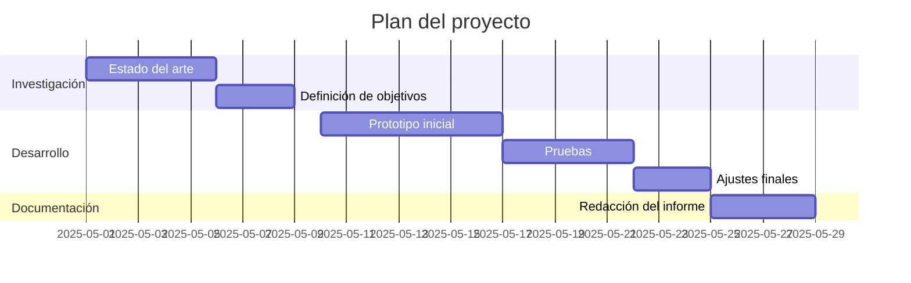
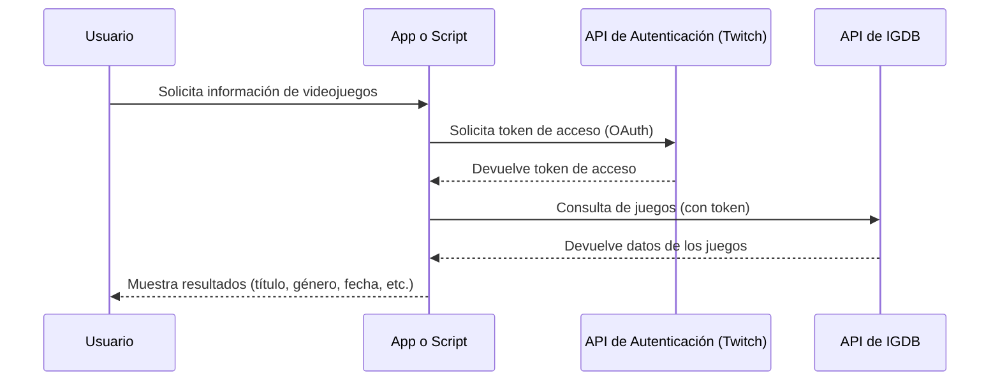

> Bienvenidos a la memoria de vuestro proyecto. Vamos a hacerla en
> Markdown porque tenéis que centraros en el contenido, del formato ya
> nos encargaremos luego. NO gastéis tiempo en dejarlo bonito, centraos
> en el contenido, por favor. Una vez que tengamos el texto, pasarlo a
> una plantilla profesional y diferenciadora es 1h de trabajo.
> Además, los ficheros .md se parsean automáticamente en github, con lo cual podéis ver el resultado sin usar un editor. Si queréis usar alguno, podéis tirar de [stackedit.io](https://stackedit.io) o alguna similar.

# Checkpoint
Brevísima descripción de vuestro proyecto, a modo de eslogan o subtítulo. Una frase. Dos como muchísimo. Os recomiendo que tengáis varias candidatas y que cada vez que se os ocurra una la apuntéis. Decidid con cuál os quedáis cuando terminéis de escribir este documento.

# Resumen (abstract)
Ignorad esta sección por completo. Volved aquí después de escribir las conclusiones.
Esto es un resumen en un par de párrafos de todo el documento. Os doy instrucciones cuando tengamos todo el documento.

# Introducción
Esta sección es la más complicada, porque todo el mundo la va a leer. Aunque es la primera, la vamos a escribir al final. Las introducciones solo son buenas si resumen perfectamente el contenido del documento. Como todavía está por escribir, pasad directamente al desarrollo. Esto es truco de perro viejo ;)

Si habéis vuelto a esta sección, es porque ya habéis acabado de escribir el documento. Vamos a por la introducción.

3 párrafos, cada uno tiene que responder a las siguientes preguntas:
- ¿Qué es Checkpoint?
- ¿Por qué es necesario que exista una herramienta como Checkpoint?
- ¿Qué nos motiva a realizar este proyecto?

> Ojo, la segunda pregunta **NO** es nada parecida a la tercera y os tenéis
> que esforzar en diferenciarla. La segunda hace referencia a los
> intereses del usuario y la tercera a los vuestros propios. Ese tercer
> párrafo es vuestro toque personal, vuestra carta de presentación:
> "estos somos nosotros y así nos las gastamos". Apuntad alto, pero
> tened cuidado. Este párrafo condiciona mucho al lector. Por ejemplo:
> si digo que soy perfeccionista pero luego tengo faltas de ortografía,
> perderé la confianza del lector. Si por el contrario cuidáis los
> detalles, tendréis el 90% del trabajo hecho con independencia de que
> el documento esté completo o no :) La mayor parte de los lectores son
> muy condicionables. Aprovechadlo.

Párrafo outline: el outline describe lo que el lector se encontrará en el documento. Sigue una estructura muy concreta y **NO** tenemos libertad para cambiarla. Os pongo un ejemplo:

> El resto de este documento se organiza de la siguiente manera. La
> sección 2 **describe** las alternativas existentes,
> incluyendo sus ventajas e inconvenientes. En la sección 3, **analizamos**
> los requisitos del sistema, tanto funcionales como no funcionales. La
> sección 4 **presenta** el diseño de capas y clases de nuestro proyecto,
> que se compone de *frontend* y *backend*. La sección 5.......

Como podéis ver, para cada una de las secciones, se mete una frasecilla en la que se describe qué contiene cada sección. MUY IMPORTANTE: esta frasecilla tiene que tener un verbo único. Ese verbo no puede repetirse (os lo he marcado en negrita). Os dejo ejemplos de verbos que podéis utilizar: describir, explicar, presentar, analizar, discutir, introducir, revisar, repasar, examinar, proporcionar, ofrecer, centrarse (se centra en)...

# Revisión de las alternativas
(aka Estado del Arte, que es una mala traducción ya aceptada de *state-of-the-art*)
Esta sección es la justificación de por qué existe vuestro proyecto. Para ello, necesitamos citar TODAS las alternativas existentes a esta plataforma, que hagan más o menos lo mismo (i.e., igdb y compañía), y TODAS las plataformas que hagan lo mismo que Checkpoint con otros formatos (e.g. filmaffinity).

Formato: un párrafo por plataforma. Contenido del párrafo:
- Nombre de la plataforma y cita bibliográfica de la URL de la plataforma.
- Presentación de la plataforma y sus funcionalidades (aka ventajas).
- Relación de inconvenientes de la plataforma. **Buscadlos**. Todas pecan de algo, bien por exceso o por defecto. Ejemplos de desventajas por exceso: publicidad, sponsorships, reviews compradas. Por defecto: carencia de funcionalidades, faltan juegos o mercados.

Evitaremos mencionar las palabras ventajas/desventajas/inconveniente/fortaleza... Tenemos que utilizar un tono objetivo, nada de opiniones personales. Ejemplo:
- IGDB es una base de datos de videojuegos, enfocada en recopilar y organizar información sobre videojuegos. Es propiedad de Twitch desde 2019, y ofrece una API pública que permite la integración con servicios externos, aunque presenta límites de cuota que dificultan la recuperación de datos. La cobertura de videojuegos es amplia para todos los mercados, pero se observan inconsistencias de documentación de algunos títulos de nicho o antiguos.

Vamos a poner el foco en describir: IGDB, RAWG, Metacritic, IGN, OpenCritic, Polygon, Steam (y, adicionalmente, todas las que queráis). 

Después de esto, necesitamos un parrafito que diga algo así como "Existen plataformas con funcionalidad similar en otros sectores. En el caso del cine...". A partir de aquí hablaremos de Filmaffinity, IMDB, etc., haciendo especial foco en sus ventajas (¡porque estas no compiten con nosotros, no tenemos que buscarles pegas! Solo necesitamos referentes). 
- Cine: Filmaffinity, IMDB, Letterboxd
- Música: Pitchfork, Rate Your Music
- Libros: Goodreads

Párrafo de conclusión de esta sección que resuma por qué nada de lo que hay es suficiente y, de nuevo, justifique la existencia de nuestro proyecto. Ejemplo (me lo invento todo, cuidado ):

> Como hemos podido observar, las plataformas sociales en el panorama de videojuegos presentan ciertas limitaciones que dejan un amplio margen de mejora que beneficie la experiencia y posibilidades de los usuarios. IGDB y RAWG tienen una gran base de datos pero están sujetas a intereses comerciales. La participación de los usuarios en estas plataformas está condicionada a los términos y condiciones de sus empresas matrices, y la interacción social entre los mismos se utiliza para elaborar perfiles publicitarios que va en contra de la privacidad deseada por la comunidad *gamer*. Además, se detecta una ausencia parcial de funcionalidades a las que la comunidad de internautas ya está acostumbrada: rankings, histograma de opiniones e interacción social entre amigos dentro de la propia plataforma. Es por esto que necesitamos una alternativa integradora, que complemente las plataformas existentes y ayude a reforzar la presencia de los videojuegos, tanto para gamers habituales como para nuevos jugadores e incluso sus familias, que les permita informarse de manera efectiva y sencilla, siempre de la mano de un componente social no sujeto a intereses comerciales.

Llegados a este punto, tenemos perfectamente justificado por qué existe nuestro proyecto. La introducción (que todavía no habéis escrito), presenta el proyecto y vuestras intenciones; el estado del arte demuestra que hemos venido para quedarnos. El resto del documento es más metódico.

## Objetivos
Redactar los **objetivos de un proyecto** implica definir con claridad **qué se espera lograr**, **para qué** y **en qué términos generales o específicos**. Los objetivos deben guiar el desarrollo del proyecto y servir como base para evaluar su éxito.

Necesitáis redactar bien los objetivos, porque tanto vuestra introducción como vuestras conclusiones dependen de ellos. No debéis mencionar nada como un "logro" si no lo habéis definido previamente como objetivo. Diferencia entre objetivo general y objetivos específicos:
- **Objetivo general**. Resume el propósito principal del proyecto. Debe responder a: _¿Qué se quiere lograr en términos amplios?_
- **Objetivos específicos**. Derivan del objetivo general. Son concretos, medibles y desglosan los pasos o resultados intermedios necesarios para alcanzar ese fin.

Usad verbos en infinitivo. Ejemplos comunes de verbos: analizar, desarrollar, implementar, diseñar, evaluar, comparar, automatizar, integrar, optimizar, etc. Ejemplo de redacción (me lo invento):

#### Objetivo general:

Desarrollar una aplicación web que permita consultar información actualizada de videojuegos usando la API de IGDB e integre la posibilidad de crear listas personalizadas, rankings compartidos y relaciones de amistad.

#### Objetivos específicos:

-   Implementar un módulo de autenticación OAuth con el servicio de Twitch.
-   Diseñar una interfaz gráfica que permita realizar búsquedas de videojuegos por título, género o año.
-   Integrar la API de IGDB para obtener y mostrar detalles relevantes de los juegos.
-   Evaluar la usabilidad del sistema con usuarios reales mediante pruebas funcionales.

# Desarrollo del proyecto
Esta sección es toda vuestra. Tenéis que describir lo que habéis hecho. Os dejo las subsecciones con el contenido mínimo que espero.

## Temporalización
Diagrama de Gantt. Breve descripción de las etapas del proyecto.

## Metodología
Desarrollo ágil, basado en iteraciones descritas mediante issues. Revisión por pares de los commits.

## Tecnologías
Lenguajes, bibliotecas y frameworks utilizados. Una breve presentación de cada una de ellas y citas/enlaces a sus páginas oficiales. Incluid las herramientas del entorno de desarrollo (ejemplo: vscode, git, github...).

## Requisitos funcionales
Intentad ser exhaustivos, pero sin meternos en una descripción muy detallada. Os describo de qué va esto:

Los **requisitos funcionales** son especificaciones que describen **lo que un sistema, software o producto debe hacer**. Es decir, **definen las funciones, comportamientos o servicios** que debe ofrecer para cumplir con sus objetivos.

-   **Se centran en funciones específicas del sistema**
-   Responden a la pregunta: **¿Qué debe hacer el sistema?**
-   Suelen estar escritos en términos claros y verificables
-   Se derivan de las **necesidades del usuario** o del negocio

Ejemplos de requisitos funcionales:
-   El sistema debe permitir a los usuarios **registrarse con una dirección de correo electrónico**.
-   El sistema debe **enviar una notificación por correo electrónico** tras cada compra.
-   El usuario debe poder **recuperar su contraseña** mediante un enlace de restablecimiento.
-   La aplicación debe permitir **consultar el historial de transacciones** en cualquier momento.

Comparación con requisitos no funcionales:
- Funcional: "El usuario puede crear y editar su perfil."
- No funcional: "La respuesta del sistema no debe exceder 2s." (lo que el sistema debe hacer)

## Estructura del proyecto
Describid aquí las partes del proyecto.
### Backend
- Responsabilidades
- UML (aunque sea una versión reducida, la completa la metemos como anexo)
- Diagramas de casos de uso (esto al final, si os sobra tiempo y queréis dejarlo profesional).
- Diagramas de sistema (esto también al final, AUNQUE hay un diagrama de sistema que sí que quiero que pongáis, que es el que describe cómo se hace la llamada a la API de IGDB desde vuestro caso de uso de "Buscar un juego"). Ejemplo:

- Estructura del proyecto: modelo-servicio-controlador. Describir responsabilidades de cada capa.
- Resumen de las entidades principales y citar las clases que dan soporte (i.e. entidades de relación muchos-muchos etc.).
- 
### Frontend
Lo mismo, pero incluyendo el diseño (con capturas, por ejemplo). Especial mención a todas las pantallas

### Base de datos
Modelo E-R y su explicación

### Especificación OpenAPI
Una vez que podáis crear el .yaml automáticamente usando la funcionalidad de Swagger UI, pillad ese .yaml y decidle a chatgpt que os lo formatee en markdown. Lo pegáis aquí y a volar. Pedidle que evite los emojis.

## Despliegue
Pasos necesarios para desplegar vuestro proyecto. Si no lo tenéis claro, lo vemos próximamente.

## Problemas encontrados y soluciones propuestas
Aquí es donde lloráis un poquito. Tono profesional y poco casual, por favor. Podéis hablar de cosas como la complejidad de las peticiones a IGDB, la inconsistencia de sus datos, la dificultad de normalización de los mismos... Para cada uno, comentad someramente cómo habéis abordado/solucionado el problema. Esta sección viste mucho un proyecto de cara al tribunal, porque pueden ver lo resolutivos que sois. No escatiméis en esta sección. Si ocupa 20 páginas, bienvenidas sean.

# Conclusiones
Es el momento de escribir la introducción. Cuando terminéis, volved aquí.

Esta es la sección más complicada, pero también es muy metódica. Tened en cuenta que un lector experimentado va a leerse el abstract (resumen). Si le interesa, se leerá la introducción. Y si le sigue interesando, se leerá las conclusiones. El resto del documento es procedimiento, y eso solo interesa si quieres replicar el proceso o verificar que todo sea correcto y no haya fallos graves.

Ejemplo: de una tarta de queso, a mi solo me interesa el precio, para saber si me la puedo permitir (aka abstract). Si decido pedirla, solo me importará la pinta que tiene cuando me la traen (aka introducción) y lo rica que está cuando me la meto por primera vez en la boca (aka conclusiones). Si resulta que me flipa, entonces será cuando me lea la receta para hacerla en mi casa.

¿Cómo la vamos a escribir? Sin repetir el contenido, pero mencionando todos los apartados. Párrafos muy concretos y muy al grano:
- Párrafo de introducción: Este proyecto surge para cubrir necesidades de interacción social asíncrona entre la comunidad de gamers y blablabla
- Párrafo reflexivo sobre el documento: A lo largo de este documento, hemos detallado el proceso de análisis y creación de nuestra plataforma de blablabla
- Párrafo que resume la competencia: En un primer análisis, hemos detectado las siguientes carencias en plataformas de videojuegos del tipo IGDB, RAWG etc etc, y hemos detectado las siguientes fortalezas en otras plataformas de diferentes sectores blablabla.
- Párrafo que describe objetivos y consecución de los mismos. Para cada objetivo, una frase que especifique qué lo habéis cumplido y cómo lo habéis hecho. Es decir, tenéis que describir los logros, y no puede haber ningún logro que no esté asociado a un objetivo. Si tenéis logros no asociados con objetivos, debéis reescribir los objetivos y añadir uno que lo contemple.
- Párrafo que describe el desarrollo: mencionad la temporalización final, las principales tecnologías y la manera que habéis tenido de trabajar (metodología). Contad la estructura final del proyecto, así por encima, y describid las bondandes de vuestra API.
- Párrafo que de verdad es conclusión: Hemos cumplido los objetivos previstos y hemos aportado las siguientes cosas a la comunidad gamer y blablabla. Mencionad la importancia y repercusión que creéis que tendrá.
- Párrafo de trabajos futuros: En las siguientes iteraciones del proyecto, esperamos seguir incluyendo funcionalidad y blablabla. Lo detallamos en la siguiente sección.

# Trabajos Futuros
Todo lo que no hayáis hecho por falta de tiempo. Todo lo que se os ocurra que alguien os puede decir que estaría bien poner pero que no tengáis intenciones. Todo lo que os de demasiada pereza y no sea demasiado crítico. 

Esta es la sección de las apariencias, lo único importante es quedar bien. Si alguien os dice "oye y por qué no puedo cambiar la visibilidad de una lista de mi perfil para que solo la puedan ver mis mejores amigos??", la respuesta NUNCA sería "porque no tiene sentido", o "porque no queremos", o "porque no nos ha dado tiempo". La respuesta SIEMPRE es "muy buena sugerencia, de hecho lo tenemos contemplado en trabajos futuros para siguientes versiones". Y si no lo tenéis, "muy buena sugerencia, no se nos había ocurrido, lo añadiremos a trabajos futuros".

Esta sección es como ayudar a poner y recoger la mesa cuando vas por primera vez a casa de tus suegros. La primeras impresiones cuentan ;)

# Bibliografía
Siempre que hagáis una afirmación, necesitáis respaldarla. Por ejemplo, si decís que los usuarios están descontentos con las plataformas de reviews, tenéis que proporcionar una fuente para esa afirmación. No puede haber afirmación sin cita que la respalde, ni citas sin mencionar en el texto.
Además, en esta sección irán todos los enlaces y páginas webs visitadas. Recoged toda la información que sea posible para cada entrada, y luego las vamos a formatear usando ChatGPT en algún formato estándar. A mi me gusta IEEE, pero probablemente quede mejor APA. No es importante hasta que formateemos el documento, pero recopiladlas bien porque si no el trabajo será el triple.

# Anexos
Cosas muy amplias que no interesen a todo el mundo pero alguien puede querer consultar. Ejemplo: UML completo. Los anexos tienen número. Es decir:
## Anexo 1
## Anexo 2
